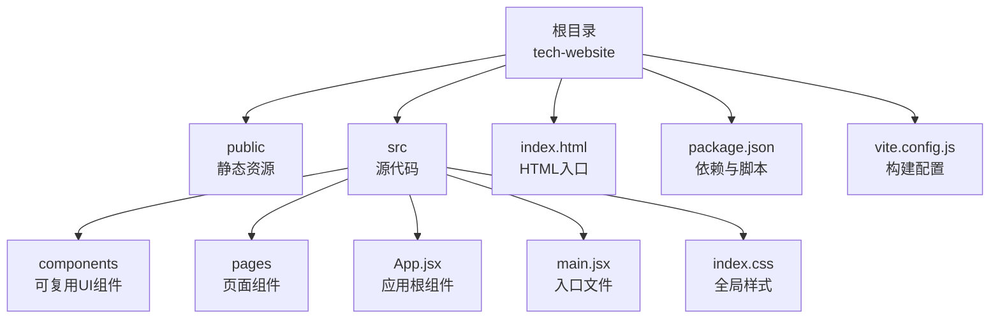
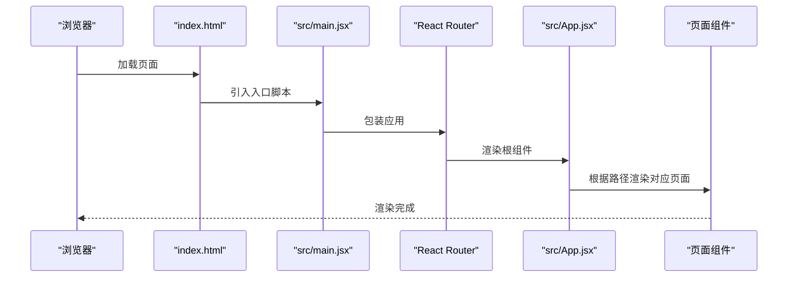
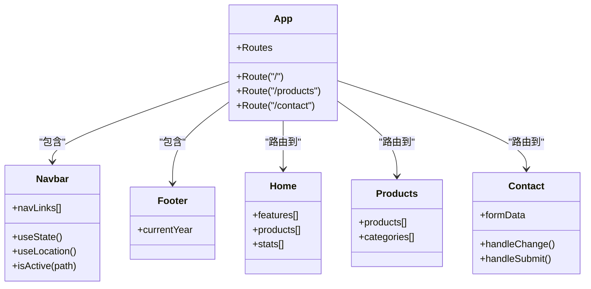
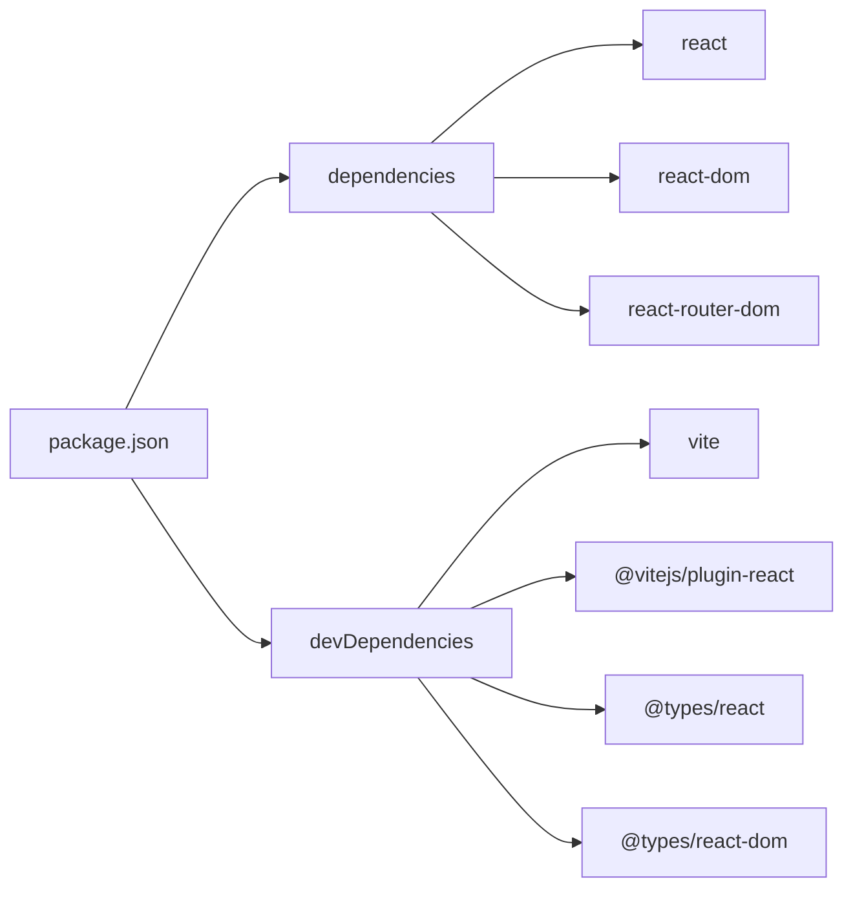

# 快速开始

<cite>
**本文引用的文件**
- [package.json](file://tech-website/package.json)
- [vite.config.js](file://tech-website/vite.config.js)
- [index.html](file://tech-website/index.html)
- [src/main.jsx](file://tech-website/src/main.jsx)
- [src/App.jsx](file://tech-website/src/App.jsx)
- [src/components/Navbar.jsx](file://tech-website/src/components/Navbar.jsx)
- [src/components/Footer.jsx](file://tech-website/src/components/Footer.jsx)
- [src/pages/Home.jsx](file://tech-website/src/pages/Home.jsx)
- [src/pages/Products.jsx](file://tech-website/src/pages/Products.jsx)
- [src/pages/Contact.jsx](file://tech-website/src/pages/Contact.jsx)
- [src/index.css](file://tech-website/src/index.css)
- [src/components/Navbar.css](file://tech-website/src/components/Navbar.css)
- [src/pages/Home.css](file://tech-website/src/pages/Home.css)
</cite>

## 目录
1. [简介](#简介)
2. [项目结构](#项目结构)
3. [核心组件](#核心组件)
4. [架构总览](#架构总览)
5. [详细组件分析](#详细组件分析)
6. [依赖关系分析](#依赖关系分析)
7. [性能注意事项](#性能注意事项)
8. [故障排查指南](#故障排查指南)
9. [结论](#结论)
10. [附录](#附录)

## 简介
本指南面向首次接触该技术网站项目的新开发者，帮助你在约30分钟内完成环境准备、依赖安装、本地开发服务器启动以及生产构建。文档覆盖：
- 环境要求（Node.js 版本、包管理器）
- 依赖安装步骤与常用命令
- 开发服务器启动与预览命令
- 生产构建流程与产物说明
- 核心配置文件的作用解析（package.json、vite.config.js）
- 常见问题排查（端口占用、依赖安装失败等）

## 项目结构
该项目采用 React + Vite 的现代前端工程化结构，使用 React Router DOM 实现页面路由，目录组织清晰，便于扩展与维护。

图表来源
- [index.html:1-14](file://tech-website/index.html#L1-L14)
- [src/main.jsx:1-14](file://tech-website/src/main.jsx#L1-L14)
- [src/App.jsx:1-25](file://tech-website/src/App.jsx#L1-L25)
- [package.json:1-23](file://tech-website/package.json#L1-L23)
- [vite.config.js:1-11](file://tech-website/vite.config.js#L1-L11)

章节来源
- [index.html:1-14](file://tech-website/index.html#L1-L14)
- [src/main.jsx:1-14](file://tech-website/src/main.jsx#L1-L14)
- [src/App.jsx:1-25](file://tech-website/src/App.jsx#L1-L25)
- [package.json:1-23](file://tech-website/package.json#L1-L23)
- [vite.config.js:1-11](file://tech-website/vite.config.js#L1-L11)

## 核心组件
- 应用入口：通过 HTML 引入入口脚本，挂载到 #root 容器。
- 根组件：App.jsx 定义路由规则，渲染导航、主内容区与页脚。
- 页面组件：Home、Products、Contact 分别承载首页、产品列表与联系页面。
- 可复用组件：Navbar、Footer 提供统一的导航与页脚布局。

章节来源
- [index.html:9-12](file://tech-website/index.html#L9-L12)
- [src/main.jsx:1-14](file://tech-website/src/main.jsx#L1-L14)
- [src/App.jsx:1-25](file://tech-website/src/App.jsx#L1-L25)
- [src/components/Navbar.jsx:1-67](file://tech-website/src/components/Navbar.jsx#L1-L67)
- [src/components/Footer.jsx:1-97](file://tech-website/src/components/Footer.jsx#L1-L97)
- [src/pages/Home.jsx:1-230](file://tech-website/src/pages/Home.jsx#L1-L230)
- [src/pages/Products.jsx:1-139](file://tech-website/src/pages/Products.jsx#L1-L139)
- [src/pages/Contact.jsx:1-274](file://tech-website/src/pages/Contact.jsx#L1-L274)

## 架构总览
下面的时序图展示了从浏览器加载到页面渲染的关键流程。

图表来源
- [index.html:9-12](file://tech-website/index.html#L9-L12)
- [src/main.jsx:1-14](file://tech-website/src/main.jsx#L1-L14)
- [src/App.jsx:1-25](file://tech-website/src/App.jsx#L1-L25)

## 详细组件分析

### 组件类图（代码级）

图表来源
- [src/App.jsx:1-25](file://tech-website/src/App.jsx#L1-L25)
- [src/components/Navbar.jsx:1-67](file://tech-website/src/components/Navbar.jsx#L1-L67)
- [src/components/Footer.jsx:1-97](file://tech-website/src/components/Footer.jsx#L1-L97)
- [src/pages/Home.jsx:1-230](file://tech-website/src/pages/Home.jsx#L1-L230)
- [src/pages/Products.jsx:1-139](file://tech-website/src/pages/Products.jsx#L1-L139)
- [src/pages/Contact.jsx:1-274](file://tech-website/src/pages/Contact.jsx#L1-L274)

章节来源
- [src/App.jsx:1-25](file://tech-website/src/App.jsx#L1-L25)
- [src/components/Navbar.jsx:1-67](file://tech-website/src/components/Navbar.jsx#L1-L67)
- [src/components/Footer.jsx:1-97](file://tech-website/src/components/Footer.jsx#L1-L97)
- [src/pages/Home.jsx:1-230](file://tech-website/src/pages/Home.jsx#L1-L230)
- [src/pages/Products.jsx:1-139](file://tech-website/src/pages/Products.jsx#L1-L139)
- [src/pages/Contact.jsx:1-274](file://tech-website/src/pages/Contact.jsx#L1-L274)

### API/服务组件（概念性）
本项目为纯前端 SPA，不涉及后端 API 调用；页面交互主要通过 React 状态与路由实现。

## 依赖关系分析
- 依赖管理：使用 npm（package-lock.json 存在），脚本通过 Vite 执行。
- 运行时依赖：React、React DOM、React Router DOM。
- 开发依赖：Vite、@vitejs/plugin-react、TypeScript 类型声明（用于开发体验）。

图表来源
- [package.json:1-23](file://tech-website/package.json#L1-L23)

章节来源
- [package.json:1-23](file://tech-website/package.json#L1-L23)

## 性能注意事项
- 使用 Vite 的热更新与按需打包，开发阶段启动快、热更新响应迅速。
- 生产构建默认启用代码分割与压缩，建议在 CI 中开启缓存策略以加速二次构建。
- 图标与背景使用 SVG，体积小、缩放清晰，有利于首屏渲染与移动端体验。

## 故障排查指南
- 端口占用（默认 3000）
  - 现象：启动时报端口被占用或无法打开页面。
  - 处理：修改 vite.config.js 中的 server.port 或关闭占用端口的进程。
  - 参考：[vite.config.js:6-9](file://tech-website/vite.config.js#L6-L9)
- 依赖安装失败
  - 现象：npm install 报错或部分包安装失败。
  - 处理：清理缓存后重试；检查网络代理；必要时更换镜像源；确认 Node.js 版本满足要求。
  - 参考：[package.json:16-21](file://tech-website/package.json#L16-L21)
- 路由跳转无效或刷新 404
  - 现象：刷新页面或直接访问路由路径返回 404。
  - 处理：确认使用 Vite 预览模式或部署到支持 SPA 的服务器；若为静态托管，需配置回退到 index.html。
  - 参考：[index.html:1-14](file://tech-website/index.html#L1-L14)
- 样式未生效
  - 现象：页面无样式或样式错乱。
  - 处理：确认 index.css 已引入；检查组件 CSS 是否正确导入；避免样式冲突。
  - 参考：[src/index.css:1-228](file://tech-website/src/index.css#L1-L228)

章节来源
- [vite.config.js:6-9](file://tech-website/vite.config.js#L6-L9)
- [package.json:16-21](file://tech-website/package.json#L16-L21)
- [index.html:1-14](file://tech-website/index.html#L1-L14)
- [src/index.css:1-228](file://tech-website/src/index.css#L1-L228)

## 结论
本项目采用现代化前端技术栈，具备良好的开发体验与可扩展性。按照本指南完成环境准备与基础操作后，你可以在短时间内完成本地开发与生产构建。遇到问题时，优先检查端口占用、依赖安装与路由配置，通常可快速定位并解决。

## 附录

### 环境要求
- Node.js：建议使用 LTS 版本（如 18.x 或 20.x），确保兼容性与性能。
- 包管理器：推荐使用 npm（与 package-lock.json 对应）；也可使用 pnpm/yarn，但需注意锁文件差异。

章节来源
- [package.json:16-21](file://tech-website/package.json#L16-L21)

### 依赖安装步骤
- 在项目根目录执行安装命令，等待依赖下载完成。
- 若安装缓慢，可考虑配置 npm 镜像源或使用代理。
- 安装完成后，可在项目根目录看到 node_modules 与 package-lock.json。

章节来源
- [package.json:1-23](file://tech-website/package.json#L1-L23)

### 开发服务器启动命令
- 启动开发服务器：执行 dev 脚本，浏览器自动打开本地地址。
- 预览开发服务器：执行 preview 脚本，查看本地预览效果。
- 参考脚本定义与默认端口配置。

章节来源
- [package.json:6-10](file://tech-website/package.json#L6-L10)
- [vite.config.js:6-9](file://tech-website/vite.config.js#L6-L9)

### 生产环境构建流程
- 构建命令：执行 build 脚本，生成 dist 目录（包含静态资源与 HTML）。
- 部署建议：将 dist 目录部署到静态服务器或支持 SPA 回退的托管平台。
- 参考构建配置与入口 HTML。

章节来源
- [package.json:8-8](file://tech-website/package.json#L8-L8)
- [vite.config.js:1-11](file://tech-website/vite.config.js#L1-L11)
- [index.html:1-14](file://tech-website/index.html#L1-L14)

### 核心配置文件说明
- package.json
  - scripts：定义 dev、build、preview 三个常用命令。
  - dependencies：运行时依赖 React 生态与路由。
  - devDependencies：开发工具链（Vite、React 插件、类型声明）。
- vite.config.js
  - plugins：启用 @vitejs/plugin-react。
  - server：设置默认端口与自动打开浏览器。
- index.html
  - 引入入口脚本，挂载 React 应用。
- src/main.jsx
  - 创建根容器并包裹 Router，渲染 App。
- src/App.jsx
  - 定义路由规则，包含首页、产品、联系页面。

章节来源
- [package.json:6-21](file://tech-website/package.json#L6-L21)
- [vite.config.js:1-11](file://tech-website/vite.config.js#L1-L11)
- [index.html:9-12](file://tech-website/index.html#L9-L12)
- [src/main.jsx:1-14](file://tech-website/src/main.jsx#L1-L14)
- [src/App.jsx:1-25](file://tech-website/src/App.jsx#L1-L25)

### 常见问题与预期输出
- 启动成功
  - 控制台显示“ready in ... ms”、“Local: http://localhost:3000”等提示。
- 端口被占用
  - 控制台提示端口冲突；修改 vite.config.js 中的 port 后重启。
- 依赖安装失败
  - 控制台报错信息包含具体原因；清理缓存后重试。
- 刷新 404
  - 需要在部署环境中配置 SPA 回退到 index.html。

章节来源
- [vite.config.js:6-9](file://tech-website/vite.config.js#L6-L9)
- [index.html:1-14](file://tech-website/index.html#L1-L14)