# 性能优化

<cite>
**本文档引用的文件**
- [vite.config.js](file://tech-website/vite.config.js)
- [package.json](file://tech-website/package.json)
- [index.html](file://tech-website/index.html)
- [main.jsx](file://tech-website/src/main.jsx)
- [App.jsx](file://tech-website/src/App.jsx)
- [Navbar.jsx](file://tech-website/src/components/Navbar.jsx)
- [Home.jsx](file://tech-website/src/pages/Home.jsx)
- [Products.jsx](file://tech-website/src/pages/Products.jsx)
- [Contact.jsx](file://tech-website/src/pages/Contact.jsx)
- [Footer.jsx](file://tech-website/src/components/Footer.jsx)
- [index.css](file://tech-website/src/index.css)
- [Navbar.css](file://tech-website/src/components/Navbar.css)
- [Home.css](file://tech-website/src/pages/Home.css)
</cite>

## 目录
1. [简介](#简介)
2. [项目结构](#项目结构)
3. [核心组件](#核心组件)
4. [架构概览](#架构概览)
5. [详细组件分析](#详细组件分析)
6. [依赖关系分析](#依赖关系分析)
7. [性能考虑因素](#性能考虑因素)
8. [故障排除指南](#故障排除指南)
9. [结论](#结论)

## 简介

本性能优化文档针对技术网站项目进行全面的性能分析和优化指导。该网站采用现代前端技术栈，包括 Vite 构建工具、React 18、React Router DOM 和原生 CSS。项目结构清晰，组件化程度高，为性能优化提供了良好的基础。

## 项目结构

技术网站采用标准的 React + Vite 项目结构，具有以下特点：

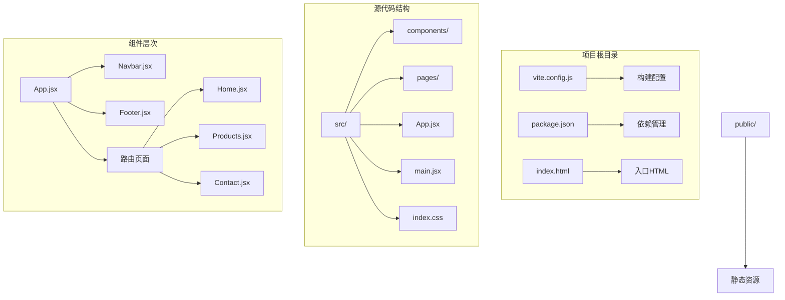

**图表来源**
- [vite.config.js:1-11](file://tech-website/vite.config.js#L1-L11)
- [package.json:1-23](file://tech-website/package.json#L1-L23)
- [index.html:1-14](file://tech-website/index.html#L1-L14)

**章节来源**
- [vite.config.js:1-11](file://tech-website/vite.config.js#L1-L11)
- [package.json:1-23](file://tech-website/package.json#L1-L23)
- [index.html:1-14](file://tech-website/index.html#L1-L14)

## 核心组件

### 应用程序入口点

应用程序采用标准的 React 18 创建根实例模式，使用严格模式确保开发时的额外检查：

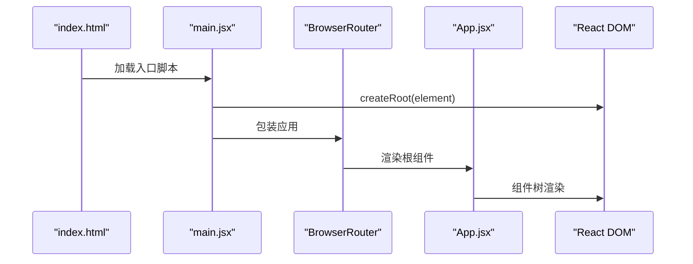

**图表来源**
- [main.jsx:1-14](file://tech-website/src/main.jsx#L1-L14)
- [index.html:9-12](file://tech-website/index.html#L9-L12)

### 路由架构

应用使用 React Router DOM 实现客户端路由，支持页面级懒加载：

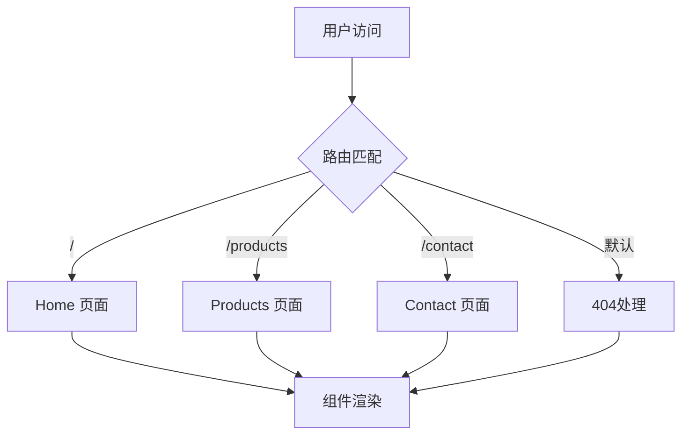

**图表来源**
- [App.jsx:8-22](file://tech-website/src/App.jsx#L8-L22)

**章节来源**
- [main.jsx:1-14](file://tech-website/src/main.jsx#L1-L14)
- [App.jsx:1-25](file://tech-website/src/App.jsx#L1-L25)

## 架构概览

### 组件层次结构

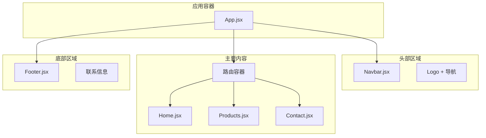

**图表来源**
- [App.jsx:8-22](file://tech-website/src/App.jsx#L8-L22)
- [Navbar.jsx:1-67](file://tech-website/src/components/Navbar.jsx#L1-L67)
- [Footer.jsx:1-97](file://tech-website/src/components/Footer.jsx#L1-L97)

### 样式架构

项目采用 CSS 变量和原子化设计原则，具有良好的可维护性和性能特征：

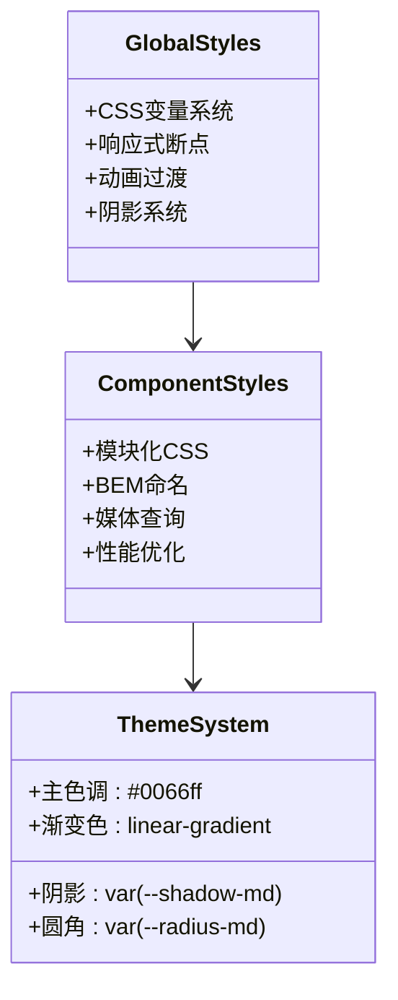

**图表来源**
- [index.css:2-54](file://tech-website/src/index.css#L2-L54)
- [Navbar.css:1-155](file://tech-website/src/components/Navbar.css#L1-L155)

**章节来源**
- [index.css:1-228](file://tech-website/src/index.css#L1-L228)
- [Navbar.css:1-155](file://tech-website/src/components/Navbar.css#L1-L155)

## 详细组件分析

### 导航栏组件性能分析

导航栏组件实现了响应式设计和交互功能，需要重点关注以下性能方面：

#### 组件结构分析

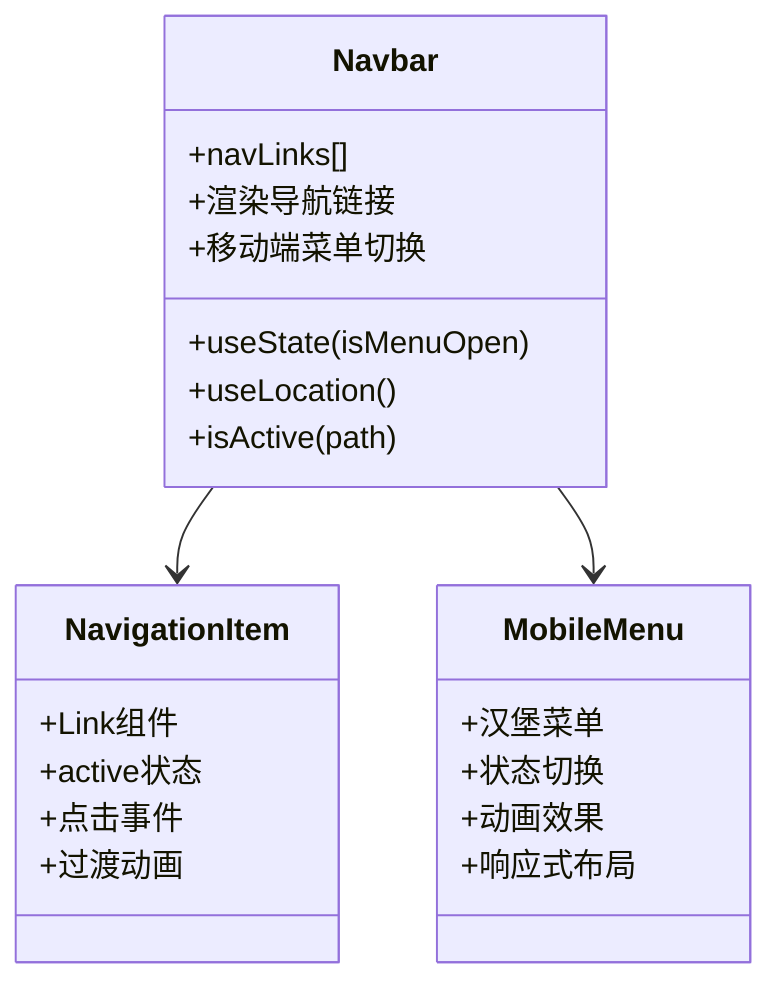

**图表来源**
- [Navbar.jsx:5-63](file://tech-website/src/components/Navbar.jsx#L5-L63)

#### 性能优化要点

1. **状态管理优化**: 使用单一状态控制菜单开关，避免不必要的重新渲染
2. **条件渲染**: 移动端菜单仅在需要时渲染，减少DOM节点数量
3. **事件处理**: 点击链接时关闭菜单，避免内存泄漏
4. **SVG图标**: 内联SVG减少HTTP请求，但需注意文件大小

**章节来源**
- [Navbar.jsx:1-67](file://tech-website/src/components/Navbar.jsx#L1-L67)

### 首页组件性能分析

首页是性能敏感的组件，包含多个动画元素和网格布局：

#### 动画系统分析

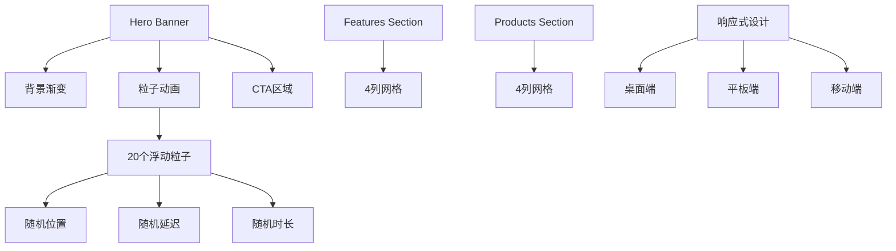

**图表来源**
- [Home.jsx:85-91](file://tech-website/src/pages/Home.jsx#L85-L91)
- [Home.css:25-49](file://tech-website/src/pages/Home.css#L25-L49)

#### 性能优化策略

1. **动画优化**: 粒子动画使用CSS动画而非JavaScript，减少主线程压力
2. **网格布局**: CSS Grid替代JavaScript计算，提高渲染性能
3. **渐变背景**: 使用CSS渐变而非图片，减少网络请求
4. **响应式断点**: 合理的媒体查询减少不必要的样式计算

**章节来源**
- [Home.jsx:1-230](file://tech-website/src/pages/Home.jsx#L1-L230)
- [Home.css:1-399](file://tech-website/src/pages/Home.css#L1-L399)

### 产品页面性能分析

产品页面包含列表渲染和分类筛选功能：

#### 数据渲染优化

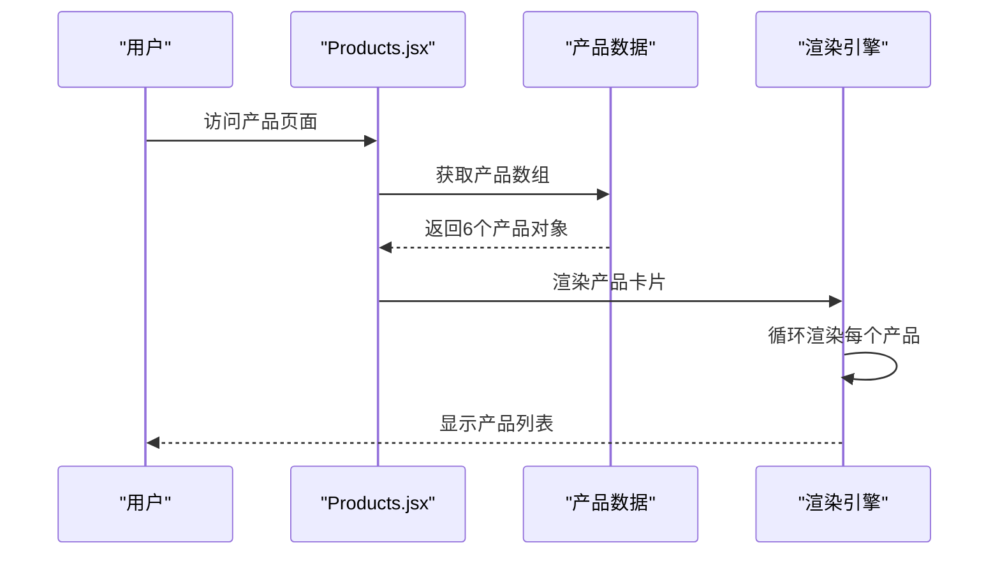

**图表来源**
- [Products.jsx:5-54](file://tech-website/src/pages/Products.jsx#L5-L54)

#### 性能考虑因素

1. **列表渲染**: 6个产品项相对较少，无需虚拟滚动
2. **分类筛选**: 当前实现为静态标签，可扩展为动态筛选
3. **特性标签**: SVG图标内联，减少HTTP请求
4. **价格显示**: 简单字符串渲染，无复杂计算

**章节来源**
- [Products.jsx:1-139](file://tech-website/src/pages/Products.jsx#L1-L139)

### 联系页面性能分析

联系页面包含表单验证和异步提交逻辑：

#### 表单处理流程

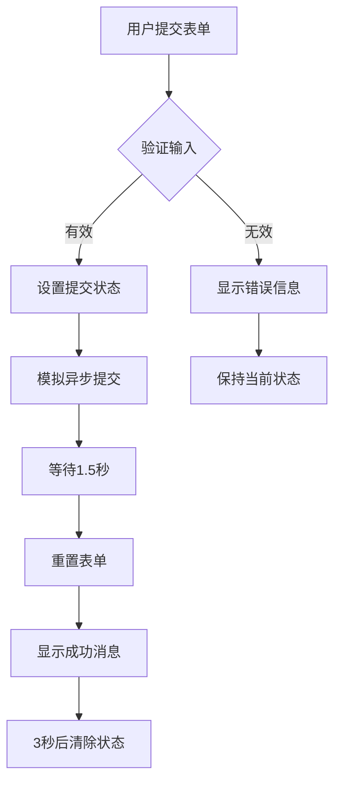

**图表来源**
- [Contact.jsx:24-43](file://tech-website/src/pages/Contact.jsx#L24-L43)

#### 性能优化建议

1. **表单状态管理**: 使用受控组件，避免不必要的重新渲染
2. **异步处理**: 使用setTimeout模拟，实际项目应使用Promise
3. **用户体验**: 提供视觉反馈，改善感知性能
4. **内存管理**: 清除定时器和事件监听器

**章节来源**
- [Contact.jsx:1-274](file://tech-website/src/pages/Contact.jsx#L1-L274)

## 依赖关系分析

### 构建工具配置

```mermaid
graph LR
subgraph "开发依赖"
A[@vitejs/plugin-react]
B[vite ^5.0.0]
C[@types/react]
D[@types/react-dom]
end
subgraph "运行时依赖"
E[react ^18.2.0]
F[react-dom ^18.2.0]
G[react-router-dom ^6.20.0]
end
subgraph "构建配置"
H[vite.config.js]
I[react插件]
J[开发服务器]
end
H --> I
I --> A
A --> E
A --> F
A --> G
```

**图表来源**
- [package.json:16-21](file://tech-website/package.json#L16-L21)
- [vite.config.js:4-10](file://tech-website/vite.config.js#L4-L10)

### 依赖关系优化

1. **版本锁定**: 使用 Caret 版本范围允许安全更新
2. **插件集成**: React 插件提供 JSX 转换和开发体验
3. **类型定义**: 开发类型定义提升开发效率
4. **构建优化**: Vite 提供快速热重载和生产构建

**章节来源**
- [package.json:1-23](file://tech-website/package.json#L1-L23)
- [vite.config.js:1-11](file://tech-website/vite.config.js#L1-L11)

## 性能考虑因素

### Vite 构建优化配置

当前配置相对基础，可进行以下优化：

#### 构建配置优化建议

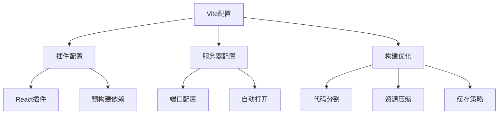

**图表来源**
- [vite.config.js:4-10](file://tech-website/vite.config.js#L4-L10)

#### 代码分割策略

1. **路由级懒加载**: 将页面组件转换为动态导入
2. **第三方库分离**: 将常用库单独打包
3. **CSS提取**: 提取样式到独立文件
4. **资源优化**: 图片和字体的优化处理

#### 资源压缩和缓存

1. **静态资源**: SVG 内联减少HTTP请求
2. **CSS优化**: 使用CSS变量减少重复
3. **字体优化**: 系统字体优先，减少字体加载
4. **缓存策略**: 合理的缓存头设置

### React 性能优化技巧

#### 组件重渲染优化

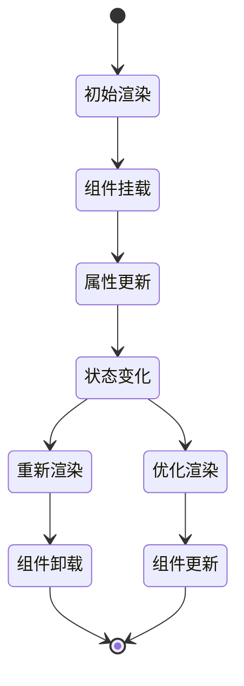

#### 虚拟DOM优化策略

1. **最小化渲染**: 使用 React.memo 避免不必要的重渲染
2. **状态提升**: 将共享状态提升到最近的共同祖先
3. **键值优化**: 为列表项提供稳定且唯一的key
4. **事件绑定**: 在组件外部绑定事件处理器

#### 内存泄漏防护

1. **清理函数**: 在 useEffect 中返回清理函数
2. **定时器管理**: 清理setTimeout和setInterval
3. **事件监听器**: 组件卸载时移除事件监听器
4. **订阅管理**: 取消网络请求和WebSocket连接

### 图片优化和资源压缩

#### 当前资源状况

1. **SVG内联**: 所有图标都是内联SVG，减少HTTP请求
2. **CSS变量**: 使用CSS变量统一管理主题色彩
3. **响应式设计**: 多媒体查询适配不同设备
4. **动画优化**: CSS动画优于JavaScript动画

#### 优化建议

1. **图片格式**: 使用WebP格式替代JPEG/PNG
2. **尺寸优化**: 提供多种尺寸的图片
3. **懒加载**: 为非首屏图片实现懒加载
4. **CDN集成**: 使用CDN加速静态资源

### 缓存策略应用

#### 浏览器缓存

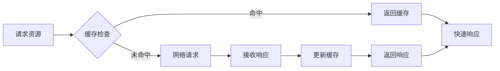

#### 缓存优化策略

1. **静态资源**: 长期缓存策略
2. **动态内容**: 短期缓存或不缓存
3. **版本控制**: 文件名包含哈希值
4. **HTTP缓存头**: 合理设置Cache-Control

**章节来源**
- [index.css:89-93](file://tech-website/src/index.css#L89-L93)
- [Home.css:282-287](file://tech-website/src/pages/Home.css#L282-L287)

## 故障排除指南

### 常见性能问题诊断

#### 构建性能问题

1. **启动缓慢**: 检查依赖数量和Vite配置
2. **热更新慢**: 排查大型依赖和插件冲突
3. **包体积大**: 分析bundle分析器输出

#### 运行时性能问题

1. **页面卡顿**: 使用浏览器性能面板分析
2. **内存泄漏**: 检查事件监听器和定时器
3. **重渲染过多**: 使用React DevTools分析

#### 优化实施检查清单

1. **代码分割**: 确认路由组件已实现懒加载
2. **资源优化**: 检查图片和字体优化情况
3. **缓存配置**: 验证HTTP缓存头设置
4. **CDN集成**: 确认CDN配置正确

**章节来源**
- [vite.config.js:6-9](file://tech-website/vite.config.js#L6-L9)

## 结论

技术网站项目具有良好的性能基础，采用现代化的技术栈和合理的架构设计。通过实施本文档提出的优化策略，可以进一步提升应用的性能表现：

### 关键优化成果

1. **构建性能**: Vite配置优化可显著提升开发体验
2. **运行时性能**: React优化技术减少不必要的重渲染
3. **资源优化**: 图片和CSS优化提升加载速度
4. **缓存策略**: 合理的缓存配置改善用户体验

### 持续改进方向

1. **监控体系建设**: 集成性能监控工具
2. **自动化测试**: 建立性能回归测试
3. **A/B测试**: 验证优化效果
4. **定期评估**: 建立性能评估机制

通过系统性的性能优化和持续改进，技术网站可以为用户提供更加流畅和高效的浏览体验。