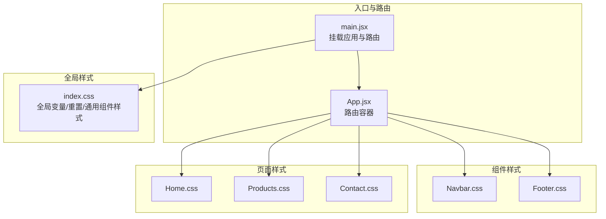
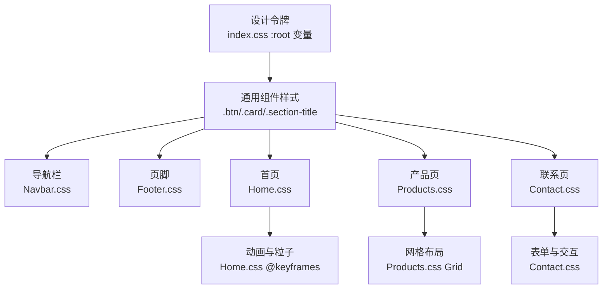
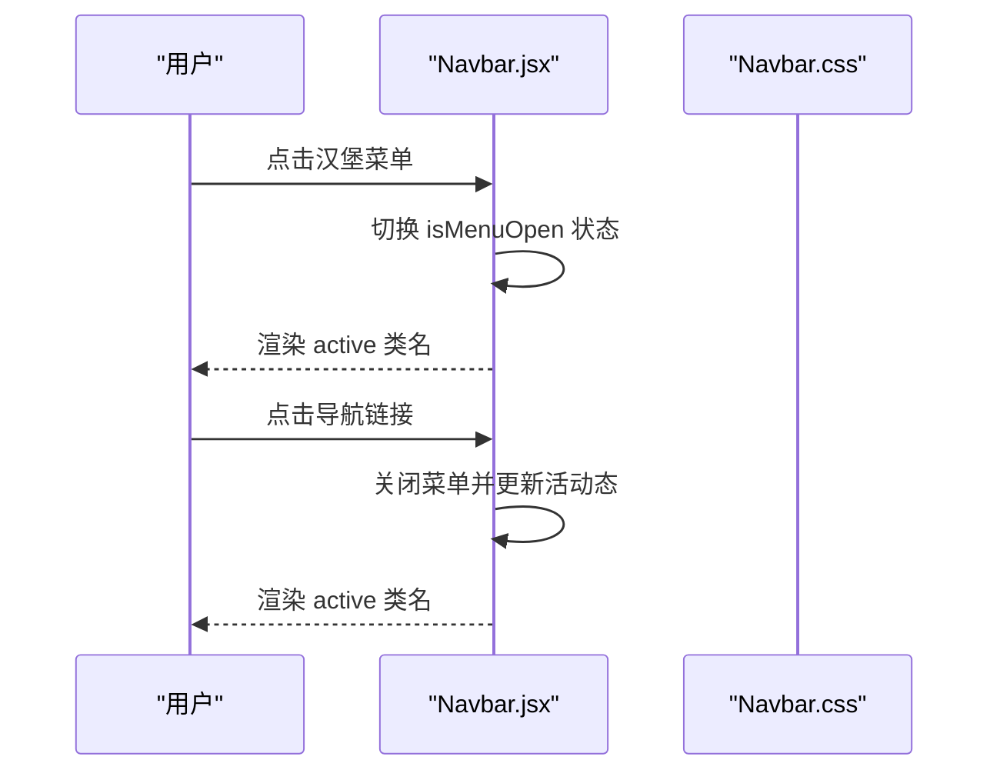
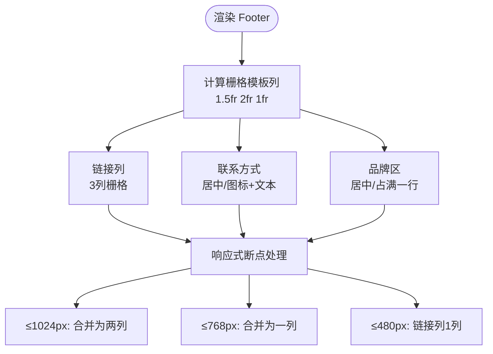
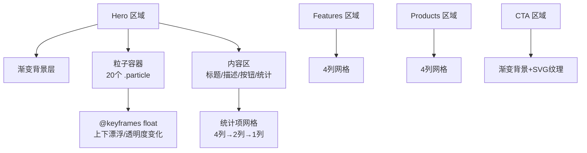
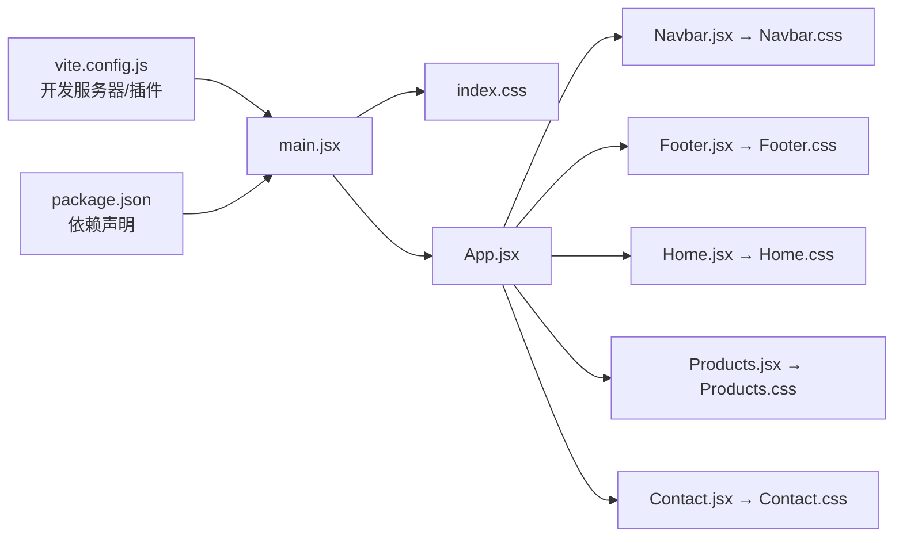

# 样式系统

<cite>
**本文引用的文件**
- [index.css](file://src/index.css)
- [Navbar.css](file://src/components/Navbar.css)
- [Footer.css](file://src/components/Footer.css)
- [Home.css](file://src/pages/Home.css)
- [Products.css](file://src/pages/Products.css)
- [Contact.css](file://src/pages/Contact.css)
- [Navbar.jsx](file://src/components/Navbar.jsx)
- [Footer.jsx](file://src/components/Footer.jsx)
- [Home.jsx](file://src/pages/Home.jsx)
- [Products.jsx](file://src/pages/Products.jsx)
- [Contact.jsx](file://src/pages/Contact.jsx)
- [App.jsx](file://src/App.jsx)
- [main.jsx](file://src/main.jsx)
- [vite.config.js](file://vite.config.js)
- [package.json](file://package.json)
</cite>

## 目录
1. [简介](#简介)
2. [项目结构](#项目结构)
3. [核心组件](#核心组件)
4. [架构总览](#架构总览)
5. [详细组件分析](#详细组件分析)
6. [依赖关系分析](#依赖关系分析)
7. [性能考量](#性能考量)
8. [故障排查指南](#故障排查指南)
9. [结论](#结论)
10. [附录](#附录)

## 简介
本样式系统服务于技术网站，采用现代前端工程化工具链（Vite + React），以CSS变量为核心的设计令牌，结合响应式断点策略与组件化样式组织，构建统一、可扩展且易于维护的视觉体系。系统覆盖导航、页脚、首页、产品页与联系页五大页面区域，并通过全局基础样式、通用组件样式与页面级样式分层管理，确保一致性与可复用性。

## 项目结构
样式系统遵循“页面级样式 + 组件级样式 + 全局基础样式”的分层组织方式，配合React组件按需引入对应CSS文件，形成清晰的模块边界与职责划分。

图表来源
- [main.jsx:1-14](file://src/main.jsx#L1-L14)
- [App.jsx:1-25](file://src/App.jsx#L1-L25)
- [index.css:1-228](file://src/index.css#L1-L228)
- [Navbar.css:1-155](file://src/components/Navbar.css#L1-L155)
- [Footer.css:1-186](file://src/components/Footer.css#L1-L186)
- [Home.css:1-399](file://src/pages/Home.css#L1-L399)
- [Products.css:1-230](file://src/pages/Products.css#L1-L230)
- [Contact.css:1-340](file://src/pages/Contact.css#L1-L340)

章节来源
- [main.jsx:1-14](file://src/main.jsx#L1-L14)
- [App.jsx:1-25](file://src/App.jsx#L1-L25)
- [index.css:1-228](file://src/index.css#L1-L228)

## 核心组件
- 全局CSS变量与基础样式：统一主色、辅色、中性色、背景色、阴影、圆角、间距、容器宽度与过渡时长，作为设计令牌贯穿全站。
- 通用组件样式：按钮、卡片、章节标题等基础UI构件，提供一致的交互与视觉反馈。
- 页面级样式：首页、产品页、联系页分别定义各自布局网格、动画与响应式规则。

章节来源
- [index.css:1-228](file://src/index.css#L1-L228)

## 架构总览
整体架构围绕“设计令牌（CSS变量）—通用组件样式—页面布局样式”三层展开，组件通过className引用对应样式类，页面通过Grid/Flex布局实现复杂结构，动画通过关键帧与过渡属性增强体验。

图表来源
- [index.css:1-228](file://src/index.css#L1-L228)
- [Navbar.css:1-155](file://src/components/Navbar.css#L1-L155)
- [Footer.css:1-186](file://src/components/Footer.css#L1-L186)
- [Home.css:1-399](file://src/pages/Home.css#L1-L399)
- [Products.css:1-230](file://src/pages/Products.css#L1-L230)
- [Contact.css:1-340](file://src/pages/Contact.css#L1-L340)

## 详细组件分析

### 导航栏组件（Navbar）
- 结构要点：固定定位、模糊背景、渐变文字、链接悬停下划线、移动端汉堡菜单。
- 交互要点：菜单开关状态切换、移动端菜单覆盖层与可见性控制。
- 响应式要点：在小屏设备显示汉堡菜单并切换为垂直堆叠布局。

图表来源
- [Navbar.jsx:1-67](file://src/components/Navbar.jsx#L1-L67)
- [Navbar.css:1-155](file://src/components/Navbar.css#L1-L155)

章节来源
- [Navbar.jsx:1-67](file://src/components/Navbar.jsx#L1-L67)
- [Navbar.css:1-155](file://src/components/Navbar.css#L1-L155)

### 页脚组件（Footer）
- 结构要点：品牌区、链接列、联系方式三栏栅格布局；底部版权与法律链接。
- 响应式要点：在中屏与小屏逐步合并为两列、一列布局，并调整对齐方式与间距。

图表来源
- [Footer.css:1-186](file://src/components/Footer.css#L1-L186)

章节来源
- [Footer.jsx:1-97](file://src/components/Footer.jsx#L1-L97)
- [Footer.css:1-186](file://src/components/Footer.css#L1-L186)

### 首页（Home）
- 布局要点：Hero区域相对定位、渐变背景与粒子动画；Features与Products双网格；CTA强调区块。
- 动画要点：粒子浮动关键帧、按钮与卡片hover变换、链接hover延伸。
- 响应式要点：在中屏与小屏将网格从4列降至2列/1列，Hero标题与按钮尺寸递减。

图表来源
- [Home.css:1-399](file://src/pages/Home.css#L1-L399)

章节来源
- [Home.jsx:1-230](file://src/pages/Home.jsx#L1-L230)
- [Home.css:1-399](file://src/pages/Home.css#L1-L399)

### 产品页（Products）
- 布局要点：页面头部渐变背景；分类标签滚动容器；产品列表网格；底部横幅CTA。
- 交互要点：分类标签hover与激活态；产品卡片hover提升与阴影变化。
- 响应式要点：在中屏将网格降为1列；小屏将横向布局改为纵向堆叠。

章节来源
- [Products.jsx:1-139](file://src/pages/Products.jsx#L1-L139)
- [Products.css:1-230](file://src/pages/Products.css#L1-L230)

### 联系页（Contact）
- 布局要点：页面头部渐变背景；左右两列栅格：表单区与信息区；地图占位区。
- 表单要点：必填星号、输入框聚焦高亮、提交按钮加载态、成功提示。
- 响应式要点：在中屏将两列合并为一列；小屏将信息卡片设为100%宽度。

章节来源
- [Contact.jsx:1-274](file://src/pages/Contact.jsx#L1-L274)
- [Contact.css:1-340](file://src/pages/Contact.css#L1-L340)

## 依赖关系分析
- 入口依赖：main.jsx 引入 index.css 并挂载 App；App 负责路由与组件装载。
- 组件依赖：各页面与组件通过 import 引入对应 CSS 文件，形成“组件→样式”的单向依赖。
- 工具链依赖：Vite 提供开发服务器与构建能力；React 生态负责组件渲染与路由。

图表来源
- [vite.config.js:1-11](file://vite.config.js#L1-L11)
- [package.json:1-23](file://package.json#L1-L23)
- [main.jsx:1-14](file://src/main.jsx#L1-L14)
- [App.jsx:1-25](file://src/App.jsx#L1-L25)
- [Navbar.jsx:1-67](file://src/components/Navbar.jsx#L1-L67)
- [Footer.jsx:1-97](file://src/components/Footer.jsx#L1-L97)
- [Home.jsx:1-230](file://src/pages/Home.jsx#L1-L230)
- [Products.jsx:1-139](file://src/pages/Products.jsx#L1-L139)
- [Contact.jsx:1-274](file://src/pages/Contact.jsx#L1-L274)

章节来源
- [vite.config.js:1-11](file://vite.config.js#L1-L11)
- [package.json:1-23](file://package.json#L1-L23)
- [main.jsx:1-14](file://src/main.jsx#L1-L14)
- [App.jsx:1-25](file://src/App.jsx#L1-L25)

## 性能考量
- CSS变量集中管理：通过 :root 统一颜色、阴影、圆角、间距与过渡，减少重复定义，便于主题切换与维护。
- 组件化样式：每个组件独立CSS文件，按需引入，避免全局污染，有利于Tree Shaking与按需加载。
- 响应式断点：在关键断点处调整容器内边距、字体大小与网格列数，兼顾可读性与渲染性能。
- 动画优化：使用transform与opacity等对合成层友好的属性，避免频繁触发回流；关键帧动画数量可控。
- 图标与背景：使用内联SVG与CSS渐变，减少HTTP请求；背景纹理采用data URI，适合小图标的场景。

## 故障排查指南
- 样式未生效
  - 检查组件是否正确引入对应CSS文件（如 Navbar.jsx → Navbar.css）。
  - 确认类名拼写与HTML结构一致。
- 响应式异常
  - 检查断点范围与媒体查询顺序，确保小屏规则覆盖大屏默认值。
  - 在浏览器开发者工具中切换设备模式验证断点行为。
- 动画卡顿
  - 使用transform/opacity替代width/height/left/top等触发布局的属性。
  - 控制动画元素数量，避免同时大量执行关键帧。
- 表单交互问题
  - 检查表单禁用态与加载态逻辑，确认按钮状态与事件绑定。
  - 校验必填字段与pattern正则，确保用户体验与数据质量。

## 结论
该样式系统以CSS变量为设计令牌，结合组件化与页面级样式的分层组织，实现了统一、可扩展且具备良好响应式表现的视觉体系。通过合理的断点策略、动画与交互细节，以及清晰的依赖关系，为后续的主题扩展与功能迭代提供了坚实基础。

## 附录

### 设计令牌（CSS变量）一览
- 主色与渐变：主色、主色浅/深、主色渐变
- 辅助色与中性色：辅助色、强调色、文本主次/浅色、边框色
- 背景色：主体背景、二级背景、深色背景、卡片背景
- 阴影：sm/md/lg/xl
- 圆角：sm/md/lg/xl
- 间距：xs/sm/md/lg/xl/2xl/3xl
- 容器：最大宽度、内边距
- 过渡：fast/normal/slow

章节来源
- [index.css:1-54](file://src/index.css#L1-L54)

### 响应式断点策略
- 1024px：调整容器内边距、章节标题与副标题字号；部分网格列数减少。
- 768px：导航菜单转为移动端布局；产品页分类滚动容器启用；联系页两列合并为一列。
- 480px：进一步缩小标题字号与间距，确保移动端可读性。

章节来源
- [index.css:192-228](file://src/index.css#L192-L228)
- [Home.css:312-399](file://src/pages/Home.css#L312-L399)
- [Products.css:173-230](file://src/pages/Products.css#L173-L230)
- [Contact.css:294-340](file://src/pages/Contact.css#L294-L340)
- [Navbar.css:121-155](file://src/components/Navbar.css#L121-L155)
- [Footer.css:127-186](file://src/components/Footer.css#L127-L186)

### Flexbox 与 CSS Grid 应用
- Flexbox：导航容器、按钮组、Hero动作区、联系页信息卡片布局。
- CSS Grid：首页与产品页的多列网格、页脚三栏布局、联系页左右两列布局。

章节来源
- [Navbar.css:14-19](file://src/components/Navbar.css#L14-L19)
- [Home.css:130-134](file://src/pages/Home.css#L130-L134)
- [Products.css:71-75](file://src/pages/Products.css#L71-L75)
- [Footer.css:14-20](file://src/components/Footer.css#L14-L20)
- [Contact.css:31-35](file://src/pages/Contact.css#L31-L35)

### 动画与视觉过渡
- 关键帧：粒子浮动（上下移动与透明度变化）。
- 过渡：按钮与卡片hover变换、链接hover延伸、导航菜单显隐过渡。
- 视觉纹理：CTA背景叠加SVG纹理，增强科技感。

章节来源
- [Home.css:30-49](file://src/pages/Home.css#L30-L49)
- [Home.css:124-126](file://src/pages/Home.css#L124-L126)
- [Home.css:180-182](file://src/pages/Home.css#L180-L182)
- [Home.css:268-287](file://src/pages/Home.css#L268-L287)

### 样式定制指南
- 主题切换建议：通过切换根元素的CSS变量值实现主题切换，无需修改组件样式代码。
- 组件扩展：新增类名时遵循现有命名规范，优先复用通用组件样式（如.btn、.card）。
- 响应式扩展：在现有断点基础上增加新的断点，确保上层样式不会被意外覆盖。

### 浏览器兼容性
- 使用现代CSS特性（CSS变量、Flexbox、Grid、backdrop-filter），建议在主流现代浏览器中运行。
- 对于不支持的特性，可通过降级方案或Polyfill补充，但当前代码未包含兼容性前缀。