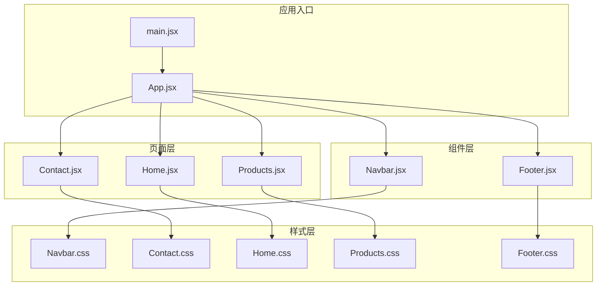
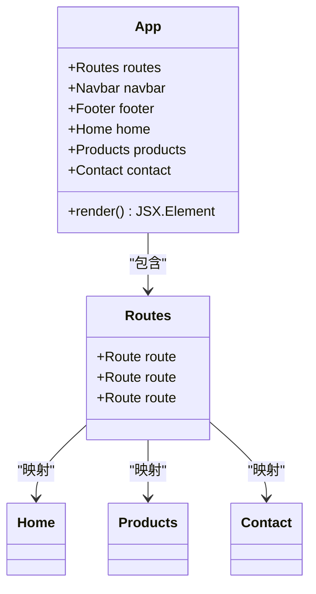
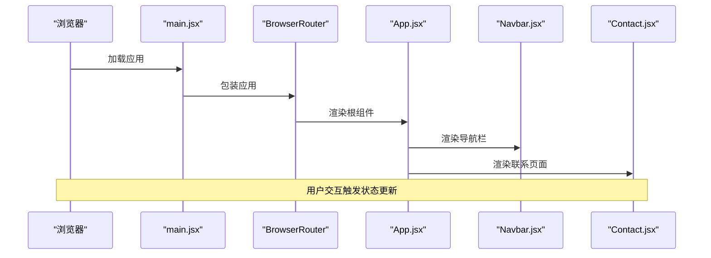
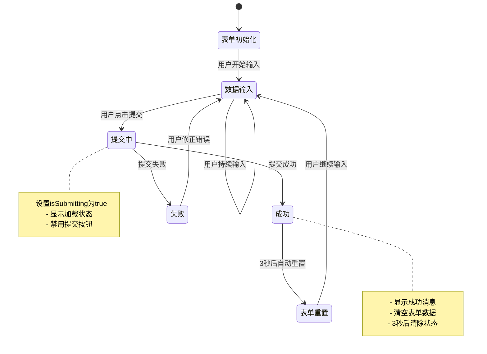
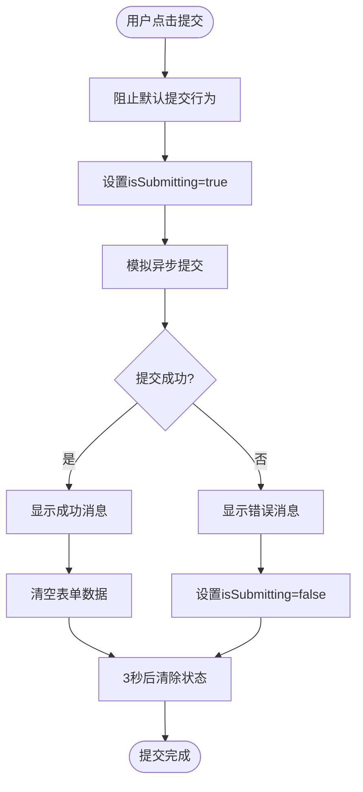
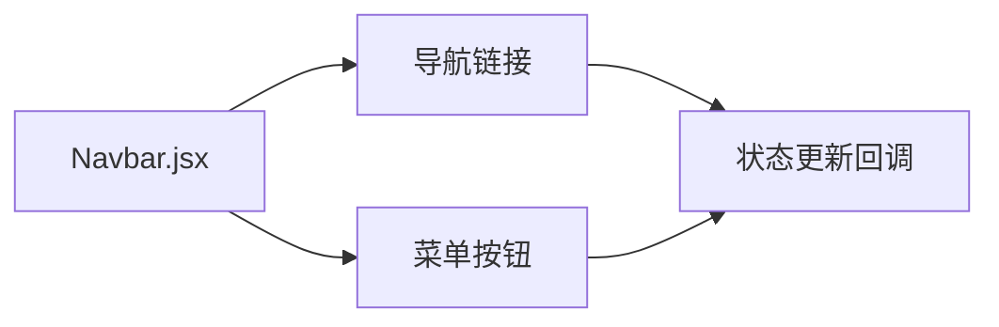
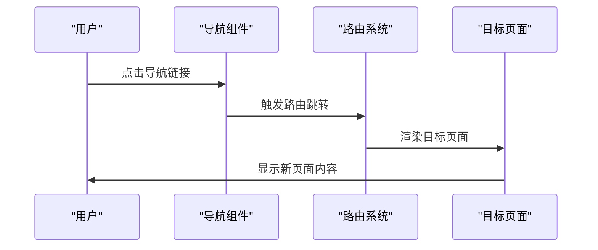

# 状态管理

<cite>
**本文引用的文件**
- [App.jsx](file://tech-website/src/App.jsx)
- [main.jsx](file://tech-website/src/main.jsx)
- [Navbar.jsx](file://tech-website/src/components/Navbar.jsx)
- [Contact.jsx](file://tech-website/src/pages/Contact.jsx)
- [Home.jsx](file://tech-website/src/pages/Home.jsx)
- [Products.jsx](file://tech-website/src/pages/Products.jsx)
- [Footer.jsx](file://tech-website/src/components/Footer.jsx)
- [package.json](file://tech-website/package.json)
</cite>

## 目录
1. [简介](#简介)
2. [项目结构](#项目结构)
3. [核心组件](#核心组件)
4. [架构概览](#架构概览)
5. [详细组件分析](#详细组件分析)
6. [依赖关系分析](#依赖关系分析)
7. [性能考虑](#性能考虑)
8. [故障排除指南](#故障排除指南)
9. [结论](#结论)

## 简介

本项目是一个技术网站的React应用程序，重点展示了现代前端开发中的状态管理最佳实践。通过分析导航组件和联系页面中的React Hooks使用，我们可以深入了解useState Hook在不同场景下的应用策略，包括菜单状态管理、表单状态处理、提交状态控制以及组件间通信机制。

该项目采用函数式组件和Hooks模式，展现了React 18+的现代化开发方式，为开发者提供了实用的状态管理参考案例。

## 项目结构

项目采用清晰的分层架构，按照功能模块组织代码：



**图表来源**
- [main.jsx:1-14](file://tech-website/src/main.jsx#L1-L14)
- [App.jsx:1-25](file://tech-website/src/App.jsx#L1-L25)

**章节来源**
- [main.jsx:1-14](file://tech-website/src/main.jsx#L1-L14)
- [App.jsx:1-25](file://tech-website/src/App.jsx#L1-L25)

## 核心组件

### 应用根组件

应用的根组件负责路由配置和页面布局管理：



**图表来源**
- [App.jsx:8-22](file://tech-website/src/App.jsx#L8-L22)

该组件展示了：
- 路由配置：使用React Router进行页面导航
- 组件组合：将导航栏、主内容区域和页脚组合在一起
- 页面映射：将URL路径映射到对应的页面组件

**章节来源**
- [App.jsx:1-25](file://tech-website/src/App.jsx#L1-L25)

## 架构概览

整个应用采用单页应用(SPA)架构，通过React Router实现客户端路由：



**图表来源**
- [main.jsx:7-13](file://tech-website/src/main.jsx#L7-L13)
- [App.jsx:8-22](file://tech-website/src/App.jsx#L8-L22)

## 详细组件分析

### 导航组件状态管理

导航组件是状态管理的典型示例，展示了菜单状态的本地管理：

```mermaid
classDiagram
class Navbar {
-boolean isMenuOpen
-location location
-navLinks[] navLinks
+useState() void
+useLocation() Location
+isActive(path) boolean
+render() JSX.Element
}
class NavLinks {
+string path
+string label
}
Navbar --> NavLinks : "使用"
Navbar --> "useState" : "管理菜单状态"
Navbar --> "useLocation" : "获取当前路由"
```

**图表来源**
- [Navbar.jsx:5-64](file://tech-website/src/components/Navbar.jsx#L5-L64)

#### 状态管理策略

导航组件使用useState Hook管理菜单展开状态：

- **状态声明**：`const [isMenuOpen, setIsMenuOpen] = useState(false)`
- **状态更新**：通过按钮点击事件切换菜单状态
- **状态清理**：点击导航链接时自动关闭菜单

#### 路由集成

组件集成了React Router的功能：

- 使用`useLocation` Hook获取当前路由信息
- 实现活动链接高亮显示
- 通过`Link`组件实现无刷新导航

**章节来源**
- [Navbar.jsx:1-67](file://tech-website/src/components/Navbar.jsx#L1-L67)

### 联系页面表单状态管理

联系页面展示了完整的表单状态管理，包括数据收集、验证和提交处理：



**图表来源**
- [Contact.jsx:4-43](file://tech-website/src/pages/Contact.jsx#L4-L43)

#### 状态结构设计

表单使用多个useState Hook管理不同类型的用户数据：

```javascript
// 主要表单数据
const [formData, setFormData] = useState({
    name: '',
    phone: '',
    company: '',
    email: '',
    message: ''
})

// 提交状态控制
const [isSubmitting, setIsSubmitting] = useState(false)
const [submitStatus, setSubmitStatus] = useState(null)
```

#### 输入处理机制

实现了统一的输入处理函数：

```javascript
const handleChange = (e) => {
    const { name, value } = e.target
    setFormData(prev => ({
        ...prev,
        [name]: value
    }))
}
```

这种设计具有以下优势：
- **单一数据源**：所有表单数据集中管理
- **响应式更新**：每个字段变化都会触发重新渲染
- **类型安全**：通过name属性确保数据完整性

#### 提交流程控制

提交过程包含完整的状态管理：



**图表来源**
- [Contact.jsx:24-43](file://tech-website/src/pages/Contact.jsx#L24-L43)

**章节来源**
- [Contact.jsx:1-274](file://tech-website/src/pages/Contact.jsx#L1-L274)

### 组件间通信策略

项目中的组件通信主要通过以下几种方式实现：

#### 1. Props传递

导航组件向子组件传递状态和方法：



#### 2. 路由集成

通过React Router实现页面间的导航和状态传递：



#### 3. 本地状态管理

各组件维护自己的本地状态，避免了全局状态管理的复杂性。

**章节来源**
- [Navbar.jsx:36-60](file://tech-website/src/components/Navbar.jsx#L36-L60)
- [App.jsx:13-17](file://tech-website/src/App.jsx#L13-L17)

## 依赖关系分析

项目的核心依赖关系如下：

```mermaid
graph TB
subgraph "运行时依赖"
REACT[react ^18.2.0]
REACTDOM[react-dom ^18.2.0]
ROUTER[react-router-dom ^6.20.0]
end
subgraph "开发时依赖"
VITE[vite ^5.0.0]
TYPES_REACT[@types/react ^18.2.37]
TYPES_REACTDOM[@types/react-dom ^18.2.15]
PLUGIN[@vitejs/plugin-react ^4.2.0]
end
subgraph "应用代码"
MAIN[main.jsx]
APP[App.jsx]
NAVBAR[Navbar.jsx]
CONTACT[Contact.jsx]
end
MAIN --> REACT
MAIN --> REACTDOM
MAIN --> ROUTER
APP --> REACT
APP --> ROUTER
APP --> NAVBAR
APP --> CONTACT
NAVBAR --> REACT
CONTACT --> REACT
```

**图表来源**
- [package.json:11-21](file://tech-website/package.json#L11-L21)

**章节来源**
- [package.json:1-23](file://tech-website/package.json#L1-L23)

## 性能考虑

### 状态更新优化

1. **批量状态更新**：使用对象解构避免不必要的状态更新
2. **条件渲染**：根据状态值决定是否显示特定元素
3. **事件处理优化**：在组件外部定义事件处理器以避免重复创建

### 渲染性能

1. **最小化重渲染**：只在必要时更新相关组件
2. **CSS类名动态绑定**：根据状态动态切换CSS类
3. **SVG图标复用**：通过内联SVG减少额外的资源请求

### 内存管理

1. **状态清理**：在组件卸载时清理定时器和事件监听器
2. **异步操作管理**：在组件卸载前取消未完成的异步请求

## 故障排除指南

### 常见问题及解决方案

#### 1. 状态不更新问题

**症状**：表单输入后UI不响应
**原因**：状态更新函数调用错误
**解决方案**：
- 确保使用正确的状态更新函数
- 检查事件处理器的this绑定
- 验证状态更新的语法正确性

#### 2. 路由状态冲突

**症状**：导航后状态没有重置
**原因**：组件状态没有在路由切换时重置
**解决方案**：
- 在组件卸载时清理状态
- 使用useEffect监听路由变化
- 实现状态重置逻辑

#### 3. 表单验证失效

**症状**：表单提交时验证规则不生效
**原因**：HTML5验证属性与JavaScript逻辑冲突
**解决方案**：
- 同步HTML5验证和JavaScript验证
- 确保验证逻辑在提交前执行
- 提供清晰的错误提示

### 调试技巧

1. **React DevTools**：使用组件树检查状态变化
2. **console.log**：在关键状态更新点添加日志
3. **条件断点**：在状态更新条件处设置断点
4. **性能面板**：监控组件渲染频率

**章节来源**
- [Contact.jsx:16-22](file://tech-website/src/pages/Contact.jsx#L16-L22)
- [Navbar.jsx:42-49](file://tech-website/src/components/Navbar.jsx#L42-L49)

## 结论

本项目展示了React Hooks在实际应用中的最佳实践，特别是在状态管理方面的优秀实践：

### 主要收获

1. **局部状态管理**：通过useState实现组件内部状态管理
2. **表单状态处理**：统一的表单数据管理和提交流程控制
3. **组件通信**：通过Props和路由实现组件间通信
4. **用户体验**：通过状态反馈提供良好的用户交互体验

### 最佳实践总结

1. **状态设计原则**：保持状态结构简单明了，避免过度嵌套
2. **事件处理模式**：使用统一的事件处理函数提高代码可维护性
3. **状态更新策略**：合理使用状态更新函数，避免不必要的重渲染
4. **错误处理机制**：在状态管理中集成错误处理和用户反馈

### 扩展建议

对于更复杂的应用场景，可以考虑：
1. **状态提升**：当多个组件需要共享状态时，考虑将状态提升到共同祖先组件
2. **Context API**：用于跨层级组件的状态共享
3. **自定义Hook**：封装复杂的状态逻辑，提高代码复用性
4. **状态管理库**：对于大型应用，可以考虑引入Redux或Zustand等状态管理库

这个项目为开发者提供了一个实用的React状态管理参考，展示了如何在实际项目中有效地使用React Hooks来构建高性能、易维护的用户界面。