# 导航栏组件 (Navbar)

<cite>
**本文档引用的文件**
- [Navbar.jsx](file://tech-website/src/components/Navbar.jsx)
- [Navbar.css](file://tech-website/src/components/Navbar.css)
- [App.jsx](file://tech-website/src/App.jsx)
- [main.jsx](file://tech-website/src/main.jsx)
- [Home.jsx](file://tech-website/src/pages/Home.jsx)
- [Products.jsx](file://tech-website/src/pages/Products.jsx)
- [Contact.jsx](file://tech-website/src/pages/Contact.jsx)
- [index.css](file://tech-website/src/index.css)
</cite>

## 目录
1. [简介](#简介)
2. [项目结构](#项目结构)
3. [核心组件](#核心组件)
4. [架构概览](#架构概览)
5. [详细组件分析](#详细组件分析)
6. [依赖关系分析](#依赖关系分析)
7. [性能考虑](#性能考虑)
8. [故障排除指南](#故障排除指南)
9. [结论](#结论)

## 简介

导航栏组件是现代企业网站的重要组成部分，负责提供网站的主要导航功能和用户体验。本文档深入分析了基于React和React Router构建的Navbar组件，详细解析其固定定位设计、品牌标识展示、主导航菜单组织结构以及移动端响应式设计的完整实现。

该组件采用现代化的设计理念，结合CSS变量系统和渐变色彩，为用户提供流畅的导航体验。通过使用React Hooks进行状态管理，实现了菜单开关的动态控制和活动状态的智能识别。

## 项目结构

导航栏组件位于项目的组件目录中，与页面组件和样式文件共同构成了完整的前端架构。

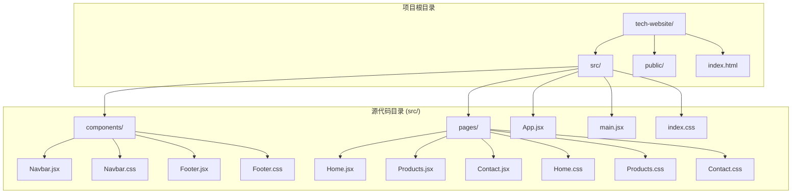

**图表来源**
- [Navbar.jsx:1-67](file://tech-website/src/components/Navbar.jsx#L1-L67)
- [App.jsx:1-25](file://tech-website/src/App.jsx#L1-L25)

**章节来源**
- [Navbar.jsx:1-67](file://tech-website/src/components/Navbar.jsx#L1-L67)
- [App.jsx:1-25](file://tech-website/src/App.jsx#L1-L25)
- [main.jsx:1-14](file://tech-website/src/main.jsx#L1-L14)

## 核心组件

### 组件架构概述

Navbar组件是一个无状态函数组件，但内部使用了React Hooks来管理本地状态。组件的核心功能包括：

- **固定定位导航栏**：使用`position: fixed`确保导航栏始终显示在页面顶部
- **品牌标识展示**：包含SVG图标和品牌文字的组合标识
- **主导航菜单**：动态生成的导航链接列表
- **移动端响应式设计**：汉堡菜单的完整实现
- **活动状态指示**：基于当前路由的自动高亮功能

### 状态管理机制

组件使用`useState` Hook管理菜单开关状态：

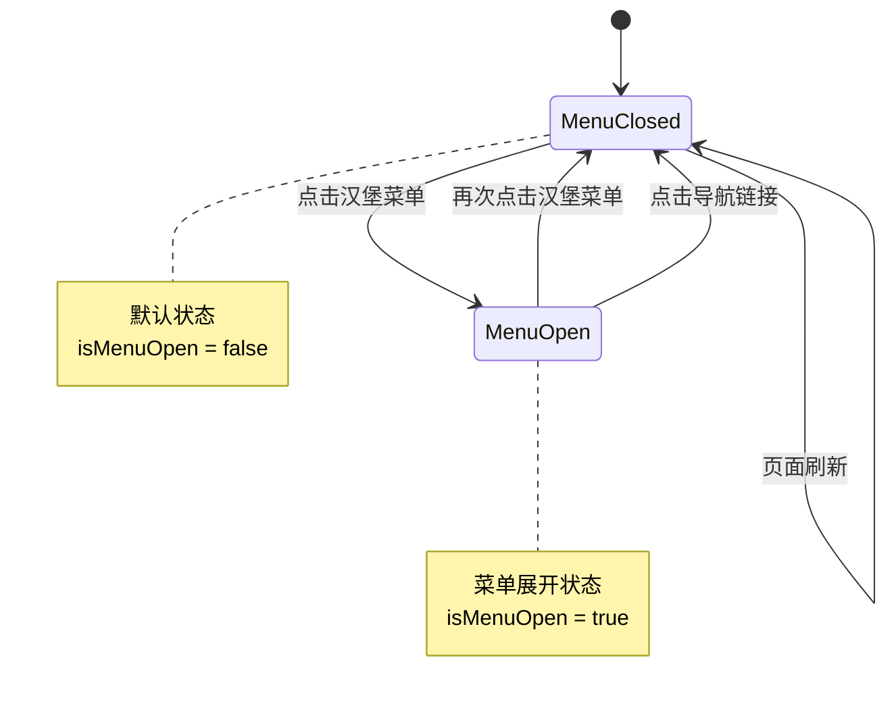

**图表来源**
- [Navbar.jsx:6-6](file://tech-website/src/components/Navbar.jsx#L6-L6)

### 导航链接配置

组件通过一个静态数组定义导航链接，便于维护和扩展：

| 路径 | 标签 | 功能 |
|------|------|------|
| `/` | 首页 | 网站主页面入口 |
| `/products` | 产品 | 产品和服务展示页面 |
| `/contact` | 联系我们 | 联系信息和表单页面 |

**章节来源**
- [Navbar.jsx:9-13](file://tech-website/src/components/Navbar.jsx#L9-L13)

## 架构概览

### 整体架构设计

导航栏组件在整个应用架构中扮演着关键角色，作为应用的顶层UI组件之一，与路由系统紧密集成。

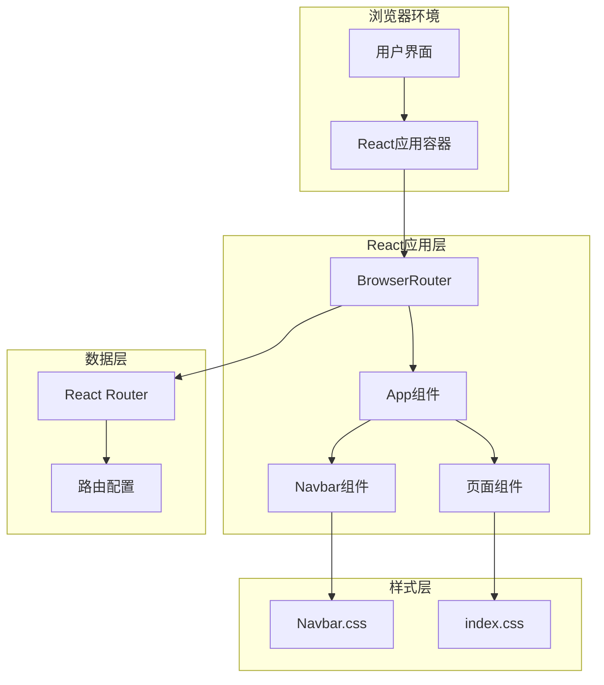

**图表来源**
- [main.jsx:7-12](file://tech-website/src/main.jsx#L7-L12)
- [App.jsx:8-22](file://tech-website/src/App.jsx#L8-L22)

### 组件间交互流程

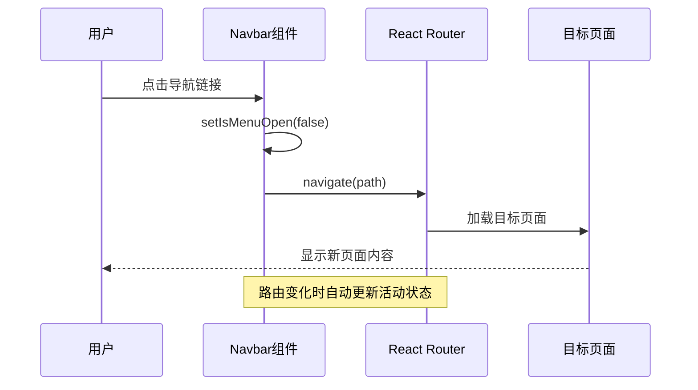

**图表来源**
- [Navbar.jsx:42-49](file://tech-website/src/components/Navbar.jsx#L42-L49)
- [Navbar.jsx:15-15](file://tech-website/src/components/Navbar.jsx#L15-L15)

## 详细组件分析

### 固定定位设计

导航栏采用了先进的固定定位技术，确保在滚动过程中始终保持可见。

#### CSS固定定位实现

```mermaid
flowchart TD
A[导航栏容器] --> B[position: fixed]
B --> C[top: 0]
B --> D[left: 0]
B --> E[right: 0]
B --> F[z-index: 1000]
B --> G[backdrop-filter: blur(10px)]
B --> H[box-shadow: var(--shadow-sm)]
I[背景效果] --> J[rgba(255, 255, 255, 0.95)]
J --> K[毛玻璃效果]
L[过渡动画] --> M[transition: all var(--transition-normal)]
```

**图表来源**
- [Navbar.css:3-12](file://tech-website/src/components/Navbar.css#L3-L12)

#### 品牌标识设计

品牌标识采用SVG图标与文本的组合设计，体现了现代科技感。

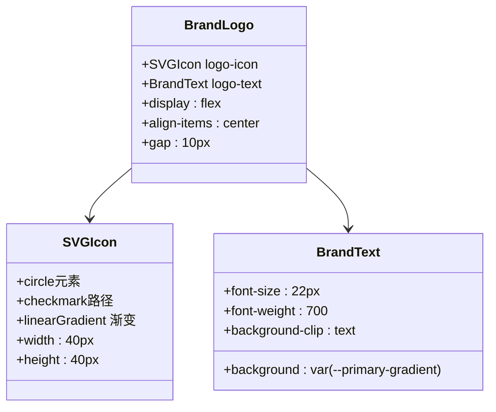

**图表来源**
- [Navbar.jsx:20-34](file://tech-website/src/components/Navbar.jsx#L20-L34)
- [Navbar.css:29-46](file://tech-website/src/components/Navbar.css#L29-L46)

**章节来源**
- [Navbar.jsx:20-34](file://tech-website/src/components/Navbar.jsx#L20-L34)
- [Navbar.css:21-46](file://tech-website/src/components/Navbar.css#L21-L46)

### 主导航菜单组织

主导航菜单采用Flex布局，提供了清晰的视觉层次和良好的用户体验。

#### 菜单链接样式系统

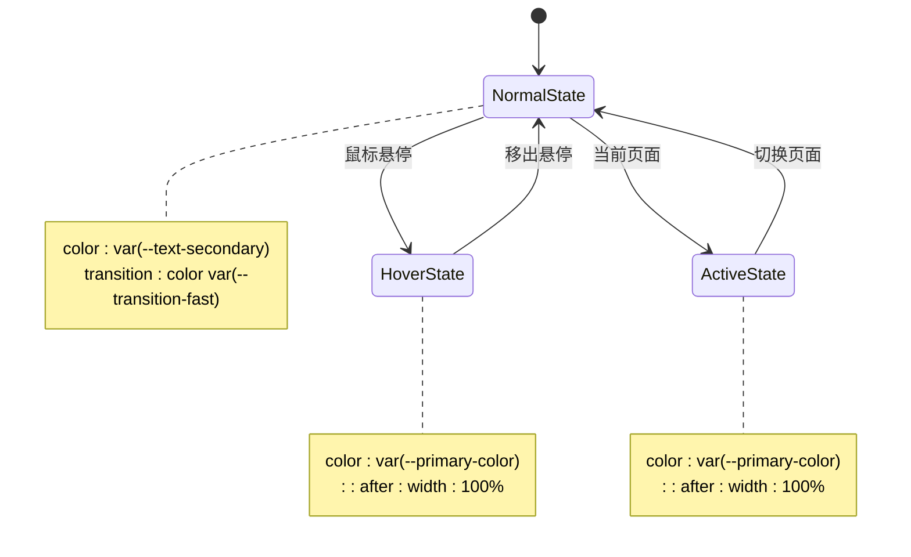

**图表来源**
- [Navbar.css:55-82](file://tech-website/src/components/Navbar.css#L55-L82)

#### CTA按钮设计

导航栏右侧的行动号召按钮采用了渐变色彩设计，与整体主题保持一致。

**章节来源**
- [Navbar.jsx:47-49](file://tech-website/src/components/Navbar.jsx#L47-L49)
- [Navbar.css:84-87](file://tech-website/src/components/Navbar.css#L84-L87)

### 移动端响应式设计

移动端响应式设计是现代Web开发的关键要素，Navbar组件提供了完整的移动端适配方案。

#### 汉堡菜单实现

```mermaid
flowchart TD
A[汉堡菜单按钮] --> B[三线段元素]
B --> C[span:nth-child(1)]
B --> D[span:nth-child(2)]
B --> E[span:nth-child(3)]
F[激活状态] --> G[.navbar-toggle.active]
G --> H[transform: rotate(45deg)]
G --> I[opacity: 0]
G --> J[transform: rotate(-45deg)]
K[媒体查询] --> L[@media (max-width: 768px)]
L --> M[display: flex]
L --> N[position: fixed]
L --> O[full-screen overlay]
```

**图表来源**
- [Navbar.jsx:52-60](file://tech-website/src/components/Navbar.jsx#L52-L60)
- [Navbar.css:90-119](file://tech-website/src/components/Navbar.css#L90-L119)
- [Navbar.css:122-145](file://tech-website/src/components/Navbar.css#L122-L145)

#### 移动端菜单展开动画

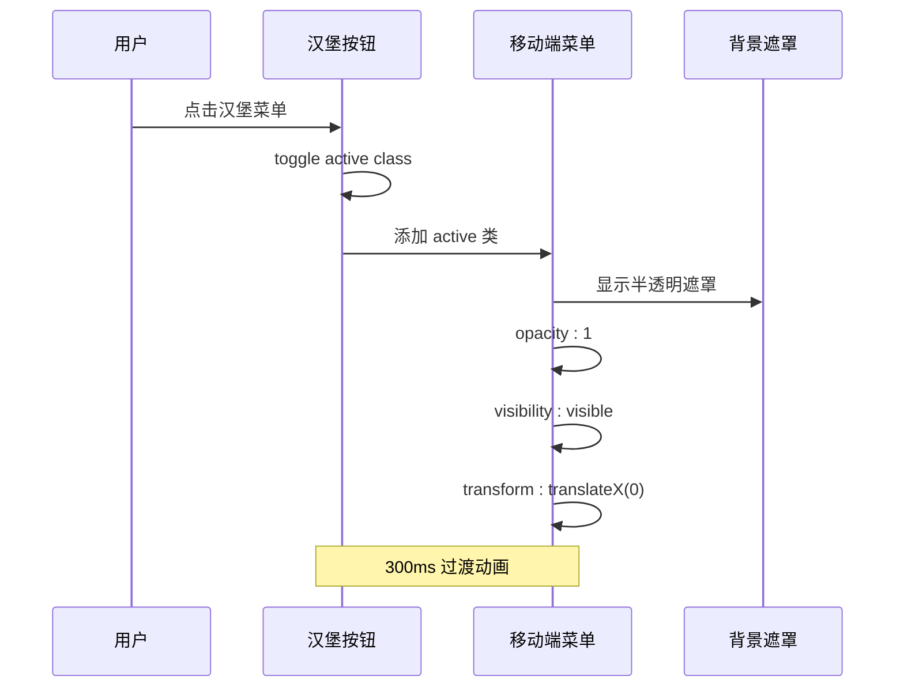

**图表来源**
- [Navbar.css:127-145](file://tech-website/src/components/Navbar.css#L127-L145)

**章节来源**
- [Navbar.jsx:52-60](file://tech-website/src/components/Navbar.jsx#L52-L60)
- [Navbar.css:121-154](file://tech-website/src/components/Navbar.css#L121-L154)

### 活动状态指示器

活动状态指示器是导航栏的核心功能之一，能够根据当前路由自动高亮对应的导航项。

#### 路由状态检测机制

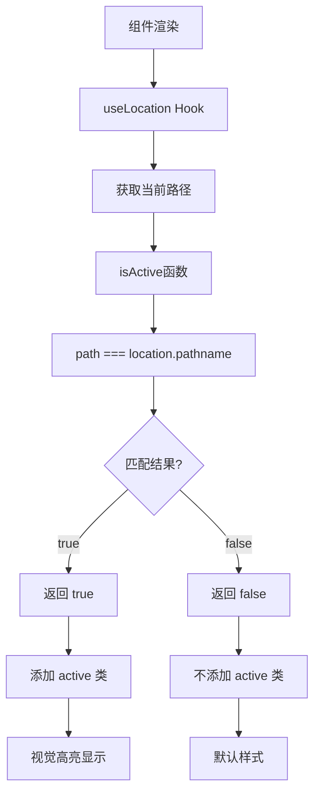

**图表来源**
- [Navbar.jsx:7-15](file://tech-website/src/components/Navbar.jsx#L7-L15)
- [Navbar.jsx:15-15](file://tech-website/src/components/Navbar.jsx#L15-L15)

#### CSS活动状态样式

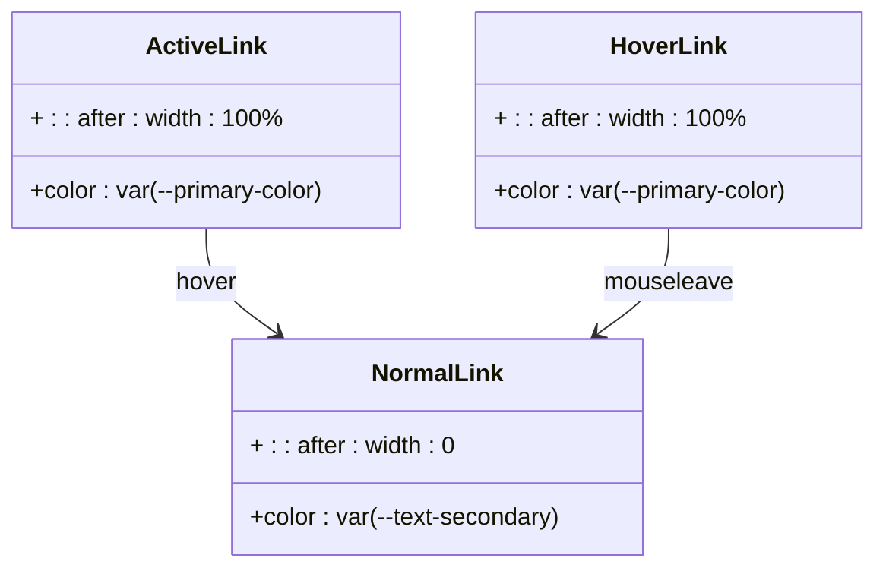

**图表来源**
- [Navbar.css:74-82](file://tech-website/src/components/Navbar.css#L74-L82)

**章节来源**
- [Navbar.jsx:15-15](file://tech-website/src/components/Navbar.jsx#L15-L15)
- [Navbar.css:74-82](file://tech-website/src/components/Navbar.css#L74-L82)

### 样式定制选项

组件提供了丰富的CSS变量定制选项，支持主题的灵活调整。

#### CSS变量系统

| 变量名 | 默认值 | 用途 |
|--------|--------|------|
| `--primary-color` | `#0066ff` | 主色调蓝色 |
| `--primary-gradient` | `linear-gradient(135deg, #0066ff 0%, #00c6ff 100%)` | 渐变色彩 |
| `--text-primary` | `#1a1a2e` | 主要文字颜色 |
| `--text-secondary` | `#4a5568` | 次要文字颜色 |
| `--bg-primary` | `#ffffff` | 主背景色 |
| `--shadow-sm` | `0 1px 2px 0 rgba(0, 0, 0, 0.05)` | 小阴影 |
| `--transition-normal` | `0.3s ease` | 标准过渡时间 |

**章节来源**
- [index.css:2-54](file://tech-website/src/index.css#L2-L54)
- [Navbar.css:1-12](file://tech-website/src/components/Navbar.css#L1-L12)

## 依赖关系分析

### 外部依赖

Navbar组件依赖于多个外部库和框架：

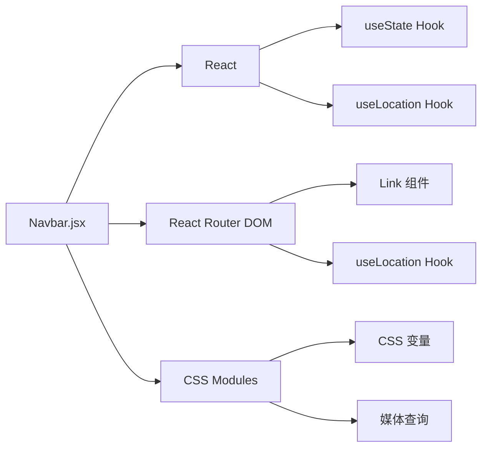

**图表来源**
- [Navbar.jsx:1-3](file://tech-website/src/components/Navbar.jsx#L1-L3)

### 内部依赖关系

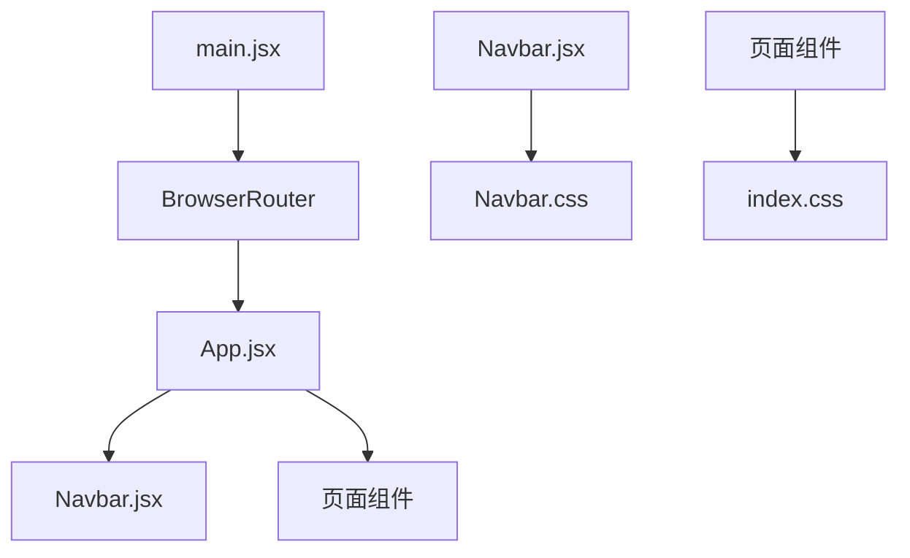

**图表来源**
- [App.jsx:1-7](file://tech-website/src/App.jsx#L1-L7)
- [main.jsx:1-14](file://tech-website/src/main.jsx#L1-L14)

**章节来源**
- [Navbar.jsx:1-3](file://tech-website/src/components/Navbar.jsx#L1-L3)
- [App.jsx:1-7](file://tech-website/src/App.jsx#L1-L7)
- [main.jsx:1-14](file://tech-website/src/main.jsx#L1-L14)

## 性能考虑

### 渲染优化

Navbar组件采用了多项性能优化策略：

1. **函数组件优化**：使用纯函数组件减少不必要的重渲染
2. **状态局部化**：仅在组件内部管理菜单状态
3. **CSS变量缓存**：利用CSS变量避免重复计算
4. **事件委托**：通过onClick事件处理减少事件监听器数量

### 内存管理

组件在设计时考虑了内存使用效率：

- 使用`useState`管理最小必要状态
- 避免在组件内创建新的函数实例
- 合理使用CSS类名而非内联样式

## 故障排除指南

### 常见问题及解决方案

#### 活动状态不正确

**问题描述**：导航项无法正确高亮显示当前页面

**可能原因**：
1. 路由配置错误
2. isActive函数逻辑问题
3. CSS类名冲突

**解决方案**：
1. 检查路由路径配置
2. 验证isActive函数实现
3. 确认CSS类名唯一性

#### 移动端菜单无法展开

**问题描述**：汉堡菜单在移动端无法正常显示

**可能原因**：
1. CSS媒体查询未生效
2. JavaScript事件绑定失败
3. z-index层级问题

**解决方案**：
1. 检查CSS媒体查询语法
2. 验证onClick事件绑定
3. 调整z-index层级设置

#### 品牌图标显示异常

**问题描述**：SVG图标在某些浏览器中显示不正确

**可能原因**：
1. SVG兼容性问题
2. CSS样式覆盖
3. 资源加载失败

**解决方案**：
1. 检查SVG语法完整性
2. 验证CSS选择器优先级
3. 确认资源路径正确性

**章节来源**
- [Navbar.jsx:15-15](file://tech-website/src/components/Navbar.jsx#L15-L15)
- [Navbar.css:122-154](file://tech-website/src/components/Navbar.css#L122-L154)

## 结论

Navbar组件展现了现代React应用开发的最佳实践，通过精心设计的架构和实现细节，为用户提供了优秀的导航体验。组件不仅实现了基本的导航功能，还融入了响应式设计、活动状态指示、品牌标识展示等多个高级特性。

该组件的成功之处在于：

1. **架构清晰**：组件职责单一，易于维护和扩展
2. **性能优秀**：采用函数组件和合理的状态管理
3. **用户体验良好**：响应式设计和动画效果提升了交互体验
4. **可定制性强**：通过CSS变量系统支持主题定制
5. **代码质量高**：遵循React最佳实践和ESLint规范

未来可以考虑的功能增强包括：
- 添加键盘导航支持
- 实现菜单项的动态加载
- 增加无障碍访问功能
- 支持更多自定义配置选项