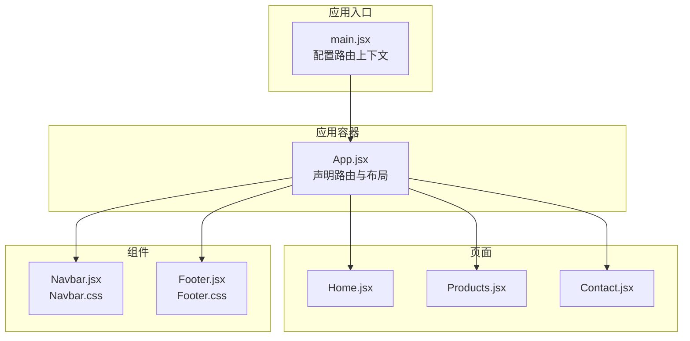
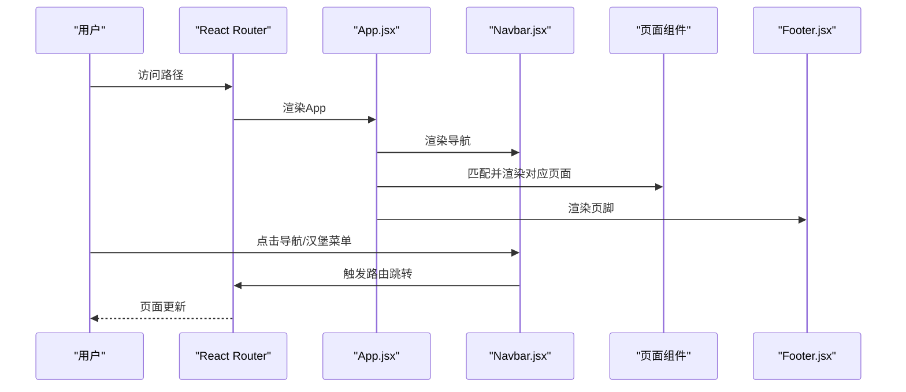
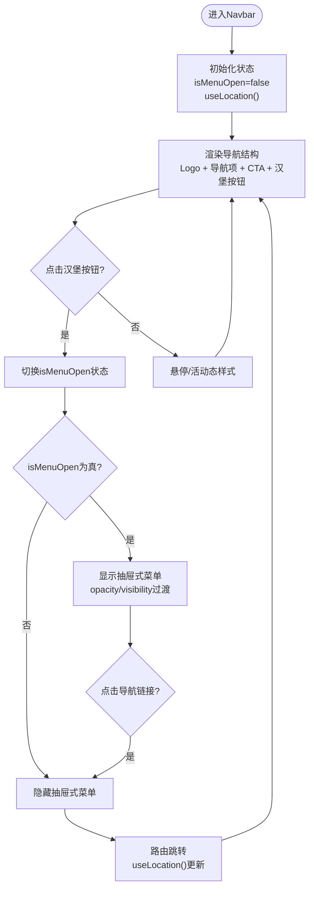
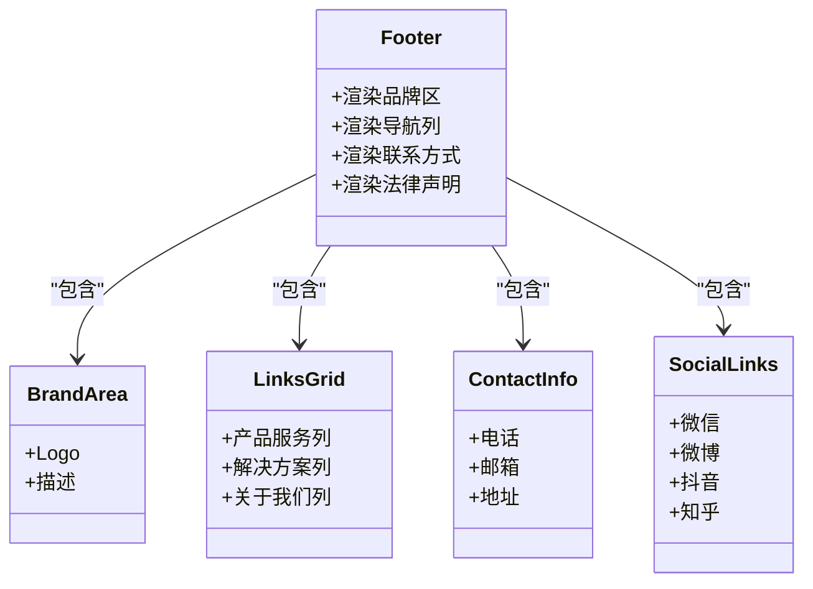
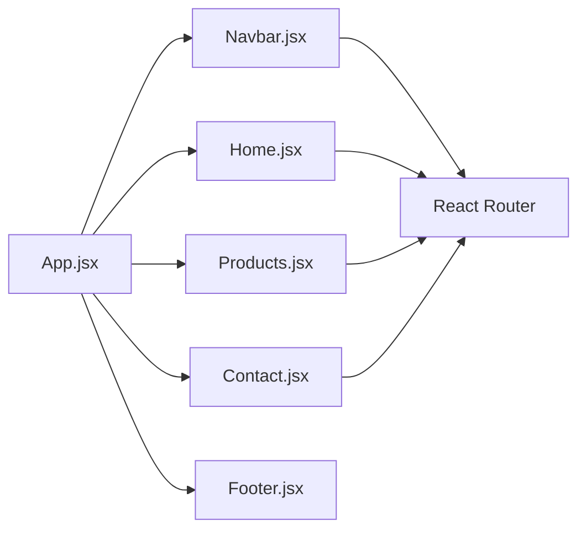
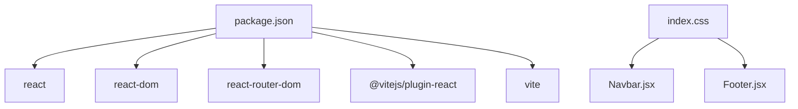

# 组件系统

<cite>
**本文引用的文件**
- [Navbar.jsx](file://src/components/Navbar.jsx)
- [Navbar.css](file://src/components/Navbar.css)
- [Footer.jsx](file://src/components/Footer.jsx)
- [Footer.css](file://src/components/Footer.css)
- [App.jsx](file://src/App.jsx)
- [Home.jsx](file://src/pages/Home.jsx)
- [Products.jsx](file://src/pages/Products.jsx)
- [Contact.jsx](file://src/pages/Contact.jsx)
- [index.css](file://src/index.css)
- [main.jsx](file://src/main.jsx)
- [package.json](file://package.json)
</cite>

## 目录
1. [简介](#简介)
2. [项目结构](#项目结构)
3. [核心组件](#核心组件)
4. [架构总览](#架构总览)
5. [组件详解](#组件详解)
6. [依赖关系分析](#依赖关系分析)
7. [性能考量](#性能考量)
8. [故障排查指南](#故障排查指南)
9. [结论](#结论)
10. [附录](#附录)

## 简介
本文件系统性梳理技术网站的可复用UI组件体系，重点围绕导航组件Navbar与页脚组件Footer展开，覆盖其导航功能、移动端响应式设计、活动状态管理、汉堡菜单交互逻辑；同时阐述Footer的企业信息展示、联系信息与社交媒体链接功能。文档还总结了组件的设计原则、Props接口建议、事件处理机制、样式组织方式，并给出使用示例、自定义配置与扩展方法，以及组件间协作与数据传递模式，帮助开发者快速理解并高效扩展组件库。

## 项目结构
该网站采用基于React + Vite的前端工程，组件位于src/components目录，页面位于src/pages目录，全局样式在src/index.css中集中定义，应用入口在src/main.jsx中配置路由上下文并挂载根组件App.jsx。

图表来源
- [main.jsx:1-14](file://src/main.jsx#L1-L14)
- [App.jsx:1-25](file://src/App.jsx#L1-L25)
- [Navbar.jsx:1-67](file://src/components/Navbar.jsx#L1-L67)
- [Footer.jsx:1-97](file://src/components/Footer.jsx#L1-L97)
- [Home.jsx:1-230](file://src/pages/Home.jsx#L1-L230)
- [Products.jsx:1-139](file://src/pages/Products.jsx#L1-L139)
- [Contact.jsx:1-274](file://src/pages/Contact.jsx#L1-L274)

章节来源
- [main.jsx:1-14](file://src/main.jsx#L1-L14)
- [App.jsx:1-25](file://src/App.jsx#L1-L25)

## 核心组件
- Navbar：固定式导航栏，包含品牌Logo、主导航链接、CTA按钮与汉堡菜单。通过路由位置判断活动状态，移动端以抽屉式菜单呈现，支持汉堡菜单的开合动画与点击关闭行为。
- Footer：企业信息展示区，包含品牌信息、产品与解决方案导航、联系方式与法律声明，提供响应式网格布局与社交媒体图标链接。

章节来源
- [Navbar.jsx:1-67](file://src/components/Navbar.jsx#L1-L67)
- [Navbar.css:1-155](file://src/components/Navbar.css#L1-L155)
- [Footer.jsx:1-97](file://src/components/Footer.jsx#L1-L97)
- [Footer.css:1-186](file://src/components/Footer.css#L1-L186)

## 架构总览
组件与页面通过React Router进行路由编排，Navbar与Footer作为应用级布局组件贯穿各页面，形成统一的品牌视觉与导航体验。

图表来源
- [App.jsx:8-22](file://src/App.jsx#L8-L22)
- [Navbar.jsx:15-42](file://src/components/Navbar.jsx#L15-L42)
- [main.jsx:7-13](file://src/main.jsx#L7-L13)

## 组件详解

### Navbar组件
- 导航功能
  - 使用路由位置判断当前活动链接，为活动项添加样式类，确保用户明确当前位置。
  - 导航项包含首页、产品、联系我们，底部附加“免费试用”CTA按钮。
- 移动端响应式设计
  - 在768px以下断点显示汉堡菜单按钮，隐藏桌面主导航。
  - 抽屉式菜单覆盖全屏，通过透明度与可见性控制显隐，配合过渡动画。
  - 汉堡菜单按钮在激活时旋转形成“X”形状，提供直观反馈。
- 活动状态管理
  - 通过useLocation与isActive函数比较当前路径与导航项路径，动态设置活动样式。
  - 点击任一导航链接会自动关闭移动端菜单，改善移动端交互体验。
- 设计原则
  - 固定定位与模糊背景增强可读性；渐变主色突出品牌调性。
  - 悬停与活动态均提供下划线指示，强调导航意图。
- Props接口建议
  - 当前组件未接收外部Props，若需扩展，建议新增：
    - links: 导航项数组（包含path与label）
    - logo: 自定义Logo节点
    - cta: 自定义CTA文本与链接
    - onLinkClick: 点击导航项回调
- 事件处理机制
  - 汉堡菜单按钮：切换isMenuOpen状态
  - 导航链接：触发路由跳转并关闭菜单
- 样式组织方式
  - 使用CSS变量统一主题色、阴影、圆角与间距，便于全局一致性与主题切换。
  - 媒体查询分层适配不同屏幕尺寸，优先保证移动端可用性。

图表来源
- [Navbar.jsx:5-64](file://src/components/Navbar.jsx#L5-L64)
- [Navbar.css:121-154](file://src/components/Navbar.css#L121-L154)

章节来源
- [Navbar.jsx:1-67](file://src/components/Navbar.jsx#L1-L67)
- [Navbar.css:1-155](file://src/components/Navbar.css#L1-L155)

### Footer组件
- 企业信息展示
  - 品牌Logo与简短描述，强化品牌识别。
- 导航与分类
  - 三列式链接区，分别展示产品服务、解决方案、关于我们，便于用户快速定位内容。
- 联系信息
  - 提供电话、邮箱、地址等基础联系信息，支持点击拨号/邮件/地图跳转。
- 社交媒体链接
  - 微信、微博、抖音、知乎等图标链接，提供关注入口与二维码提示。
- 设计原则
  - 采用深色背景与高对比度文字，确保信息层级清晰。
  - 响应式网格布局：在不同断点下调整列数与对齐方式，保证移动端阅读体验。
- Props接口建议
  - 当前组件未接收外部Props，若需扩展，建议新增：
    - brand: 品牌信息对象（含Logo与描述）
    - links: 导航分组数组
    - contact: 联系信息数组
    - social: 社交媒体链接数组
    - legal: 法律声明链接数组
- 事件处理机制
  - 外链点击由浏览器默认行为处理，无需额外事件绑定。
- 样式组织方式
  - 使用CSS Grid实现主内容区布局，媒体查询在1024px、768px、480px断点下逐步简化布局。

图表来源
- [Footer.jsx:4-96](file://src/components/Footer.jsx#L4-L96)
- [Footer.css:14-185](file://src/components/Footer.css#L14-L185)

章节来源
- [Footer.jsx:1-97](file://src/components/Footer.jsx#L1-L97)
- [Footer.css:1-186](file://src/components/Footer.css#L1-L186)

### 组件协作与数据传递
- App.jsx负责声明路由与布局，Navbar与Footer作为应用级组件贯穿所有页面。
- Navbar通过路由位置判断活动状态，实现跨页面的一致导航体验。
- 页面组件（Home、Products、Contact）各自负责业务内容渲染，与Navbar/Footers无直接耦合。

图表来源
- [App.jsx:8-22](file://src/App.jsx#L8-L22)
- [main.jsx:7-13](file://src/main.jsx#L7-L13)

章节来源
- [App.jsx:1-25](file://src/App.jsx#L1-L25)
- [main.jsx:1-14](file://src/main.jsx#L1-L14)

## 依赖关系分析
- 运行时依赖
  - react、react-dom、react-router-dom：提供组件框架与路由能力。
- 开发时依赖
  - @vitejs/plugin-react、vite：构建与开发服务器。
- 样式依赖
  - 全局CSS变量与通用按钮、卡片等基础样式的集中定义，为Navbar与Footer提供一致的视觉语言。

图表来源
- [package.json:11-22](file://package.json#L11-L22)
- [index.css:1-228](file://src/index.css#L1-L228)

章节来源
- [package.json:1-23](file://package.json#L1-L23)
- [index.css:1-228](file://src/index.css#L1-L228)

## 性能考量
- 组件状态最小化：Navbar仅维护isMenuOpen与location，避免不必要的重渲染。
- 条件渲染：移动端菜单仅在需要时渲染，减少DOM节点数量。
- CSS变量与媒体查询：统一主题与断点，降低重复样式与计算开销。
- 路由切换：使用React Router进行客户端导航，避免整页刷新。

## 故障排查指南
- 活动状态不更新
  - 检查路由是否正确配置BrowserRouter上下文。
  - 确认isActive逻辑与实际路径一致。
- 移动端菜单无法关闭
  - 确认导航链接的onClick回调是否调用关闭菜单逻辑。
- 样式异常
  - 检查全局CSS变量是否正确加载，确认断点与媒体查询生效。
- 外链不可点击
  - 确认外链URL格式正确，检查CSS层叠顺序是否被遮挡。

章节来源
- [main.jsx:7-13](file://src/main.jsx#L7-L13)
- [Navbar.jsx:42-49](file://src/components/Navbar.jsx#L42-L49)
- [index.css:1-228](file://src/index.css#L1-L228)

## 结论
该组件系统以Navbar与Footer为核心，结合React Router实现了统一的导航与页脚体验。Navbar强调活动状态与移动端交互，Footer聚焦信息密度与响应式布局。通过CSS变量与媒体查询，组件具备良好的可维护性与可扩展性。建议后续引入Props接口与可配置化，进一步提升组件复用性与灵活性。

## 附录

### 使用示例与最佳实践
- 在页面中引入并渲染组件
  - 在App.jsx中直接渲染Navbar与Footer，确保所有页面共享同一布局。
- 自定义配置
  - Navbar：可通过外部传入links数组与cta配置，或通过插槽形式扩展Logo区域。
  - Footer：可注入brand、links、contact、social、legal等数据源，实现内容驱动的页脚。
- 扩展方法
  - 为Navbar增加搜索框或用户菜单，保持移动端抽屉式布局不变。
  - 为Footer增加订阅表单或回到顶部按钮，优化用户体验。
- 数据传递模式
  - 使用React Router的状态管理与useLocation进行导航联动。
  - 通过全局CSS变量统一主题，避免硬编码颜色与尺寸。

章节来源
- [App.jsx:8-22](file://src/App.jsx#L8-L22)
- [Navbar.jsx:9-13](file://src/components/Navbar.jsx#L9-L13)
- [Footer.jsx:11-56](file://src/components/Footer.jsx#L11-L56)
- [index.css:2-54](file://src/index.css#L2-L54)