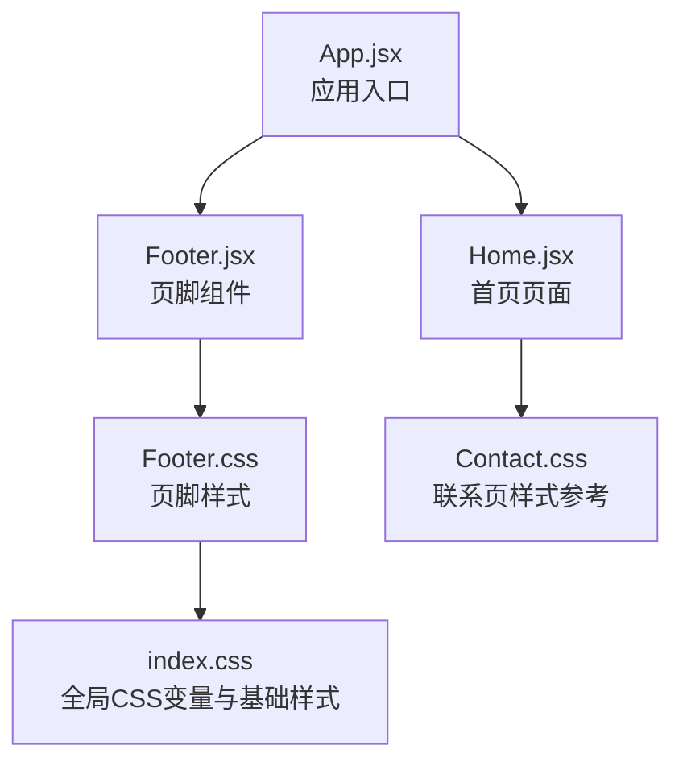
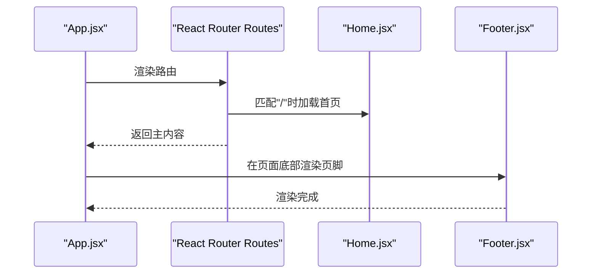
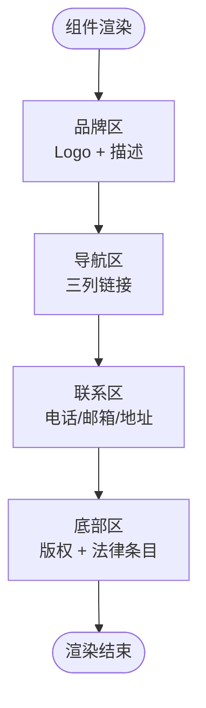
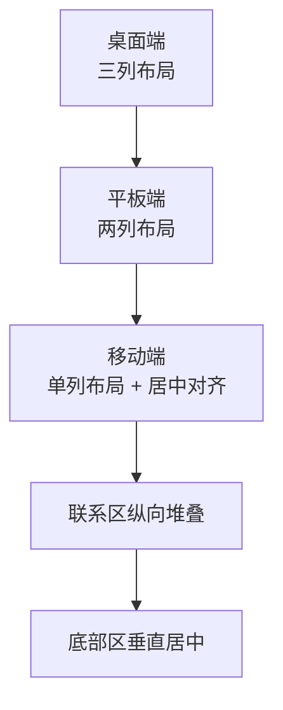
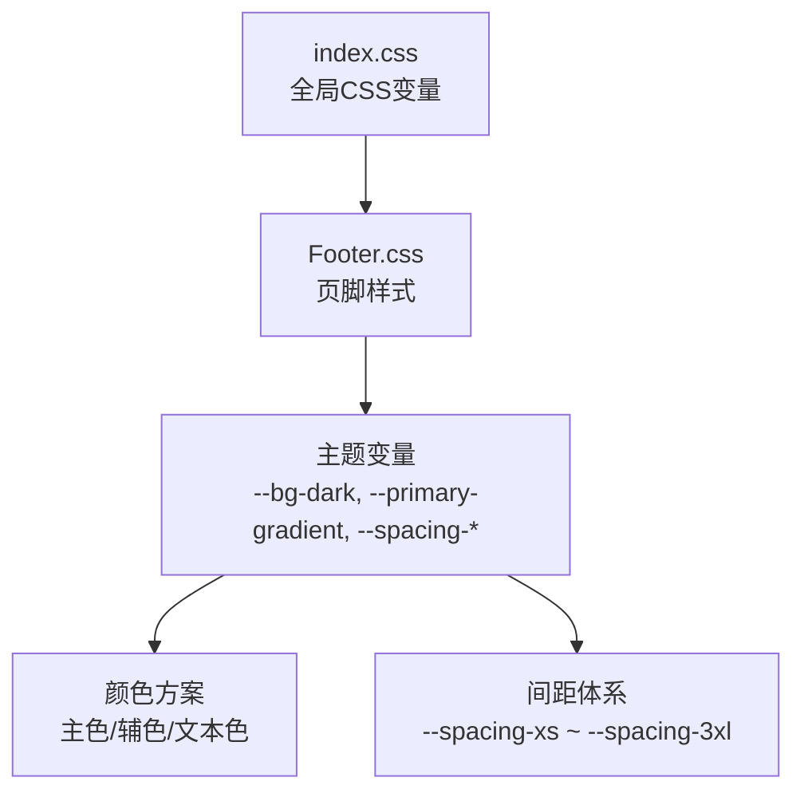
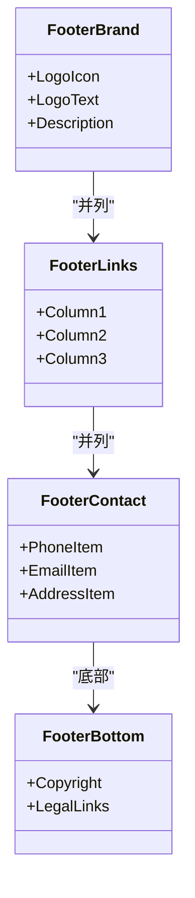
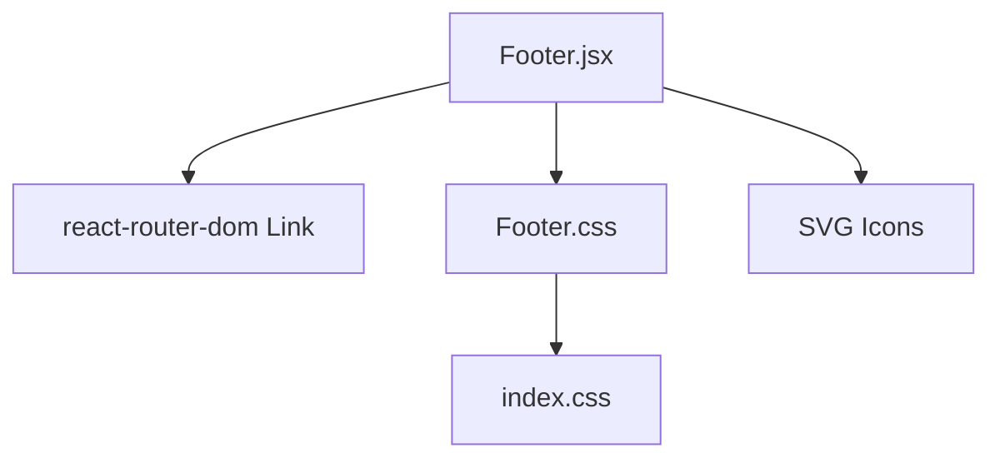

# 页脚组件（Footer）

<cite>
**本文档引用的文件**
- [Footer.jsx](file://tech-website/src/components/Footer.jsx)
- [Footer.css](file://tech-website/src/components/Footer.css)
- [index.css](file://tech-website/src/index.css)
- [App.jsx](file://tech-website/src/App.jsx)
- [Home.jsx](file://tech-website/src/pages/Home.jsx)
- [Contact.css](file://tech-website/src/pages/Contact.css)
</cite>

## 目录
1. [简介](#简介)
2. [项目结构](#项目结构)
3. [核心组件](#核心组件)
4. [架构总览](#架构总览)
5. [详细组件分析](#详细组件分析)
6. [依赖关系分析](#依赖关系分析)
7. [性能考量](#性能考量)
8. [故障排查指南](#故障排查指南)
9. [结论](#结论)
10. [附录](#附录)

## 简介
本文件面向前端开发者与产品设计人员，系统性解析页脚组件（Footer）的设计理念与实现细节。内容覆盖企业信息展示（公司名称、地址、电话、邮箱）、联系信息组织与视觉呈现、社交媒体链接的图标设计与跳转逻辑、多列信息的响应式布局与垂直对齐、样式系统的组织方式（CSS变量、命名规范、颜色与字体）、组件使用示例与自定义配置方法，以及无障碍访问与SEO优化建议。

## 项目结构
页脚组件位于组件目录中，并通过全局样式系统统一管理主题与响应式规则。应用在根组件中引入页脚，确保所有页面共享一致的页脚体验。

图表来源
- [App.jsx:1-25](file://tech-website/src/App.jsx#L1-L25)
- [Footer.jsx:1-97](file://tech-website/src/components/Footer.jsx#L1-L97)
- [Footer.css:1-186](file://tech-website/src/components/Footer.css#L1-L186)
- [index.css:1-228](file://tech-website/src/index.css#L1-L228)
- [Home.jsx:1-230](file://tech-website/src/pages/Home.jsx#L1-L230)
- [Contact.css:1-340](file://tech-website/src/pages/Contact.css#L1-L340)

章节来源
- [App.jsx:1-25](file://tech-website/src/App.jsx#L1-L25)
- [Footer.jsx:1-97](file://tech-website/src/components/Footer.jsx#L1-L97)
- [Footer.css:1-186](file://tech-website/src/components/Footer.css#L1-L186)
- [index.css:1-228](file://tech-website/src/index.css#L1-L228)

## 核心组件
页脚组件采用函数式组件形式，使用React Router的Link进行内部导航，通过SVG图标提供语义化的联系信息展示。组件包含品牌区、导航链接区、联系方式区与底部版权及法律条目区四大部分，整体采用网格布局实现多列信息的响应式排列与垂直对齐。

- 设计要点
  - 品牌区：包含Logo图标与品牌描述，强调企业形象。
  - 导航区：三列信息，分别展示“产品服务”“解决方案”“关于我们”，便于用户快速定位。
  - 联系区：以带图标的联系项展示电话、邮箱与地址，增强可读性与点击友好性。
  - 底部区：版权信息与法律条目，支持外链跳转。

- 数据与交互
  - 年份动态生成，避免每年手动更新。
  - 内部路由使用Link，外部链接使用a标签。

章节来源
- [Footer.jsx:4-97](file://tech-website/src/components/Footer.jsx#L4-L97)

## 架构总览
页脚组件与应用入口的关系如下：应用在渲染主内容后挂载页脚，确保页脚始终位于页面底部，形成稳定的信息承载层。

图表来源
- [App.jsx:8-22](file://tech-website/src/App.jsx#L8-L22)
- [Footer.jsx:7-93](file://tech-website/src/components/Footer.jsx#L7-L93)

## 详细组件分析

### 组件结构与数据流
页脚组件通过JSX构建DOM结构，使用CSS Grid实现主区域的多列布局；通过React Router的Link实现内部导航；通过SVG图标提供语义化与高可访问性的联系信息展示。

图表来源
- [Footer.jsx:11-90](file://tech-website/src/components/Footer.jsx#L11-L90)

章节来源
- [Footer.jsx:4-97](file://tech-website/src/components/Footer.jsx#L4-L97)

### 布局设计与响应式策略
- 主布局采用CSS Grid，主容器设置最大宽度与内边距，保证在大屏与小屏下的良好阅读体验。
- 主区域采用三列布局（品牌区、导航区、联系区），在中等屏幕下自动调整为两列，小屏下降为单列并居中对齐。
- 联系区在小屏下改为纵向堆叠，底部区在小屏下垂直居中并换行，提升移动端可读性。

图表来源
- [Footer.css:14-20](file://tech-website/src/components/Footer.css#L14-L20)
- [Footer.css:128-172](file://tech-website/src/components/Footer.css#L128-L172)

章节来源
- [Footer.css:14-20](file://tech-website/src/components/Footer.css#L14-L20)
- [Footer.css:128-172](file://tech-website/src/components/Footer.css#L128-L172)

### 样式系统与主题管理
- CSS变量集中于全局样式文件，统一管理主色、辅色、背景色、阴影、圆角、间距与过渡等，确保组件样式与全局主题一致。
- 页脚组件使用变量实现深色背景、浅色文字、渐变文本效果与图标颜色的一致性。
- 字体与字号遵循全局规范，确保在不同断点下的可读性与一致性。

图表来源
- [index.css:2-54](file://tech-website/src/index.css#L2-L54)
- [Footer.css:2-6](file://tech-website/src/components/Footer.css#L2-L6)
- [Footer.css:40-46](file://tech-website/src/components/Footer.css#L40-L46)

章节来源
- [index.css:2-54](file://tech-website/src/index.css#L2-L54)
- [Footer.css:2-6](file://tech-website/src/components/Footer.css#L2-L6)
- [Footer.css:40-46](file://tech-website/src/components/Footer.css#L40-L46)

### 企业信息展示与格式化
- 品牌描述采用半透明白色文字，配合品牌标题的渐变文本效果，突出企业形象。
- 导航区标题使用白色文字，链接项采用半透明白色，悬停切换至辅色，增强交互反馈。
- 联系区使用带图标的联系项，图标尺寸固定且颜色与辅色一致，提升识别度与可点击性。

图表来源
- [Footer.jsx:11-90](file://tech-website/src/components/Footer.jsx#L11-L90)

章节来源
- [Footer.jsx:11-90](file://tech-website/src/components/Footer.jsx#L11-L90)

### 社交媒体链接与跳转逻辑
- 社交媒体链接在联系页中采用独立的社交链接样式，提供圆形图标与悬停动画，便于用户识别与交互。
- 页脚组件未直接包含社交媒体链接，如需集成可在联系区或品牌区扩展相应图标与链接。

章节来源
- [Contact.css:233-267](file://tech-website/src/pages/Contact.css#L233-L267)

### 可访问性与SEO优化建议
- 可访问性
  - 使用语义化HTML结构与适当的标题层级，确保屏幕阅读器可正确解析。
  - 图标使用SVG并具备清晰的stroke属性，便于在高对比度模式下识别。
  - 链接使用标准a标签与Link组件，确保键盘可操作性与焦点可见性。
- SEO优化
  - 版权信息与法律条目使用a标签，便于搜索引擎抓取。
  - 保持内容简洁明确，避免冗余装饰元素影响爬虫解析。
  - 使用语义化标签与结构化内容，提升页面可读性与索引质量。

## 依赖关系分析
页脚组件依赖于：
- React Router的Link用于内部导航。
- 全局CSS变量与基础样式，确保主题一致性。
- SVG图标提供语义化与高可访问性的联系信息展示。

图表来源
- [Footer.jsx:1](file://tech-website/src/components/Footer.jsx#L1)
- [Footer.css:1](file://tech-website/src/components/Footer.css#L1)
- [index.css:1](file://tech-website/src/index.css#L1)

章节来源
- [Footer.jsx:1](file://tech-website/src/components/Footer.jsx#L1)
- [Footer.css:1](file://tech-website/src/components/Footer.css#L1)
- [index.css:1](file://tech-website/src/index.css#L1)

## 性能考量
- 组件结构简单，无复杂状态与副作用，渲染开销极低。
- 使用CSS Grid与Flex布局，避免JavaScript控制布局，减少重排与重绘。
- SVG图标体积小、可缩放，适合多设备显示，无需额外图片资源。

## 故障排查指南
- 样式不生效
  - 检查全局CSS变量是否正确加载，确认根节点存在对应变量。
  - 确认组件样式文件已正确导入。
- 响应式异常
  - 检查断点设置与媒体查询顺序，确保优先级正确。
  - 确认容器宽度与内边距变量在目标断点下生效。
- 导航失效
  - 检查Link组件的to属性是否指向有效路由。
  - 确认路由配置中存在对应路径。

章节来源
- [Footer.css:128-185](file://tech-website/src/components/Footer.css#L128-L185)
- [App.jsx:13-18](file://tech-website/src/App.jsx#L13-L18)

## 结论
页脚组件通过清晰的结构划分、统一的主题变量与响应式布局策略，实现了企业信息的有效承载与良好的用户体验。其简洁的实现与可扩展的样式体系，使其易于根据业务需求进行定制与维护。

## 附录

### 使用示例与自定义配置
- 在应用入口中引入页脚组件，确保所有页面共享一致的页脚。
- 如需扩展社交媒体链接，可在品牌区或联系区添加相应图标与链接。
- 如需调整品牌描述或导航内容，直接修改组件中的对应区块。

章节来源
- [App.jsx:19](file://tech-website/src/App.jsx#L19)
- [Footer.jsx:11-90](file://tech-website/src/components/Footer.jsx#L11-L90)