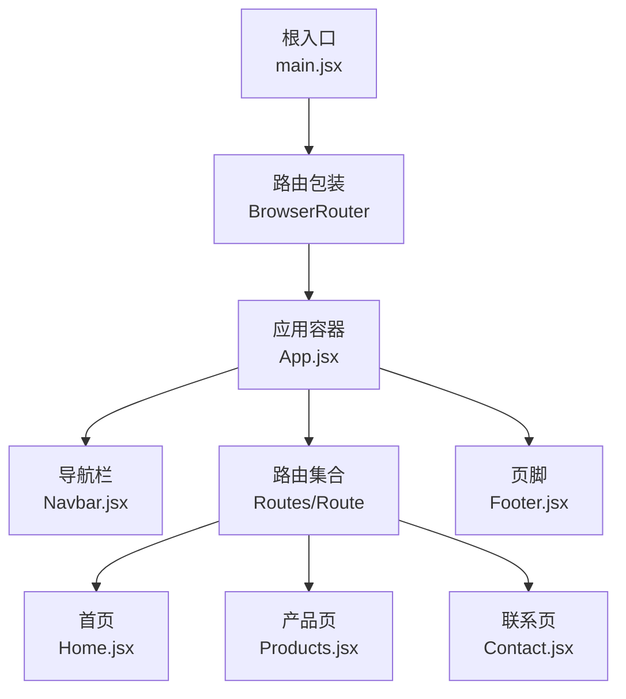
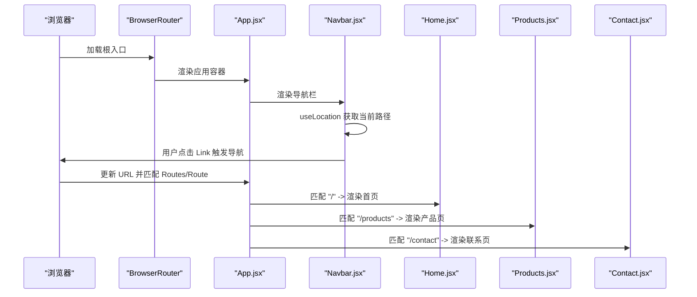
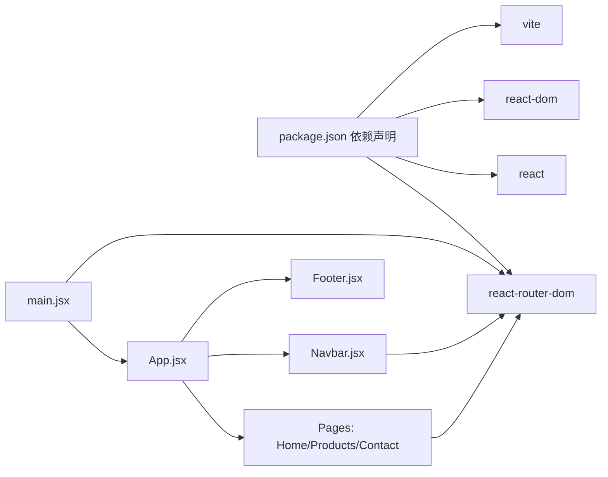

# 路由系统

<cite>
**本文引用的文件列表**
- [main.jsx](file://tech-website/src/main.jsx)
- [App.jsx](file://tech-website/src/App.jsx)
- [Navbar.jsx](file://tech-website/src/components/Navbar.jsx)
- [Footer.jsx](file://tech-website/src/components/Footer.jsx)
- [Home.jsx](file://tech-website/src/pages/Home.jsx)
- [Products.jsx](file://tech-website/src/pages/Products.jsx)
- [Contact.jsx](file://tech-website/src/pages/Contact.jsx)
- [package.json](file://tech-website/package.json)
- [vite.config.js](file://tech-website/vite.config.js)
- [Navbar.css](file://tech-website/src/components/Navbar.css)
- [Home.css](file://tech-website/src/pages/Home.css)
- [Products.css](file://tech-website/src/pages/Products.css)
- [Contact.css](file://tech-website/src/pages/Contact.css)
</cite>

## 目录
1. [简介](#简介)
2. [项目结构](#项目结构)
3. [核心组件](#核心组件)
4. [架构总览](#架构总览)
5. [详细组件分析](#详细组件分析)
6. [依赖关系分析](#依赖关系分析)
7. [性能考量](#性能考量)
8. [故障排查指南](#故障排查指南)
9. [结论](#结论)
10. [附录：扩展与最佳实践](#附录扩展与最佳实践)

## 简介
本项目采用现代前端技术栈，基于 Vite 构建工具与 React Router v6 实现单页应用的页面导航与路由配置。路由系统通过 BrowserRouter 包裹根组件，使用 Routes/Route 定义静态路径映射，并在导航组件中通过 Link 组件进行无刷新跳转。当前路由覆盖首页、产品页与联系页，页面间通过统一的导航栏与页脚组件进行连接，形成清晰的站点结构。

## 项目结构
项目采用按功能分层的目录组织方式：
- 根入口与构建配置：main.jsx、vite.config.js、package.json
- 应用主体：App.jsx（路由定义与页面容器）
- 导航与页脚：Navbar.jsx、Footer.jsx
- 页面组件：Home.jsx、Products.jsx、Contact.jsx
- 样式文件：各组件与页面对应的 CSS 文件

图表来源
- [main.jsx:7-13](file://tech-website/src/main.jsx#L7-L13)
- [App.jsx:8-22](file://tech-website/src/App.jsx#L8-L22)
- [Navbar.jsx:17-63](file://tech-website/src/components/Navbar.jsx#L17-L63)
- [Footer.jsx:7-93](file://tech-website/src/components/Footer.jsx#L7-L93)

章节来源
- [main.jsx:1-14](file://tech-website/src/main.jsx#L1-L14)
- [App.jsx:1-25](file://tech-website/src/App.jsx#L1-L25)
- [Navbar.jsx:1-67](file://tech-website/src/components/Navbar.jsx#L1-L67)
- [Footer.jsx:1-97](file://tech-website/src/components/Footer.jsx#L1-L97)

## 核心组件
- 根入口与路由包装
  - 在根入口文件中使用 BrowserRouter 包裹应用，确保路由上下文可用。
  - 参考路径：[main.jsx:7-13](file://tech-website/src/main.jsx#L7-L13)

- 路由定义与页面容器
  - App.jsx 中通过 Routes/Route 定义静态路由，将路径与页面组件一一对应。
  - 参考路径：[App.jsx:13-17](file://tech-website/src/App.jsx#L13-L17)

- 导航栏与活动态样式
  - Navbar.jsx 使用 Link 进行导航，并通过 useLocation 判断当前路径，动态设置活动态样式。
  - 参考路径：[Navbar.jsx:15-46](file://tech-website/src/components/Navbar.jsx#L15-L46)

- 页面组件
  - Home.jsx、Products.jsx、Contact.jsx 分别承载不同页面的内容与交互。
  - 参考路径：[Home.jsx:1-230](file://tech-website/src/pages/Home.jsx#L1-L230)、[Products.jsx:1-139](file://tech-website/src/pages/Products.jsx#L1-L139)、[Contact.jsx:1-274](file://tech-website/src/pages/Contact.jsx#L1-L274)

章节来源
- [main.jsx:7-13](file://tech-website/src/main.jsx#L7-L13)
- [App.jsx:13-17](file://tech-website/src/App.jsx#L13-L17)
- [Navbar.jsx:15-46](file://tech-website/src/components/Navbar.jsx#L15-L46)
- [Home.jsx:1-230](file://tech-website/src/pages/Home.jsx#L1-L230)
- [Products.jsx:1-139](file://tech-website/src/pages/Products.jsx#L1-L139)
- [Contact.jsx:1-274](file://tech-website/src/pages/Contact.jsx#L1-L274)

## 架构总览
下图展示了从浏览器请求到页面渲染的路由流转过程，以及导航组件如何参与页面切换。

图表来源
- [main.jsx:7-13](file://tech-website/src/main.jsx#L7-L13)
- [App.jsx:13-17](file://tech-website/src/App.jsx#L13-L17)
- [Navbar.jsx:15-46](file://tech-website/src/components/Navbar.jsx#L15-L46)

## 详细组件分析

### 路由定义与页面切换机制
- 路由定义语法
  - 使用 Routes/Route 将路径与组件绑定，支持精确匹配与默认回退（可扩展）。
  - 参考路径：[App.jsx:13-17](file://tech-website/src/App.jsx#L13-L17)

- 页面切换机制
  - 导航栏中的 Link 组件负责无刷新跳转；页面内也通过 Link 进行内部跳转（如首页“了解更多”、“查看全部产品”等）。
  - 参考路径：[Navbar.jsx:37-49](file://tech-website/src/components/Navbar.jsx#L37-L49)、[Home.jsx:103-112](file://tech-website/src/pages/Home.jsx#L103-L112)、[Products.jsx:107-114](file://tech-website/src/pages/Products.jsx#L107-L114)

- URL 结构设计
  - 当前采用简洁的层级路径：/, /products, /contact，符合语义化与 SEO 友好原则。
  - 参考路径：[App.jsx:14-16](file://tech-website/src/App.jsx#L14-L16)

- 嵌套路由与动态参数
  - 当前未实现嵌套路由与动态路由参数（如 /products/:id）。若需扩展，可在现有结构上增加子路由与参数解析逻辑。
  - 参考路径：[App.jsx:13-17](file://tech-website/src/App.jsx#L13-L17)

章节来源
- [App.jsx:13-17](file://tech-website/src/App.jsx#L13-L17)
- [Navbar.jsx:37-49](file://tech-website/src/components/Navbar.jsx#L37-L49)
- [Home.jsx:103-112](file://tech-website/src/pages/Home.jsx#L103-L112)
- [Products.jsx:107-114](file://tech-website/src/pages/Products.jsx#L107-L114)

### 导航栏与活动态样式
- 导航逻辑
  - 通过 useLocation 获取当前路径，结合 Link 的 to 属性实现导航。
  - 参考路径：[Navbar.jsx:7](file://tech-website/src/components/Navbar.jsx#L7)、[Navbar.jsx:15](file://tech-website/src/components/Navbar.jsx#L15)

- 活动态样式
  - isActive(path) 判断当前路径是否与导航项一致，从而添加 active 类名。
  - 参考路径：[Navbar.jsx:15](file://tech-website/src/components/Navbar.jsx#L15)

- 响应式菜单
  - 移动端通过切换类名控制菜单显示隐藏，适配小屏设备。
  - 参考路径：[Navbar.jsx:6](file://tech-website/src/components/Navbar.jsx#L6)、[Navbar.css:122-154](file://tech-website/src/components/Navbar.css#L122-L154)

章节来源
- [Navbar.jsx:7-15](file://tech-website/src/components/Navbar.jsx#L7-L15)
- [Navbar.jsx:6](file://tech-website/src/components/Navbar.jsx#L6)
- [Navbar.css:122-154](file://tech-website/src/components/Navbar.css#L122-L154)

### 页面组件与交互
- 首页（Home.jsx）
  - 包含英雄区、特性展示、产品推荐与行动号召等区块，内部通过 Link 跳转到产品页与联系页。
  - 参考路径：[Home.jsx:103-112](file://tech-website/src/pages/Home.jsx#L103-L112)、[Home.jsx:189-196](file://tech-website/src/pages/Home.jsx#L189-L196)

- 产品页（Products.jsx）
  - 展示产品列表与分类筛选，提供“免费试用”与“了解详情”等交互入口。
  - 参考路径：[Products.jsx:107-114](file://tech-website/src/pages/Products.jsx#L107-L114)

- 联系页（Contact.jsx）
  - 表单提交模拟与成功反馈提示，包含联系信息与地图占位。
  - 参考路径：[Contact.jsx:24-43](file://tech-website/src/pages/Contact.jsx#L24-L43)

章节来源
- [Home.jsx:103-112](file://tech-website/src/pages/Home.jsx#L103-L112)
- [Home.jsx:189-196](file://tech-website/src/pages/Home.jsx#L189-L196)
- [Products.jsx:107-114](file://tech-website/src/pages/Products.jsx#L107-L114)
- [Contact.jsx:24-43](file://tech-website/src/pages/Contact.jsx#L24-L43)

### 页脚组件与全局链接
- 页脚 Footer.jsx 提供品牌信息、产品服务、解决方案、关于我们与联系方式等链接，统一使用 Link 组件保持导航一致性。
- 参考路径：[Footer.jsx:32-80](file://tech-website/src/components/Footer.jsx#L32-L80)

章节来源
- [Footer.jsx:32-80](file://tech-website/src/components/Footer.jsx#L32-L80)

## 依赖关系分析
- 外部依赖
  - React 与 React DOM：用于组件渲染与生命周期管理。
  - React Router DOM：提供路由能力与导航组件。
  - Vite：开发服务器与打包工具。
  - 参考路径：[package.json:11-21](file://tech-website/package.json#L11-L21)

- 内部依赖
  - main.jsx 依赖 BrowserRouter 包裹 App.jsx。
  - App.jsx 依赖 Navbar、Footer 与各页面组件。
  - Navbar.jsx 依赖 Link/useLocation。
  - 各页面组件依赖 Link 进行内部跳转。
  - 参考路径：[main.jsx:3](file://tech-website/src/main.jsx#L3)、[App.jsx:1-6](file://tech-website/src/App.jsx#L1-L6)、[Navbar.jsx:2](file://tech-website/src/components/Navbar.jsx#L2)

图表来源
- [package.json:11-21](file://tech-website/package.json#L11-L21)
- [main.jsx:3](file://tech-website/src/main.jsx#L3)
- [App.jsx:1-6](file://tech-website/src/App.jsx#L1-L6)
- [Navbar.jsx:2](file://tech-website/src/components/Navbar.jsx#L2)

章节来源
- [package.json:11-21](file://tech-website/package.json#L11-L21)
- [main.jsx:3](file://tech-website/src/main.jsx#L3)
- [App.jsx:1-6](file://tech-website/src/App.jsx#L1-L6)
- [Navbar.jsx:2](file://tech-website/src/components/Navbar.jsx#L2)

## 性能考量
- 路由切换性能
  - 使用 Link 组件进行客户端导航，避免整页刷新，提升切换体验。
  - 参考路径：[Navbar.jsx:37-49](file://tech-website/src/components/Navbar.jsx#L37-L49)

- 样式与响应式
  - 各页面与组件的 CSS 已针对移动端进行优化，减少重排与重绘。
  - 参考路径：[Navbar.css:122-154](file://tech-website/src/components/Navbar.css#L122-L154)、[Home.css:312-398](file://tech-website/src/pages/Home.css#L312-L398)、[Products.css:173-229](file://tech-website/src/pages/Products.css#L173-L229)、[Contact.css:294-339](file://tech-website/src/pages/Contact.css#L294-L339)

- 构建与开发体验
  - Vite 提供快速热更新与按需打包，适合开发阶段的频繁改动。
  - 参考路径：[vite.config.js:4-10](file://tech-website/vite.config.js#L4-L10)

[本节为通用性能建议，不直接分析具体代码文件]

## 故障排查指南
- 路由不生效或页面空白
  - 确认根入口已包裹 BrowserRouter，且 App.jsx 正确渲染 Routes/Route。
  - 参考路径：[main.jsx:7-13](file://tech-website/src/main.jsx#L7-L13)、[App.jsx:13-17](file://tech-website/src/App.jsx#L13-L17)

- 导航链接无效或无法高亮
  - 检查 Link 的 to 属性与实际路由路径是否一致；确认 useLocation 的使用位置正确。
  - 参考路径：[Navbar.jsx:15-46](file://tech-website/src/components/Navbar.jsx#L15-L46)

- 页面内链接跳转异常
  - 确保页面组件中 Link 的 to 属性与路由表一致。
  - 参考路径：[Home.jsx:103-112](file://tech-website/src/pages/Home.jsx#L103-L112)、[Products.jsx:107-114](file://tech-website/src/pages/Products.jsx#L107-L114)

- 样式异常或响应式失效
  - 检查 CSS 文件是否正确引入，媒体查询断点是否符合预期。
  - 参考路径：[Navbar.css:122-154](file://tech-website/src/components/Navbar.css#L122-L154)、[Home.css:312-398](file://tech-website/src/pages/Home.css#L312-L398)、[Products.css:173-229](file://tech-website/src/pages/Products.css#L173-L229)、[Contact.css:294-339](file://tech-website/src/pages/Contact.css#L294-L339)

章节来源
- [main.jsx:7-13](file://tech-website/src/main.jsx#L7-L13)
- [App.jsx:13-17](file://tech-website/src/App.jsx#L13-L17)
- [Navbar.jsx:15-46](file://tech-website/src/components/Navbar.jsx#L15-L46)
- [Home.jsx:103-112](file://tech-website/src/pages/Home.jsx#L103-L112)
- [Products.jsx:107-114](file://tech-website/src/pages/Products.jsx#L107-L114)
- [Navbar.css:122-154](file://tech-website/src/components/Navbar.css#L122-L154)
- [Home.css:312-398](file://tech-website/src/pages/Home.css#L312-L398)
- [Products.css:173-229](file://tech-website/src/pages/Products.css#L173-L229)
- [Contact.css:294-339](file://tech-website/src/pages/Contact.css#L294-L339)

## 结论
本项目的路由系统以 React Router v6 为核心，通过 BrowserRouter 包裹与 Routes/Route 定义实现简洁高效的页面导航。导航栏与页脚组件统一使用 Link，保证了良好的用户体验与一致的交互行为。当前路由结构清晰、易于维护，具备进一步扩展嵌套路由与动态参数的能力。建议在后续迭代中逐步引入路由守卫、权限控制与错误页面，以增强系统的安全性与健壮性。

[本节为总结性内容，不直接分析具体代码文件]

## 附录：扩展与最佳实践
- 路由守卫与权限控制
  - 可在 App.jsx 或新增的路由包装组件中实现鉴权逻辑，对受保护的路由进行前置校验。
  - 参考路径：[App.jsx:8-22](file://tech-website/src/App.jsx#L8-L22)

- 错误页面与回退
  - 在 Routes 下添加通配符路由，统一处理 404 场景，提升用户体验。
  - 参考路径：[App.jsx:13-17](file://tech-website/src/App.jsx#L13-L17)

- SEO 友好策略
  - 使用静态路径与语义化命名，配合页面标题与 meta 描述（可在页面组件中注入）。
  - 参考路径：[Home.jsx:95-101](file://tech-website/src/pages/Home.jsx#L95-L101)、[Products.jsx:61-66](file://tech-website/src/pages/Products.jsx#L61-L66)、[Contact.jsx:48-53](file://tech-website/src/pages/Contact.jsx#L48-L53)

- 嵌套路由与动态参数
  - 若需实现产品详情页等场景，可在 App.jsx 中增加子路由与参数解析逻辑。
  - 参考路径：[App.jsx:13-17](file://tech-website/src/App.jsx#L13-L17)

- 性能优化与预加载
  - 对于大型页面，可考虑懒加载组件；在用户即将进入视口时触发预加载。
  - 参考路径：[package.json:11-21](file://tech-website/package.json#L11-L21)

- 自定义导航组件开发
  - 基于现有 Navbar.jsx 的模式，封装可复用的导航组件，支持主题切换与国际化。
  - 参考路径：[Navbar.jsx:17-63](file://tech-website/src/components/Navbar.jsx#L17-L63)

章节来源
- [App.jsx:8-22](file://tech-website/src/App.jsx#L8-L22)
- [App.jsx:13-17](file://tech-website/src/App.jsx#L13-L17)
- [Home.jsx:95-101](file://tech-website/src/pages/Home.jsx#L95-L101)
- [Products.jsx:61-66](file://tech-website/src/pages/Products.jsx#L61-L66)
- [Contact.jsx:48-53](file://tech-website/src/pages/Contact.jsx#L48-L53)
- [package.json:11-21](file://tech-website/package.json#L11-L21)
- [Navbar.jsx:17-63](file://tech-website/src/components/Navbar.jsx#L17-L63)