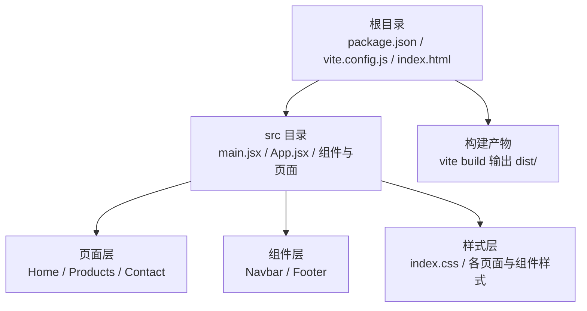
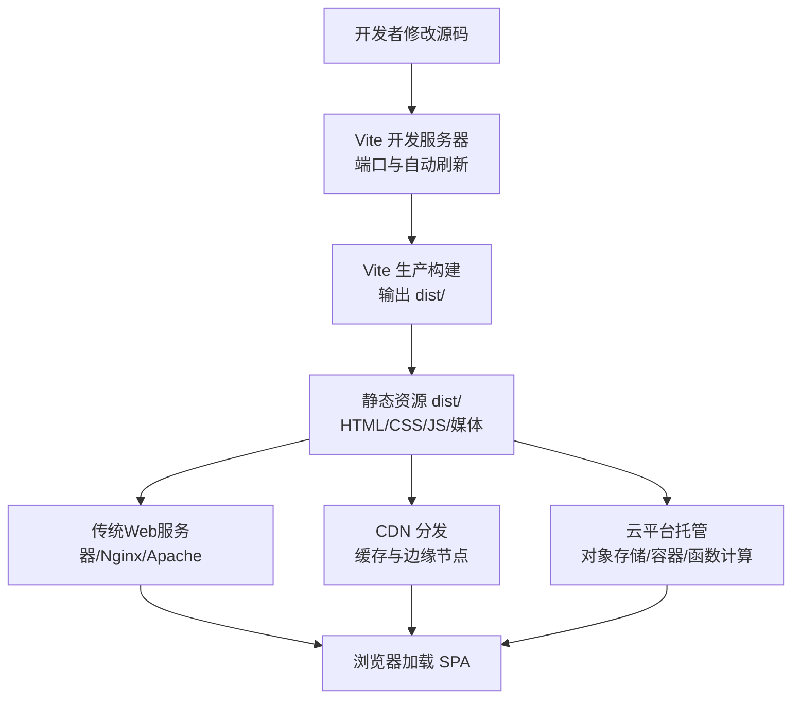
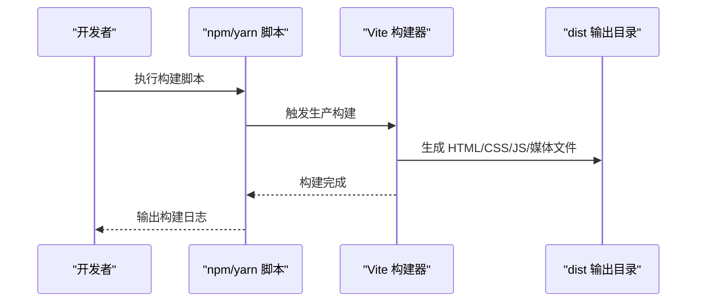
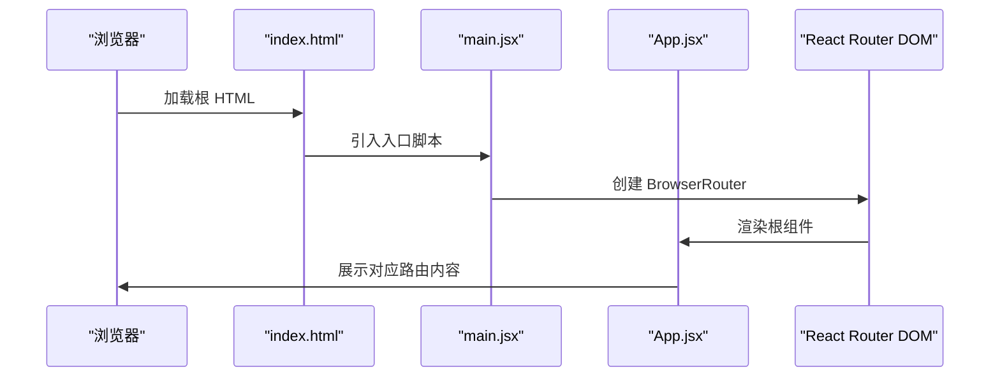
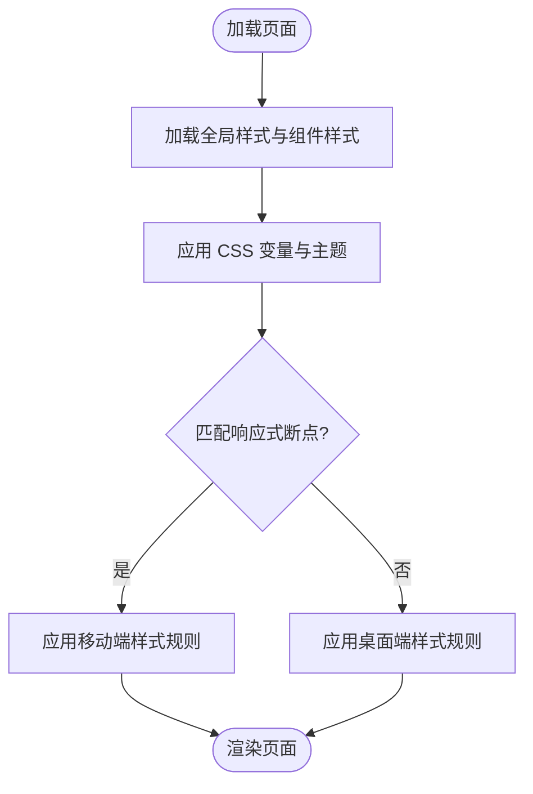
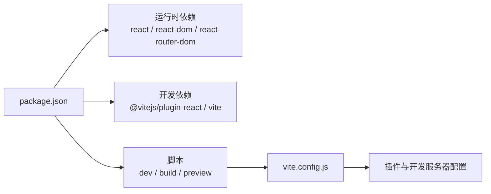

# 部署指南

<cite>
**本文引用的文件**
- [package.json](file://tech-website/package.json)
- [vite.config.js](file://tech-website/vite.config.js)
- [index.html](file://tech-website/index.html)
- [src/main.jsx](file://tech-website/src/main.jsx)
- [src/App.jsx](file://tech-website/src/App.jsx)
- [src/pages/Home.jsx](file://tech-website/src/pages/Home.jsx)
- [src/components/Navbar.jsx](file://tech-website/src/components/Navbar.jsx)
- [src/components/Footer.jsx](file://tech-website/src/components/Footer.jsx)
- [src/index.css](file://tech-website/src/index.css)
- [src/components/Navbar.css](file://tech-website/src/components/Navbar.css)
- [src/components/Footer.css](file://tech-website/src/components/Footer.css)
- [src/pages/Products.css](file://tech-website/src/pages/Products.css)
- [src/pages/Contact.css](file://tech-website/src/pages/Contact.css)
</cite>

## 目录
1. [简介](#简介)
2. [项目结构](#项目结构)
3. [核心组件](#核心组件)
4. [架构总览](#架构总览)
5. [详细组件分析](#详细组件分析)
6. [依赖分析](#依赖分析)
7. [性能考虑](#性能考虑)
8. [故障排除指南](#故障排除指南)
9. [结论](#结论)
10. [附录](#附录)

## 简介
本指南面向运维与开发团队，提供技术网站从源码到生产环境的完整部署流程与配置说明。内容覆盖生产构建、静态资源生成与部署准备、多平台部署（传统Web服务器、CDN、云平台）、环境变量与域名HTTPS配置、自动化部署与CI/CD集成、版本发布策略，以及部署后的性能监控、错误追踪与回滚机制。文档以仓库现有代码为基础，结合可扩展的最佳实践，帮助确保网站稳定上线与长期可靠运行。

## 项目结构
该技术网站采用前端单页应用（SPA）架构，基于 Vite 构建工具与 React 技术栈，路由由 React Router DOM 提供。项目主要由以下层次构成：
- 根目录：构建脚本、配置与入口 HTML
- src 目录：应用入口、页面与组件、全局样式
- public 目录：静态资源（当前仓库未包含该目录）

图表来源
- [package.json:1-23](file://tech-website/package.json#L1-L23)
- [vite.config.js:1-11](file://tech-website/vite.config.js#L1-L11)
- [index.html:1-14](file://tech-website/index.html#L1-L14)
- [src/main.jsx:1-14](file://tech-website/src/main.jsx#L1-L14)
- [src/App.jsx:1-25](file://tech-website/src/App.jsx#L1-L25)

章节来源
- [package.json:1-23](file://tech-website/package.json#L1-L23)
- [vite.config.js:1-11](file://tech-website/vite.config.js#L1-L11)
- [index.html:1-14](file://tech-website/index.html#L1-L14)
- [src/main.jsx:1-14](file://tech-website/src/main.jsx#L1-L14)
- [src/App.jsx:1-25](file://tech-website/src/App.jsx#L1-L25)

## 核心组件
- 构建与开发工具链
  - 使用 Vite 作为构建与本地预览工具，提供快速热更新与生产打包能力
  - 使用 React 与 React Router DOM 实现客户端路由
- 应用入口与路由
  - 入口文件负责挂载 BrowserRouter 并渲染根组件 App
  - App 组织导航、主内容区与页脚，并定义站点路由
- 页面与组件
  - 页面组件包含业务内容与交互逻辑
  - 导航与页脚组件提供统一的头部与底部布局
- 样式体系
  - 全局 CSS 变量定义主题色彩、阴影、圆角与间距
  - 页面与组件样式通过独立 CSS 文件组织，支持响应式适配

章节来源
- [package.json:6-10](file://tech-website/package.json#L6-L10)
- [vite.config.js:4-10](file://tech-website/vite.config.js#L4-L10)
- [src/main.jsx:1-14](file://tech-website/src/main.jsx#L1-L14)
- [src/App.jsx:1-25](file://tech-website/src/App.jsx#L1-L25)
- [src/pages/Home.jsx:1-230](file://tech-website/src/pages/Home.jsx#L1-L230)
- [src/components/Navbar.jsx:1-67](file://tech-website/src/components/Navbar.jsx#L1-L67)
- [src/components/Footer.jsx:1-97](file://tech-website/src/components/Footer.jsx#L1-L97)
- [src/index.css:1-228](file://tech-website/src/index.css#L1-L228)

## 架构总览
下图展示从源码到浏览器的关键路径：开发时通过 Vite 启动本地服务；生产时通过 Vite 打包生成静态资源；部署阶段将静态资源交由 Web 服务器或 CDN 提供。

图表来源
- [vite.config.js:6-9](file://tech-website/vite.config.js#L6-L9)
- [package.json:8-8](file://tech-website/package.json#L8-L8)

## 详细组件分析

### 构建与打包流程
- 开发模式
  - 通过 Vite 启动本地开发服务器，默认端口与自动打开浏览器
- 生产模式
  - 使用 Vite 的生产构建命令生成 dist 目录下的静态资源
  - HTML 由入口模板注入构建产物，路由为 SPA，需在服务器侧进行回退处理

图表来源
- [package.json:8-8](file://tech-website/package.json#L8-L8)
- [vite.config.js:4-10](file://tech-website/vite.config.js#L4-L10)

章节来源
- [package.json:6-10](file://tech-website/package.json#L6-L10)
- [vite.config.js:4-10](file://tech-website/vite.config.js#L4-L10)

### 路由与入口
- 入口文件负责创建根节点并包裹 BrowserRouter，使应用具备客户端路由能力
- App 组件定义站点路由，包含首页、产品页与联系页

图表来源
- [index.html:9-12](file://tech-website/index.html#L9-L12)
- [src/main.jsx:1-14](file://tech-website/src/main.jsx#L1-L14)
- [src/App.jsx:1-25](file://tech-website/src/App.jsx#L1-L25)

章节来源
- [index.html:9-12](file://tech-website/index.html#L9-L12)
- [src/main.jsx:1-14](file://tech-website/src/main.jsx#L1-L14)
- [src/App.jsx:1-25](file://tech-website/src/App.jsx#L1-L25)

### 样式与响应式
- 全局样式通过 CSS 变量统一主题，组件与页面样式分别维护
- 响应式断点在全局样式中集中定义，确保移动端体验一致

图表来源
- [src/index.css:192-227](file://tech-website/src/index.css#L192-L227)
- [src/components/Navbar.css:121-154](file://tech-website/src/components/Navbar.css#L121-L154)
- [src/components/Footer.css:127-185](file://tech-website/src/components/Footer.css#L127-L185)
- [src/pages/Products.css:173-229](file://tech-website/src/pages/Products.css#L173-L229)
- [src/pages/Contact.css:294-339](file://tech-website/src/pages/Contact.css#L294-L339)

章节来源
- [src/index.css:1-228](file://tech-website/src/index.css#L1-L228)
- [src/components/Navbar.css:1-155](file://tech-website/src/components/Navbar.css#L1-L155)
- [src/components/Footer.css:1-186](file://tech-website/src/components/Footer.css#L1-L186)
- [src/pages/Products.css:1-230](file://tech-website/src/pages/Products.css#L1-L230)
- [src/pages/Contact.css:1-340](file://tech-website/src/pages/Contact.css#L1-L340)

## 依赖分析
- 运行时依赖
  - React 与 React DOM：提供组件模型与渲染
  - React Router DOM：提供客户端路由
- 开发时依赖
  - @vitejs/plugin-react：Vite 的 React 插件
  - vite：构建与开发服务器
- 项目脚本
  - dev：启动开发服务器
  - build：执行生产构建
  - preview：本地预览构建产物

图表来源
- [package.json:11-21](file://tech-website/package.json#L11-L21)
- [package.json:6-10](file://tech-website/package.json#L6-L10)
- [vite.config.js:1-11](file://tech-website/vite.config.js#L1-L11)

章节来源
- [package.json:11-21](file://tech-website/package.json#L11-L21)
- [package.json:6-10](file://tech-website/package.json#L6-L10)
- [vite.config.js:1-11](file://tech-website/vite.config.js#L1-L11)

## 性能考虑
- 构建优化
  - 使用 Vite 的原生 ESM 与按需编译，减少打包体积与提升冷启动速度
  - 合理拆分页面与组件，避免一次性加载过多资源
- 资源优化
  - 图片与媒体建议压缩与使用现代格式（如 WebP）
  - 启用浏览器缓存与长效缓存策略（静态资源指纹命名）
- 网络与传输
  - 使用 CDN 缓存静态资源，降低源站压力
  - 启用 Gzip/Brotli 压缩与 HTTP/2 多路复用
- 用户体验
  - 骨架屏与懒加载策略提升首屏渲染
  - 减少主线程阻塞，避免大计算任务长时间占用

## 故障排除指南
- 构建失败
  - 检查 Node 版本与依赖安装是否完整
  - 确认构建脚本与插件配置正确
- 本地预览异常
  - 确认开发服务器端口未被占用
  - 检查入口 HTML 是否正确引入入口脚本
- 生产路由问题（404）
  - 服务器需对所有路由回退至 index.html，保证 SPA 正常工作
- 样式错乱
  - 检查 CSS 变量与响应式断点是否生效
  - 确认组件样式文件是否正确引入
- 性能问题
  - 分析网络面板与性能面板，定位瓶颈
  - 优化图片与第三方资源加载顺序

章节来源
- [vite.config.js:6-9](file://tech-website/vite.config.js#L6-L9)
- [index.html:9-12](file://tech-website/index.html#L9-L12)
- [src/index.css:192-227](file://tech-website/src/index.css#L192-L227)

## 结论
本指南基于仓库现有代码，梳理了从开发到生产的完整流程，并针对多平台部署、环境变量与域名HTTPS、自动化与版本发布、监控与回滚等运维关键环节提供了可操作的建议。建议在实际部署前完成环境验证与压测，确保线上稳定性与用户体验。

## 附录

### 部署平台选择与配置要点
- 传统 Web 服务器（Nginx/Apache）
  - 将 dist 目录作为站点根目录
  - 配置静态资源缓存与压缩
  - 设置回退规则，将未命中路由回退至 index.html
- CDN
  - 将 dist 内容上传至 CDN 源站或对象存储
  - 配置缓存策略与边缘节点加速
  - 绑定自定义域名与 HTTPS 证书
- 云平台
  - 对象存储直传静态资源，配合负载均衡
  - 容器平台部署反向代理，转发静态与 API 请求
  - 无服务器平台可直接托管静态站点

### 环境变量、域名与 HTTPS
- 环境变量
  - 在构建阶段注入只读配置（如 API 基础地址、站点标识）
  - 避免在客户端暴露敏感信息
- 域名绑定
  - DNS 解析指向服务器或 CDN
  - 配置 CNAME 或 A 记录
- HTTPS 证书
  - 通过平台证书服务或 ACME 自动签发
  - 强制跳转与 HSTS 策略

### 自动化部署与 CI/CD
- 流水线步骤
  - 拉取代码 → 安装依赖 → 运行测试 → 生产构建 → 上传制品 → 部署到目标环境
- 发布策略
  - 蓝绿部署或滚动更新，降低停机风险
  - 版本标签与回滚分支管理

### 部署后监控与回滚
- 监控
  - 健康检查与可用性监控
  - 错误率与性能指标（TTFB、FCP、LCP）
- 追踪
  - 前端错误上报与日志聚合
- 回滚
  - 快速回滚至上一稳定版本
  - 数据库迁移与配置回滚配套