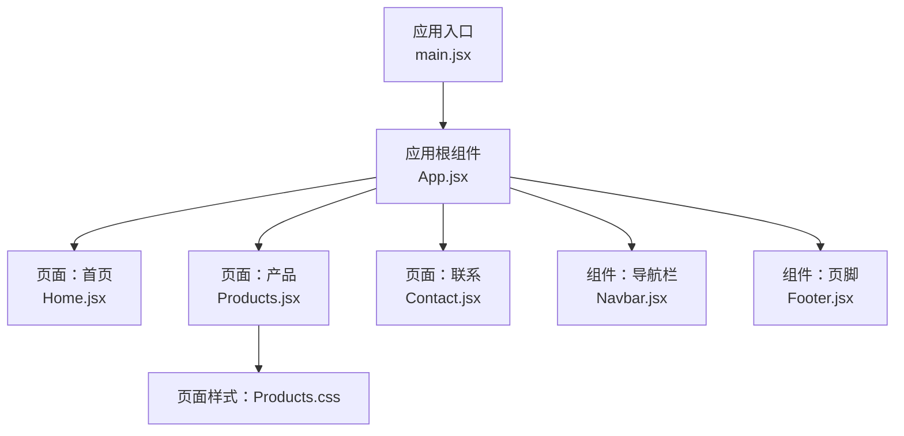
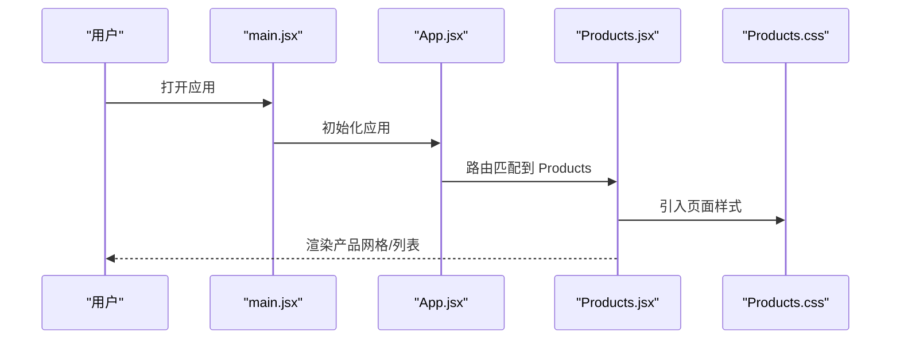
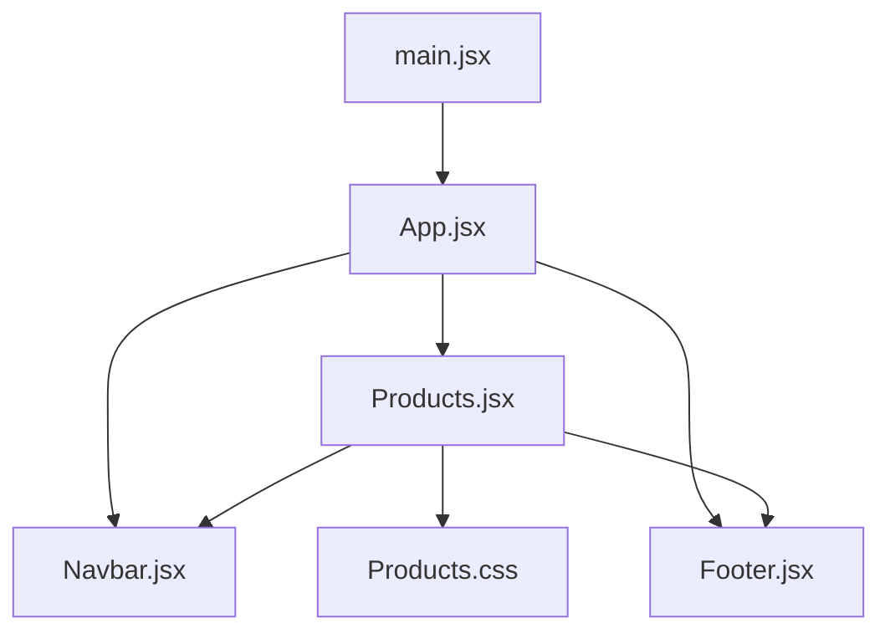

# 产品页面（Products）

<cite>
**本文引用的文件**
- [Products.css](file://tech-website/src/pages/Products.css)
- [Products.jsx](file://tech-website/src/pages/Products.jsx)
- [App.jsx](file://tech-website/src/App.jsx)
- [Navbar.jsx](file://tech-website/src/components/Navbar.jsx)
- [Footer.jsx](file://tech-website/src/components/Footer.jsx)
- [Home.jsx](file://tech-website/src/pages/Home.jsx)
- [Contact.jsx](file://tech-website/src/pages/Contact.jsx)
- [index.css](file://tech-website/src/index.css)
- [main.jsx](file://tech-website/src/main.jsx)
</cite>

## 目录
1. [简介](#简介)
2. [项目结构](#项目结构)
3. [核心组件](#核心组件)
4. [架构总览](#架构总览)
5. [详细组件分析](#详细组件分析)
6. [依赖关系分析](#依赖关系分析)
7. [性能考虑](#性能考虑)
8. [故障排查指南](#故障排查指南)
9. [结论](#结论)
10. [附录](#附录)

## 简介
本文件聚焦于产品页面（Products）的设计与实现，系统性阐述其布局架构、视觉设计原则、响应式网格布局机制、产品信息结构化展示、CSS Grid 与 Flexbox 的应用、移动端适配与用户体验优化，以及样式定制、主题切换与性能优化的最佳实践。文档以仓库中实际存在的文件为依据，避免臆测，确保可追溯性与可操作性。

## 项目结构
该技术网站采用前端单页应用（SPA）架构，使用 Vite 构建工具，页面与组件分别位于 src/pages 与 src/components 目录下。Products 页面作为独立页面存在，并通过路由在应用入口中进行挂载。导航栏与页脚作为通用组件被多个页面复用。

图表来源
- [main.jsx](file://tech-website/src/main.jsx)
- [App.jsx](file://tech-website/src/App.jsx)
- [Home.jsx](file://tech-website/src/pages/Home.jsx)
- [Products.jsx](file://tech-website/src/pages/Products.jsx)
- [Contact.jsx](file://tech-website/src/pages/Contact.jsx)
- [Navbar.jsx](file://tech-website/src/components/Navbar.jsx)
- [Footer.jsx](file://tech-website/src/components/Footer.jsx)
- [Products.css](file://tech-website/src/pages/Products.css)

章节来源
- [main.jsx](file://tech-website/src/main.jsx)
- [App.jsx](file://tech-website/src/App.jsx)
- [Products.jsx](file://tech-website/src/pages/Products.jsx)
- [Products.css](file://tech-website/src/pages/Products.css)
- [Navbar.jsx](file://tech-website/src/components/Navbar.jsx)
- [Footer.jsx](file://tech-website/src/components/Footer.jsx)

## 核心组件
- 产品页面容器：负责渲染产品列表或详情区域，承载网格布局与交互逻辑。
- 导航栏与页脚：提供全局导航与版权信息，贯穿多页面。
- 应用入口与路由挂载：将页面组件集成到应用生命周期中。

章节来源
- [Products.jsx](file://tech-website/src/pages/Products.jsx)
- [Navbar.jsx](file://tech-website/src/components/Navbar.jsx)
- [Footer.jsx](file://tech-website/src/components/Footer.jsx)
- [App.jsx](file://tech-website/src/App.jsx)
- [main.jsx](file://tech-website/src/main.jsx)

## 架构总览
Products 页面通过路由在应用中加载，页面样式由独立的 CSS 文件管理。页面与通用组件之间通过 props 或上下文进行数据与行为传递。整体采用组件化与模块化的组织方式，便于扩展与维护。

图表来源
- [main.jsx](file://tech-website/src/main.jsx)
- [App.jsx](file://tech-website/src/App.jsx)
- [Products.jsx](file://tech-website/src/pages/Products.jsx)
- [Products.css](file://tech-website/src/pages/Products.css)

## 详细组件分析

### 响应式网格布局与断点策略
- 断点与列数：建议在不同视口宽度下定义列数（如小屏 1 列、中屏 2–3 列、大屏 4 列），通过媒体查询控制容器的列数与间距。
- 容器模型：优先采用 CSS Grid 作为网格容器，子项使用自动换行与对齐属性，保证内容在断点间平滑过渡。
- 对齐策略：网格项在主轴与交叉轴上保持居中或弹性对齐，避免内容拥挤或留白不均。
- 内容密度：在窄屏时减少每列商品数量，提升可读性；在宽屏时增加列数以充分利用空间。

章节来源
- [Products.css](file://tech-website/src/pages/Products.css)

### 产品信息结构化展示
- 图片区域：固定比例的占位图或懒加载缩略图，确保加载性能与视觉稳定。
- 标题与描述：标题使用语义化标签，描述采用简洁文本，必要时提供“展开/收起”交互。
- 价格与按钮：价格清晰突出，购买/加入购物车按钮具备明确状态反馈。
- 排列方式：卡片式布局中，图片在上、文字在下，垂直方向使用 Flexbox 进行内部分区与对齐。

章节来源
- [Products.css](file://tech-website/src/pages/Products.css)

### CSS Grid 与 Flexbox 的应用示例
- Grid 场景：用于产品网格容器，定义轨道与间距，自动换行与对齐。
- Flexbox 场景：用于卡片内部的垂直或水平排布，如标题与描述的堆叠、价格与按钮的水平对齐。
- 组合策略：Grid 控制宏观布局，Flexbox 处理微观元素对齐与间距。

章节来源
- [Products.css](file://tech-website/src/pages/Products.css)

### 移动端适配与用户体验优化
- 触摸目标：按钮与链接尺寸满足移动端点击需求，避免过小导致误触。
- 滚动体验：在窄屏下限制横向滚动，确保纵向浏览顺畅。
- 加载优化：图片懒加载、骨架屏或占位符，缩短首屏等待时间。
- 反馈机制：按钮状态（悬停/按下/禁用）与加载指示，增强交互确定性。

章节来源
- [Products.css](file://tech-website/src/pages/Products.css)

### 样式定制与主题切换
- 主题变量：通过 CSS 自定义属性集中管理颜色、字体与间距，便于快速切换。
- 组件化样式：页面样式与通用组件样式分离，避免主题切换时的样式冲突。
- 渐进增强：基础样式在低版本浏览器可用，高级特性（如 Grid）提供降级方案。

章节来源
- [Products.css](file://tech-website/src/pages/Products.css)
- [index.css](file://tech-website/src/index.css)

### 性能优化最佳实践
- 资源优化：压缩与合并 CSS/JS，按需加载页面资源。
- 渲染优化：虚拟滚动（如商品量较大时）、防抖与节流处理窗口事件。
- 缓存策略：利用浏览器缓存与 CDN，减少重复请求。
- 可访问性：为图片提供替代文本，为交互元素提供键盘可达性。

章节来源
- [Products.css](file://tech-website/src/pages/Products.css)

### 与导航栏和页脚的协作
- 导航栏：在产品页面顶部提供主导航与面包屑，帮助用户定位当前页面。
- 页脚：提供辅助链接与版权信息，保持跨页面一致的品牌体验。

章节来源
- [Navbar.jsx](file://tech-website/src/components/Navbar.jsx)
- [Footer.jsx](file://tech-website/src/components/Footer.jsx)

### 页面路由与入口集成
- 路由挂载：应用入口负责初始化与路由配置，Products 页面通过路由进入。
- 组件加载：页面组件在路由命中时动态加载，减少初始包体积。

章节来源
- [main.jsx](file://tech-website/src/main.jsx)
- [App.jsx](file://tech-website/src/App.jsx)

## 依赖关系分析
Products 页面与通用组件之间的依赖关系如下：

图表来源
- [Products.jsx](file://tech-website/src/pages/Products.jsx)
- [Navbar.jsx](file://tech-website/src/components/Navbar.jsx)
- [Footer.jsx](file://tech-website/src/components/Footer.jsx)
- [Products.css](file://tech-website/src/pages/Products.css)
- [App.jsx](file://tech-website/src/App.jsx)
- [main.jsx](file://tech-website/src/main.jsx)

章节来源
- [Products.jsx](file://tech-website/src/pages/Products.jsx)
- [Navbar.jsx](file://tech-website/src/components/Navbar.jsx)
- [Footer.jsx](file://tech-website/src/components/Footer.jsx)
- [Products.css](file://tech-website/src/pages/Products.css)
- [App.jsx](file://tech-website/src/App.jsx)
- [main.jsx](file://tech-website/src/main.jsx)

## 性能考虑
- 首屏渲染：将非关键 CSS 延迟加载，关键样式内联，缩短 TTI。
- 资源分块：按页面拆分代码，避免不必要的全量加载。
- 动画与重绘：避免在滚动或交互过程中触发昂贵的重排/重绘。
- 图片优化：使用现代格式与合适尺寸，配合懒加载与占位符。

## 故障排查指南
- 样式未生效：检查页面样式是否正确引入，是否存在选择器优先级问题。
- 布局错位：确认网格容器与子项的对齐属性，核对媒体查询断点是否覆盖目标设备。
- 交互无响应：验证事件绑定与状态更新逻辑，确保在目标设备上可点击。
- 主题异常：检查主题变量是否统一管理，是否存在局部覆盖导致的不一致。

## 结论
Products 页面通过模块化与组件化的方式实现了清晰的职责划分与可维护性。结合 CSS Grid 与 Flexbox 的合理运用，能够高效构建响应式网格布局；配合移动端适配与性能优化策略，可显著提升用户体验。建议在后续迭代中完善主题切换与可访问性支持，持续优化加载性能与交互反馈。

## 附录
- 示例参考路径（不展示具体代码内容）
  - 响应式网格断点与列数控制：[Products.css](file://tech-website/src/pages/Products.css)
  - 卡片内布局与对齐：[Products.css](file://tech-website/src/pages/Products.css)
  - 页面样式引入与挂载：[Products.jsx](file://tech-website/src/pages/Products.jsx)、[Products.css](file://tech-website/src/pages/Products.css)
  - 应用入口与路由集成：[main.jsx](file://tech-website/src/main.jsx)、[App.jsx](file://tech-website/src/App.jsx)
  - 通用组件协作：[Navbar.jsx](file://tech-website/src/components/Navbar.jsx)、[Footer.jsx](file://tech-website/src/components/Footer.jsx)