# 联系页面 (Contact)

<cite>
**本文档引用的文件**
- [Contact.jsx](file://tech-website/src/pages/Contact.jsx)
- [Contact.css](file://tech-website/src/pages/Contact.css)
- [App.jsx](file://tech-website/src/App.jsx)
- [main.jsx](file://tech-website/src/main.jsx)
- [Navbar.jsx](file://tech-website/src/components/Navbar.jsx)
- [Footer.jsx](file://tech-website/src/components/Footer.jsx)
- [package.json](file://tech-website/package.json)
</cite>

## 目录
1. [简介](#简介)
2. [项目结构](#项目结构)
3. [核心组件](#核心组件)
4. [架构概览](#架构概览)
5. [详细组件分析](#详细组件分析)
6. [依赖关系分析](#依赖关系分析)
7. [性能考虑](#性能考虑)
8. [故障排除指南](#故障排除指南)
9. [结论](#结论)

## 简介

联系页面组件是技术网站的核心功能模块之一，负责为用户提供联系信息展示和咨询表单提交功能。该组件采用现代化的React开发模式，结合CSS Grid布局和响应式设计，为用户提供了直观、易用且美观的联系体验。

本组件实现了完整的表单数据绑定机制、状态管理和用户体验优化，包括实时验证反馈、加载状态管理和成功提示等功能。通过精心设计的布局和交互逻辑，确保用户能够快速获取所需信息并完成咨询提交。

## 项目结构

联系页面组件位于项目的页面组件目录中，采用标准的React项目结构组织：

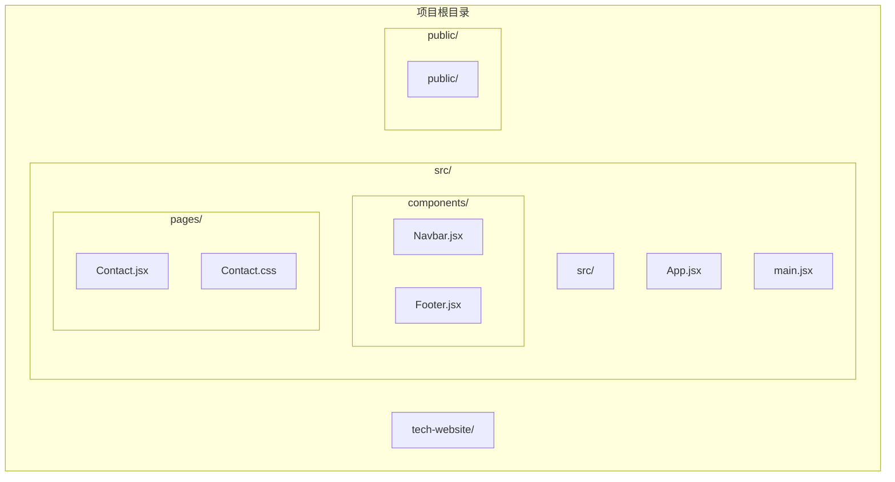

**图表来源**
- [Contact.jsx:1-274](file://tech-website/src/pages/Contact.jsx#L1-L274)
- [App.jsx:1-25](file://tech-website/src/App.jsx#L1-L25)

**章节来源**
- [Contact.jsx:1-274](file://tech-website/src/pages/Contact.jsx#L1-L274)
- [App.jsx:1-25](file://tech-website/src/App.jsx#L1-L25)

## 核心组件

### 组件架构设计

联系页面组件采用函数式组件设计，使用React Hooks进行状态管理。组件内部包含三个主要状态：

1. **表单数据状态** (`formData`): 管理所有表单字段的数据绑定
2. **提交状态** (`isSubmitting`): 控制表单提交过程中的UI状态
3. **结果状态** (`submitStatus`): 显示提交结果的成功或错误状态

### 数据绑定机制

组件实现了双向数据绑定机制，通过单一事件处理器处理所有表单字段的变化：

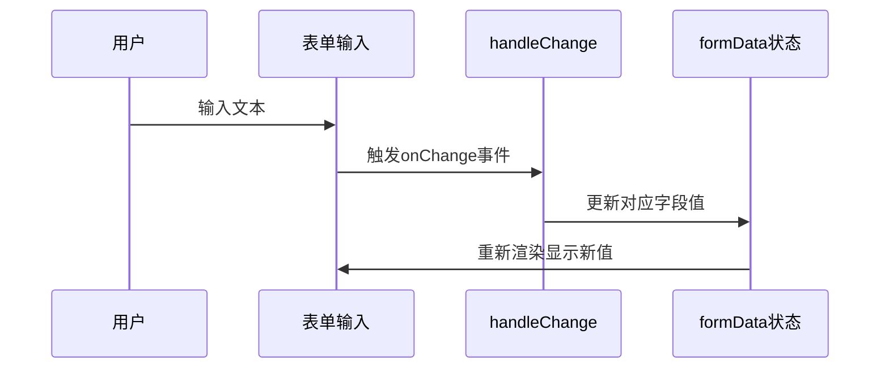

**图表来源**
- [Contact.jsx:16-22](file://tech-website/src/pages/Contact.jsx#L16-L22)

### 表单字段配置

组件包含五个核心表单字段，每个字段都经过精心设计以提供最佳用户体验：

| 字段名 | 类型 | 必填 | 验证规则 | 描述 |
|--------|------|------|----------|------|
| name | 文本输入 | 是 | 最少字符限制 | 用户姓名 |
| phone | 电话号码 | 是 | 11位数字格式 | 联系电话号码 |
| company | 文本输入 | 是 | 最少字符限制 | 公司名称 |
| email | 邮箱地址 | 否 | 标准邮箱格式 | 电子邮箱地址 |
| message | 多行文本 | 否 | 自由文本 | 留言内容 |

**章节来源**
- [Contact.jsx:5-11](file://tech-website/src/pages/Contact.jsx#L5-L11)
- [Contact.jsx:76-146](file://tech-website/src/pages/Contact.jsx#L76-L146)

## 架构概览

### 整体架构设计

联系页面组件采用分层架构设计，清晰分离了视图层、状态管理层和业务逻辑层：

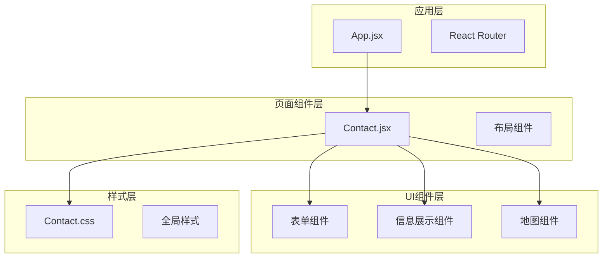

**图表来源**
- [App.jsx:8-19](file://tech-website/src/App.jsx#L8-L19)
- [Contact.jsx:45-270](file://tech-website/src/pages/Contact.jsx#L45-L270)

### 状态管理架构

组件采用集中式状态管理模式，通过React Hooks实现状态的统一管理：

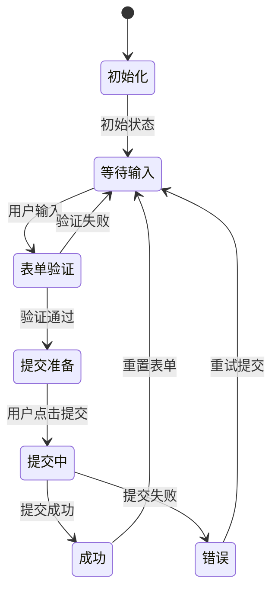

**图表来源**
- [Contact.jsx:13-43](file://tech-website/src/pages/Contact.jsx#L13-L43)

**章节来源**
- [Contact.jsx:1-274](file://tech-website/src/pages/Contact.jsx#L1-L274)

## 详细组件分析

### 表单组件分析

#### 表单结构设计

联系页面的表单采用网格布局设计，实现了响应式的两列布局：

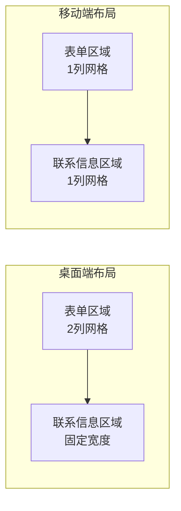

**图表来源**
- [Contact.css:31-35](file://tech-website/src/pages/Contact.css#L31-L35)
- [Contact.css:295-309](file://tech-website/src/pages/Contact.css#L295-L309)

#### 表单字段实现

每个表单字段都实现了完整的数据绑定和验证机制：

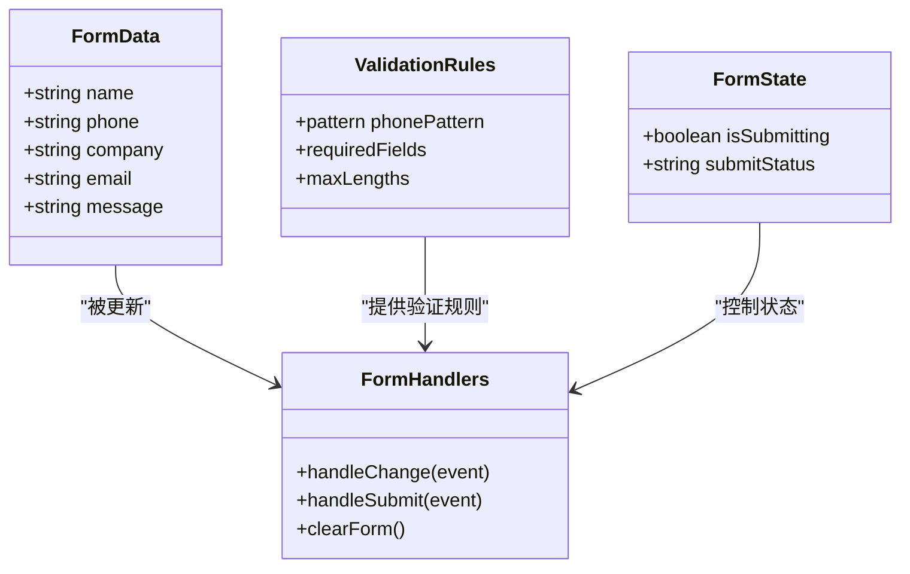

**图表来源**
- [Contact.jsx:5-11](file://tech-website/src/pages/Contact.jsx#L5-L11)
- [Contact.jsx:16-43](file://tech-website/src/pages/Contact.jsx#L16-L43)

#### 实时验证机制

组件实现了基于HTML5原生验证和自定义验证规则的双重验证机制：

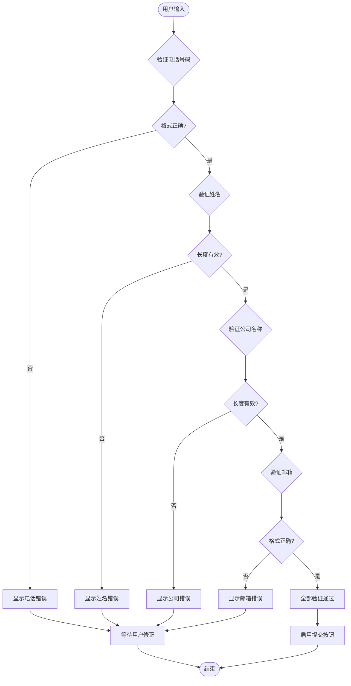

**图表来源**
- [Contact.jsx:96-106](file://tech-website/src/pages/Contact.jsx#L96-L106)
- [Contact.jsx:125-134](file://tech-website/src/pages/Contact.jsx#L125-L134)

### 联系信息展示模块

#### 信息卡片设计

联系信息模块采用卡片式设计，提供了四种不同类型的信息展示：

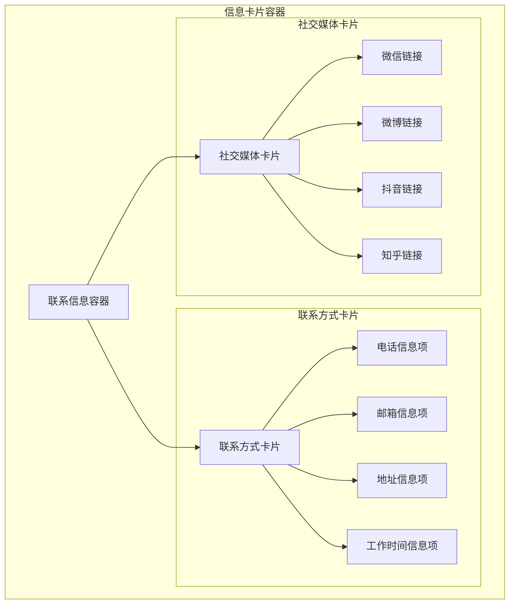

**图表来源**
- [Contact.jsx:169-252](file://tech-website/src/pages/Contact.jsx#L169-L252)

#### 图标系统设计

组件使用SVG图标系统，为每种联系信息类型提供了专门的视觉标识：

| 信息类型 | SVG图标 | 功能用途 |
|----------|---------|----------|
| 电话 | 📞 | 显示客户服务热线 |
| 邮箱 | ✉️ | 显示官方邮箱地址 |
| 地址 | 📍 | 显示公司办公地址 |
| 时间 | ⏰ | 显示工作时间安排 |
| 微信 | 🤝 | 社交媒体链接 |
| 微博 | 📱 | 社交媒体链接 |
| 抖音 | 🎥 | 社交媒体链接 |
| 知乎 | 💡 | 社交媒体链接 |

**章节来源**
- [Contact.jsx:170-252](file://tech-website/src/pages/Contact.jsx#L170-L252)

### 地图展示模块

#### 地图占位符设计

地图模块采用了简洁的占位符设计，提供了视觉引导和信息展示功能：

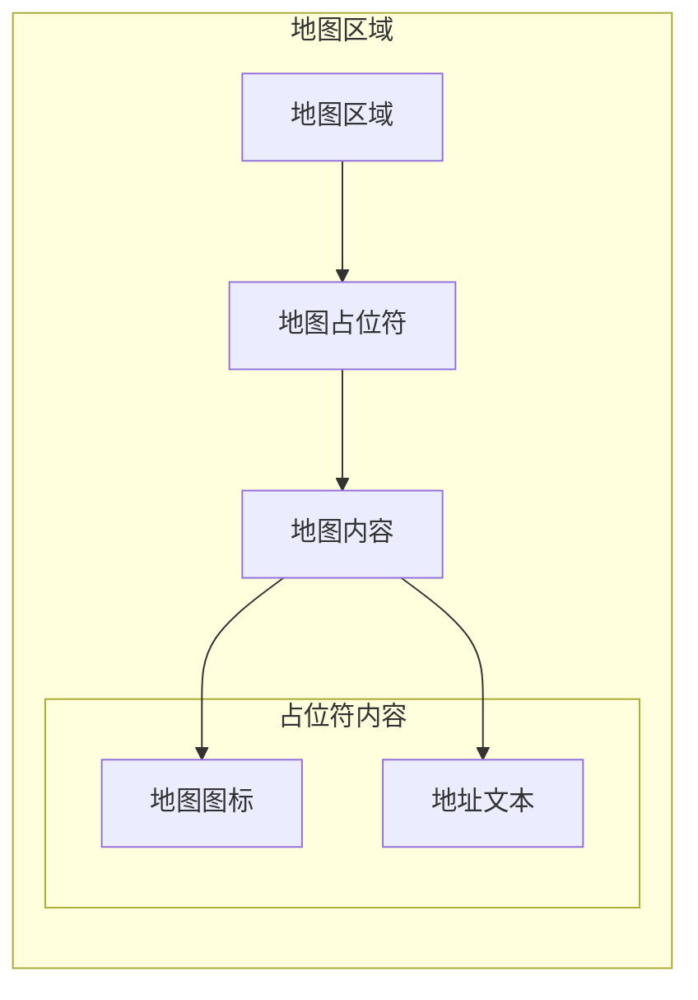

**图表来源**
- [Contact.jsx:257-268](file://tech-website/src/pages/Contact.jsx#L257-L268)

**章节来源**
- [Contact.jsx:257-268](file://tech-website/src/pages/Contact.jsx#L257-L268)

## 依赖关系分析

### 外部依赖

联系页面组件依赖于以下外部库和框架：

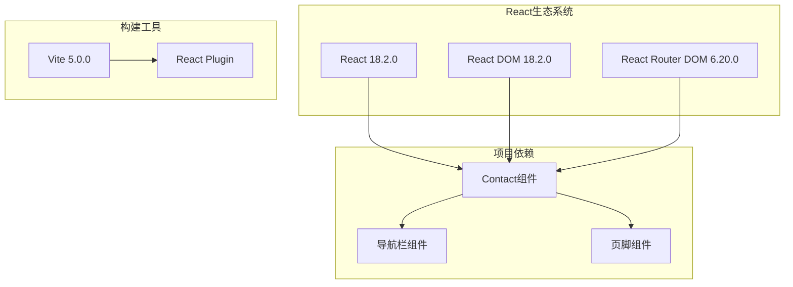

**图表来源**
- [package.json:11-21](file://tech-website/package.json#L11-L21)
- [App.jsx:1-25](file://tech-website/src/App.jsx#L1-L25)

### 内部组件依赖

组件之间的依赖关系相对简单，遵循了单一职责原则：

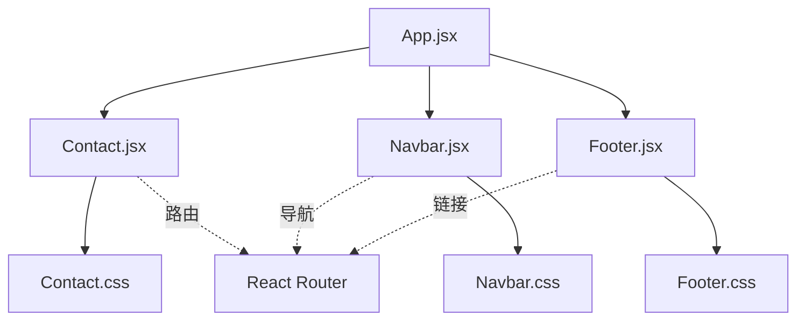

**图表来源**
- [App.jsx:1-25](file://tech-website/src/App.jsx#L1-L25)
- [main.jsx:1-14](file://tech-website/src/main.jsx#L1-L14)

**章节来源**
- [package.json:1-23](file://tech-website/package.json#L1-L23)
- [App.jsx:1-25](file://tech-website/src/App.jsx#L1-L25)

## 性能考虑

### 渲染优化

联系页面组件在设计时充分考虑了性能优化：

1. **状态最小化**: 使用useState钩子管理必要的状态，避免不必要的重渲染
2. **事件处理优化**: 单一的handleChange处理器减少了事件监听器的数量
3. **条件渲染**: 使用条件渲染避免不必要DOM元素的创建

### 内存管理

组件实现了良好的内存管理策略：

- **状态清理**: 提交成功后自动清空表单数据
- **定时器管理**: 使用setTimeout设置的定时器在组件卸载时会被自动清理
- **样式隔离**: CSS类名采用作用域隔离，避免样式冲突

### 响应式性能

组件针对不同设备进行了性能优化：

- **CSS Grid布局**: 使用现代CSS布局减少JavaScript计算
- **媒体查询**: 针对移动设备优化了渲染性能
- **SVG图标**: 使用矢量图形减少图片资源加载

## 故障排除指南

### 常见问题及解决方案

#### 表单验证问题

**问题**: 电话号码验证失败
**原因**: 输入格式不符合11位数字要求
**解决方案**: 确保输入11位纯数字，移除空格和特殊字符

**问题**: 表单无法提交
**原因**: 必填字段未填写或验证失败
**解决方案**: 检查红色星号标记的必填字段，确保所有必填字段都有有效输入

#### 样式显示问题

**问题**: 响应式布局异常
**原因**: 屏幕尺寸变化导致的布局问题
**解决方案**: 检查CSS媒体查询断点，确保在目标设备上测试

**问题**: 图标显示不正确
**原因**: SVG图标路径问题
**解决方案**: 确保SVG元素的viewBox属性正确设置

#### 交互问题

**问题**: 加载动画不显示
**原因**: CSS动画样式未正确加载
**解决方案**: 检查CSS文件是否正确导入，确认动画关键帧定义

**问题**: 提交状态不更新
**原因**: 异步操作状态管理问题
**解决方案**: 检查setIsSubmitting和setSubmitStatus的调用时机

**章节来源**
- [Contact.jsx:24-43](file://tech-website/src/pages/Contact.jsx#L24-L43)

### 调试技巧

#### 开发者工具使用

1. **React DevTools**: 检查组件状态和props的变化
2. **网络面板**: 监控表单提交请求的发送和响应
3. **控制台**: 查看JavaScript错误和警告信息

#### 测试建议

1. **单元测试**: 为表单验证逻辑编写测试用例
2. **集成测试**: 测试完整的表单提交流程
3. **跨浏览器测试**: 在不同浏览器中验证兼容性

## 结论

联系页面组件是一个设计精良、功能完整的React组件，展现了现代前端开发的最佳实践。组件通过合理的架构设计、完善的表单管理机制和优秀的用户体验设计，为用户提供了优质的联系功能。

### 主要优势

1. **架构清晰**: 采用函数式组件和Hooks的设计模式，代码结构清晰易维护
2. **用户体验优秀**: 完整的状态管理和实时反馈机制提升了用户满意度
3. **响应式设计**: 针对不同设备的优化确保了良好的跨设备体验
4. **可扩展性强**: 模块化的组件设计便于后续功能扩展和维护

### 改进建议

1. **增强验证**: 可以添加更复杂的验证规则和实时验证反馈
2. **国际化支持**: 添加多语言支持以服务更广泛的用户群体
3. **无障碍访问**: 进一步优化无障碍访问功能
4. **性能监控**: 添加性能监控和错误追踪机制

该组件为技术网站提供了坚实的基础，通过持续的优化和改进，可以进一步提升用户体验和系统稳定性。