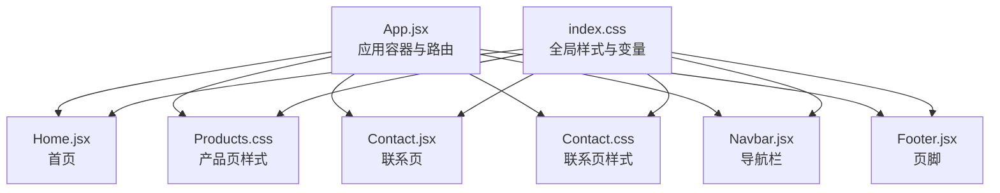
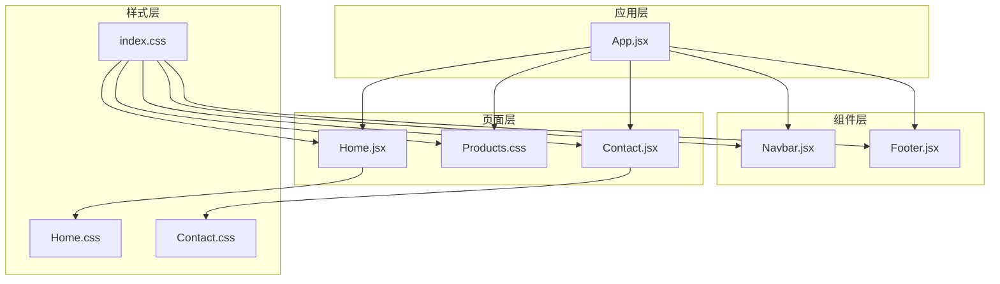
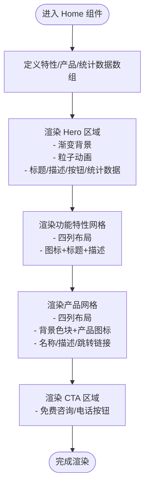
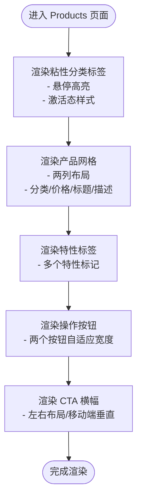
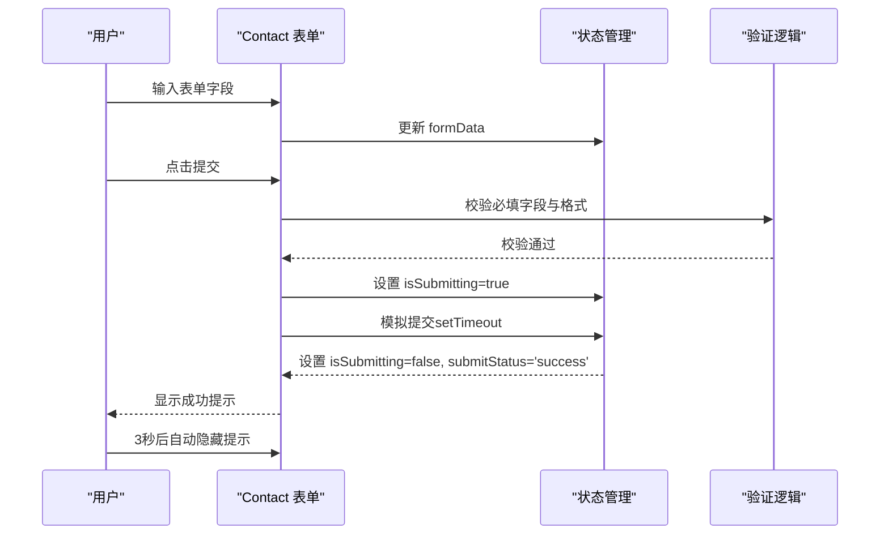
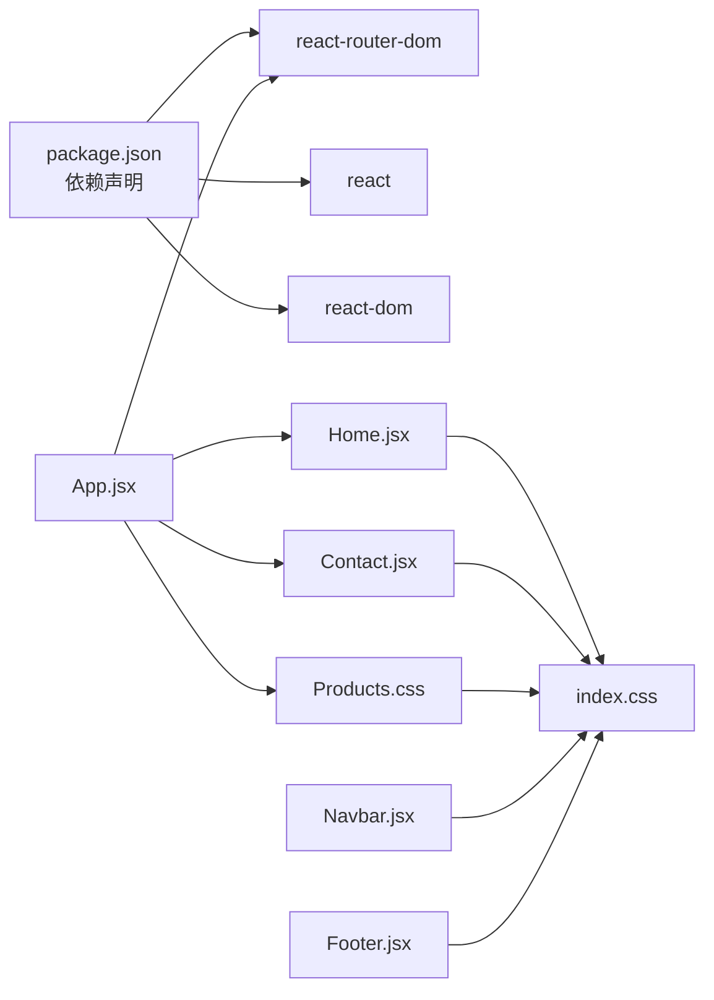

# 页面组件

<cite>
**本文引用的文件**
- [App.jsx](file://src/App.jsx)
- [Home.jsx](file://src/pages/Home.jsx)
- [Home.css](file://src/pages/Home.css)
- [Products.css](file://src/pages/Products.css)
- [Contact.jsx](file://src/pages/Contact.jsx)
- [Contact.css](file://src/pages/Contact.css)
- [Navbar.jsx](file://src/components/Navbar.jsx)
- [Footer.jsx](file://src/components/Footer.jsx)
- [index.css](file://src/index.css)
- [package.json](file://package.json)
</cite>

## 目录
1. [简介](#简介)
2. [项目结构](#项目结构)
3. [核心组件](#核心组件)
4. [架构总览](#架构总览)
5. [详细组件分析](#详细组件分析)
6. [依赖关系分析](#依赖关系分析)
7. [性能考虑](#性能考虑)
8. [故障排查指南](#故障排查指南)
9. [结论](#结论)
10. [附录](#附录)

## 简介
本文件面向技术网站的页面级组件，系统性梳理并解析以下页面组件的设计与实现：
- 首页（Home）：Hero 区域设计、功能特性展示、产品网格布局、统计数据展示
- 产品页（Products）：产品列表展示与响应式网格布局
- 联系页（Contact）：表单设计、验证逻辑、提交状态管理与用户体验优化
同时，文档覆盖页面组件的生命周期管理、状态处理、与全局样式的集成方式，并提供页面开发最佳实践、SEO 优化建议与性能优化策略。

## 项目结构
该网站采用 React + Vite 构建，路由通过 react-router-dom 管理。页面组件位于 src/pages，公共组件位于 src/components，全局样式位于 src/index.css，入口在 src/main.jsx（未列出但由 package.json 的构建脚本可知存在）。

图表来源
- [App.jsx:1-25](file://src/App.jsx#L1-L25)
- [Home.jsx:1-230](file://src/pages/Home.jsx#L1-L230)
- [Products.css:1-230](file://src/pages/Products.css#L1-L230)
- [Contact.jsx:1-274](file://src/pages/Contact.jsx#L1-L274)
- [Contact.css:1-340](file://src/pages/Contact.css#L1-L340)
- [Navbar.jsx:1-67](file://src/components/Navbar.jsx#L1-L67)
- [Footer.jsx:1-97](file://src/components/Footer.jsx#L1-L97)
- [index.css:1-228](file://src/index.css#L1-L228)

章节来源
- [App.jsx:1-25](file://src/App.jsx#L1-L25)
- [index.css:1-228](file://src/index.css#L1-L228)
- [package.json:1-23](file://package.json#L1-L23)

## 核心组件
- 应用容器与路由：在 App.jsx 中定义路由规则，挂载导航与页脚，承载各页面组件。
- 页面组件：Home、Products、Contact 分别负责首页、产品页、联系页的结构与交互。
- 公共组件：Navbar、Footer 提供统一的导航与页脚，复用品牌与链接资源。
- 全局样式：index.css 定义主题变量、通用组件样式与响应式断点，页面样式通过局部 CSS 文件扩展。

章节来源
- [App.jsx:1-25](file://src/App.jsx#L1-L25)
- [Navbar.jsx:1-67](file://src/components/Navbar.jsx#L1-L67)
- [Footer.jsx:1-97](file://src/components/Footer.jsx#L1-L97)
- [index.css:1-228](file://src/index.css#L1-L228)

## 架构总览
页面组件遵循“容器 + 展示”的分层思想：
- 容器层：App.jsx 负责路由与布局骨架
- 页面层：Home/Products/Contact 负责各自业务视图与交互
- 组件层：Navbar/Footer 提供可复用 UI
- 样式层：index.css 提供全局变量与通用样式，页面 CSS 扩展局部样式

图表来源
- [App.jsx:1-25](file://src/App.jsx#L1-L25)
- [Home.jsx:1-230](file://src/pages/Home.jsx#L1-L230)
- [Products.css:1-230](file://src/pages/Products.css#L1-L230)
- [Contact.jsx:1-274](file://src/pages/Contact.jsx#L1-L274)
- [Contact.css:1-340](file://src/pages/Contact.css#L1-L340)
- [Navbar.jsx:1-67](file://src/components/Navbar.jsx#L1-L67)
- [Footer.jsx:1-97](file://src/components/Footer.jsx#L1-L97)
- [index.css:1-228](file://src/index.css#L1-L228)

## 详细组件分析

### 首页（Home）组件
- 设计目标：以 Hero 区域吸引用户注意力，通过功能特性卡片展示能力，以产品网格呈现核心产品，并用统计数据强化信任度。
- 关键模块：
  - Hero 区域：包含渐变背景、粒子动画、标题文案、副标题、行动按钮与统计数据展示。
  - 功能特性：使用四列网格展示四项能力，每项包含图标、标题与描述。
  - 产品网格：四列网格展示四款核心产品，每项包含带色块背景的图标区与信息区。
  - CTA 区域：强调转化动作，提供免费咨询与电话入口。
- 数据与状态：
  - 特性数据、产品数据、统计数据均以内联数组形式定义，渲染时直接映射到 JSX。
  - Hero 区域的粒子动画通过随机位置与动画参数生成，体现轻量动态效果。
- 样式集成：
  - 使用全局变量控制颜色、阴影、圆角、间距与过渡，Hero 与产品卡片 hover 效果增强交互反馈。
  - 响应式断点在 1024px、768px、480px 处调整字体大小、网格列数与布局方向，确保移动端体验。

图表来源
- [Home.jsx:48-226](file://src/pages/Home.jsx#L48-L226)
- [Home.css:1-399](file://src/pages/Home.css#L1-L399)
- [index.css:1-228](file://src/index.css#L1-L228)

章节来源
- [Home.jsx:1-230](file://src/pages/Home.jsx#L1-L230)
- [Home.css:1-399](file://src/pages/Home.css#L1-L399)
- [index.css:1-228](file://src/index.css#L1-L228)

### 产品页（Products）组件
- 设计目标：以清晰的分类标签与产品列表展示产品矩阵，配合响应式网格适配多端。
- 关键模块：
  - 页面头部：使用主色渐变背景突出标题与描述。
  - 分类标签：使用粘性定位在顶部固定，支持横向滚动与激活态高亮。
  - 产品列表：两列网格展示产品项，包含分类标签、价格、标题、描述、特性标签与操作按钮。
  - CTA 横幅：深色背景的行动号召内容，左右布局在移动端垂直堆叠。
- 样式集成：
  - 使用全局变量统一颜色与阴影；分类标签采用过渡动画与悬停高亮。
  - 响应式断点在 1024px 与 768px 调整网格列数与布局，保证可读性与可用性。

图表来源
- [Products.css:1-230](file://src/pages/Products.css#L1-L230)
- [index.css:1-228](file://src/index.css#L1-L228)

章节来源
- [Products.css:1-230](file://src/pages/Products.css#L1-L230)
- [index.css:1-228](file://src/index.css#L1-L228)

### 联系页（Contact）组件
- 设计目标：提供简洁高效的表单收集与联系方式展示，优化提交流程与可访问性。
- 关键模块：
  - 表单区域：包含标题、说明、必填字段（姓名、电话、公司）、选填字段（邮箱、留言），以及提交按钮与加载状态。
  - 成功提示：提交成功后显示绿色成功提示与对勾图标。
  - 联系信息：左侧展示联系方式与社交媒体链接，右侧展示地图占位。
- 状态与交互：
  - 使用 useState 管理表单数据、提交状态与加载状态。
  - 提交流程：阻止默认提交、设置加载状态、模拟异步提交、成功后清空表单并自动隐藏状态。
  - 表单验证：HTML5 pattern 与 required 属性结合，提供即时反馈。
- 样式集成：
  - 使用全局按钮样式与阴影卡片，表单输入框聚焦时高亮边框与背景。
  - 响应式断点在 1024px 与 768px 调整布局与字号，移动端将联系信息改为纵向排列。

图表来源
- [Contact.jsx:1-274](file://src/pages/Contact.jsx#L1-L274)
- [Contact.css:1-340](file://src/pages/Contact.css#L1-L340)
- [index.css:1-228](file://src/index.css#L1-L228)

章节来源
- [Contact.jsx:1-274](file://src/pages/Contact.jsx#L1-L274)
- [Contact.css:1-340](file://src/pages/Contact.css#L1-L340)
- [index.css:1-228](file://src/index.css#L1-L228)

### 导航与页脚（Navbar 与 Footer）
- 导航（Navbar）：响应式菜单、当前路由高亮、移动端汉堡菜单切换。
- 页脚（Footer）：品牌信息、产品导航、解决方案导航、关于导航、联系方式与版权信息。

章节来源
- [Navbar.jsx:1-67](file://src/components/Navbar.jsx#L1-L67)
- [Footer.jsx:1-97](file://src/components/Footer.jsx#L1-L97)

## 依赖关系分析
- 路由依赖：App.jsx 通过 react-router-dom 的 Routes/Route 管理页面切换。
- 组件依赖：页面组件不直接依赖彼此，通过路由与导航组件进行跳转。
- 样式依赖：页面 CSS 与公共组件 CSS 均依赖全局变量与通用样式。
- 依赖注入：全局样式通过 :root 变量集中管理，减少重复与维护成本。

图表来源
- [package.json:1-23](file://package.json#L1-L23)
- [App.jsx:1-25](file://src/App.jsx#L1-L25)
- [Home.jsx:1-230](file://src/pages/Home.jsx#L1-L230)
- [Products.css:1-230](file://src/pages/Products.css#L1-L230)
- [Contact.jsx:1-274](file://src/pages/Contact.jsx#L1-L274)
- [index.css:1-228](file://src/index.css#L1-L228)

章节来源
- [package.json:1-23](file://package.json#L1-L23)
- [App.jsx:1-25](file://src/App.jsx#L1-L25)

## 性能考虑
- 渲染优化
  - 首页 Hero 粒子动画通过内联样式与随机参数生成，避免额外资源请求；建议在大屏设备上限制动画数量或使用媒体查询降低复杂度。
  - 产品网格与特性网格使用 CSS Grid，避免 JavaScript 循环拼接 DOM，提升渲染性能。
- 状态与副作用
  - 联系页提交流程使用 setTimeout 模拟异步，实际项目应替换为真实 API 调用；建议引入防抖与去抖策略，避免重复提交。
  - 表单状态仅在本地保存，适合静态展示；如需持久化，建议结合后端或本地存储方案。
- 样式与资源
  - 全局变量集中管理，减少重复计算；建议在生产环境启用 CSS 压缩与 Tree Shaking。
  - SVG 图标内联，体积小且无需额外请求；建议对不常用图标按需懒加载。
- 响应式
  - 在 768px 断点下将网格从两列降为一列，减少重排；建议在更小断点进一步合并布局，提升移动端性能。

## 故障排查指南
- 表单提交失败
  - 症状：点击提交按钮无反应或状态不更新
  - 排查：确认事件处理器绑定正确、禁用按钮逻辑生效、模拟提交回调是否执行
  - 参考路径：[Contact.jsx:24-43](file://src/pages/Contact.jsx#L24-L43)
- 样式不生效
  - 症状：组件样式未按预期显示
  - 排查：检查全局变量是否正确导入、CSS 优先级是否被覆盖、媒体查询断点是否匹配
  - 参考路径：[index.css:1-228](file://src/index.css#L1-L228)，[Contact.css:1-340](file://src/pages/Contact.css#L1-L340)
- 响应式布局异常
  - 症状：在特定屏幕尺寸下布局错乱
  - 排查：核对断点设置与容器宽度、网格列数与最小宽度配置
  - 参考路径：[Home.css:312-398](file://src/pages/Home.css#L312-L398)，[Products.css:173-229](file://src/pages/Products.css#L173-L229)，[Contact.css:294-339](file://src/pages/Contact.css#L294-L339)
- 导航高亮不准确
  - 症状：当前页面链接未高亮
  - 排查：确认 useLocation 返回的 pathname 与导航项 path 是否一致
  - 参考路径：[Navbar.jsx:7-15](file://src/components/Navbar.jsx#L7-L15)

章节来源
- [Contact.jsx:1-274](file://src/pages/Contact.jsx#L1-L274)
- [index.css:1-228](file://src/index.css#L1-L228)
- [Home.css:312-398](file://src/pages/Home.css#L312-L398)
- [Products.css:173-229](file://src/pages/Products.css#L173-L229)
- [Contact.css:294-339](file://src/pages/Contact.css#L294-L339)
- [Navbar.jsx:1-67](file://src/components/Navbar.jsx#L1-L67)

## 结论
本页面组件体系以清晰的职责划分与统一的样式规范为基础，实现了从首页引导、产品展示到联系转化的完整闭环。通过合理的响应式策略与状态管理，兼顾了视觉体验与交互效率。建议后续在真实业务中补充后端接口、SEO 元数据与性能监控，持续优化用户体验与可维护性。

## 附录
- 最佳实践
  - 将数据源抽象为外部配置或 API，便于迭代与国际化
  - 引入表单校验库（如 React Hook Form）统一校验逻辑
  - 对关键交互增加无障碍属性（aria-*）与键盘导航支持
- SEO 优化建议
  - 为每个页面设置标题与描述，使用 react-helmet 或同等方案
  - 为图片添加 alt 属性，提供语义化描述
  - 生成站点地图与结构化数据（Schema.org）
- 性能优化策略
  - 启用代码分割与路由懒加载
  - 对首屏关键资源进行预加载与预连接
  - 使用 Web Vitals 监控与告警