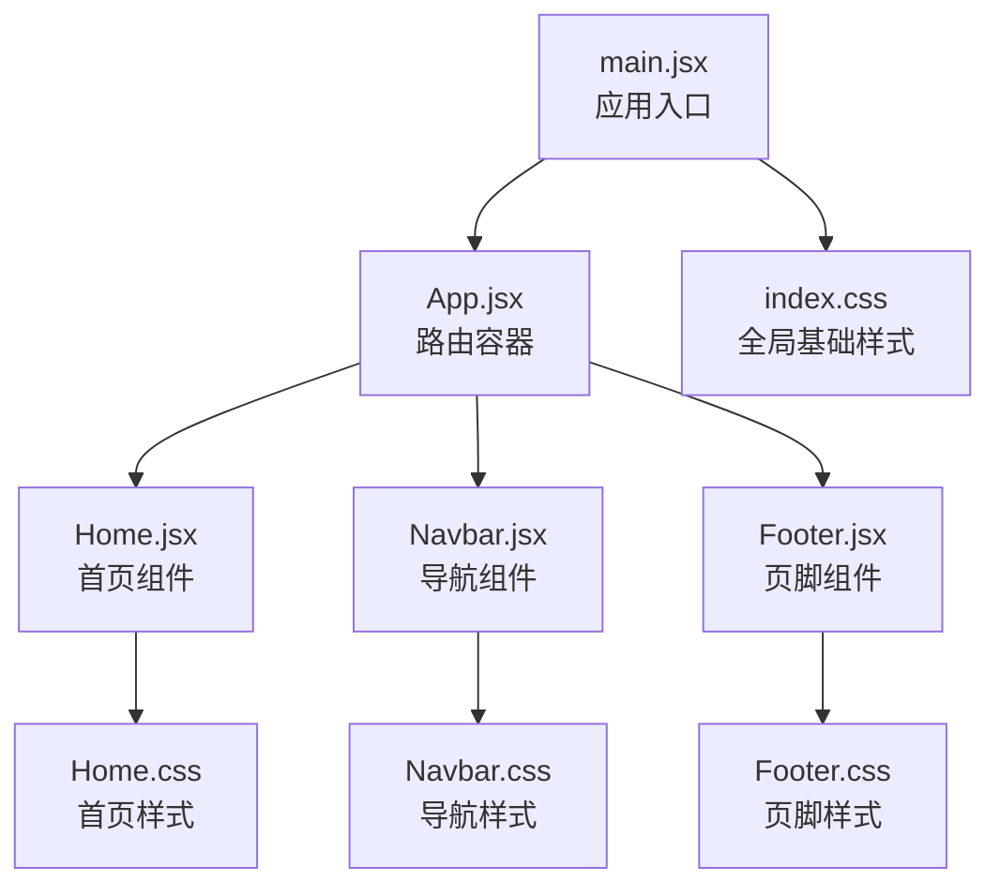
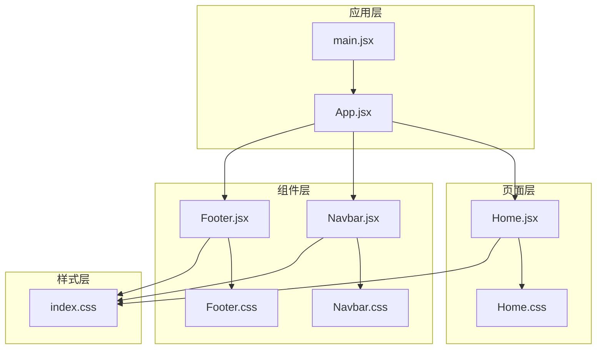
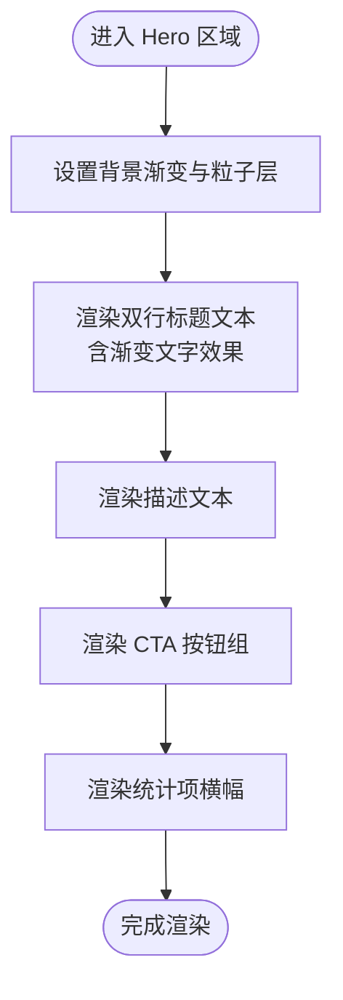
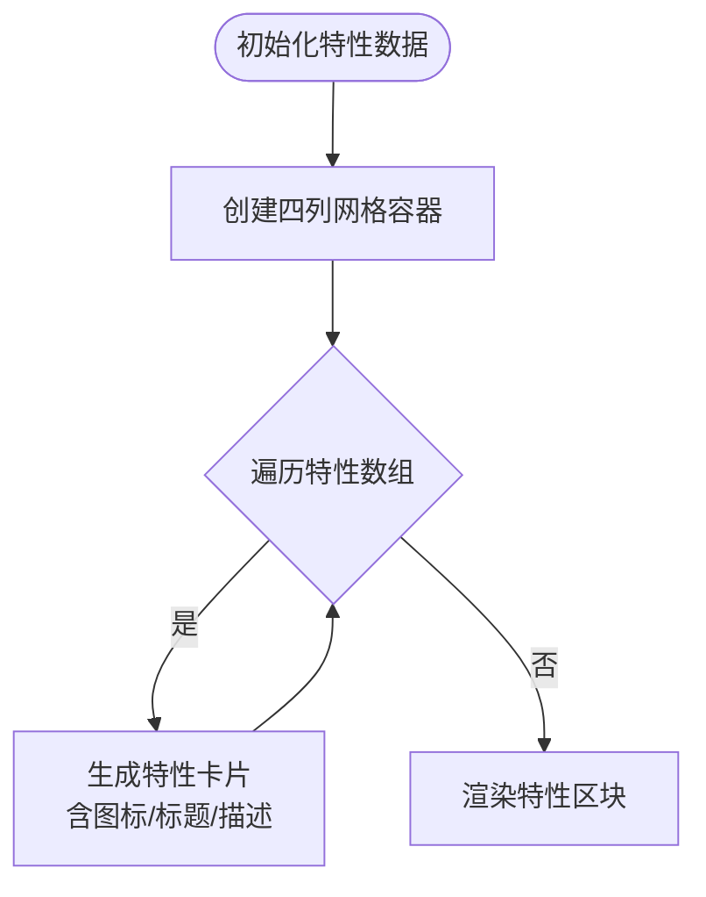
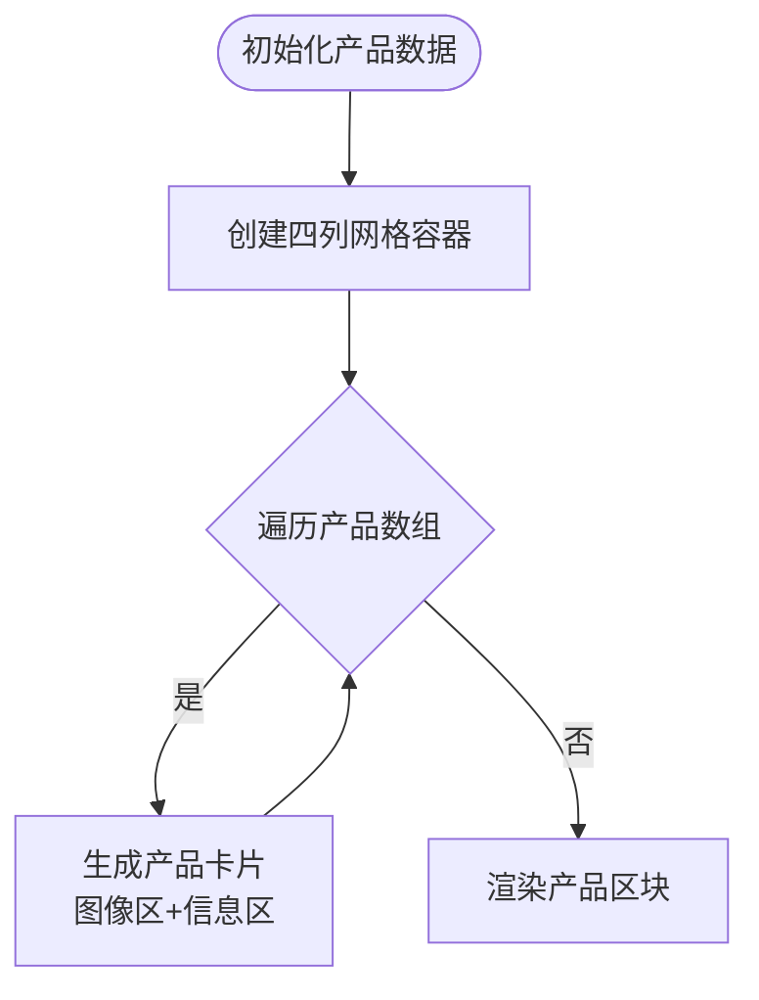
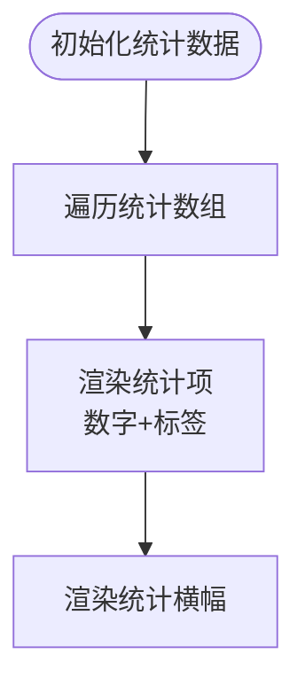
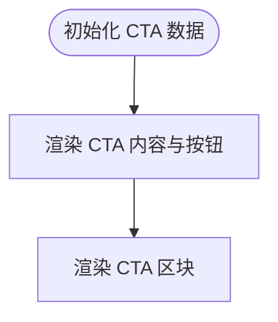
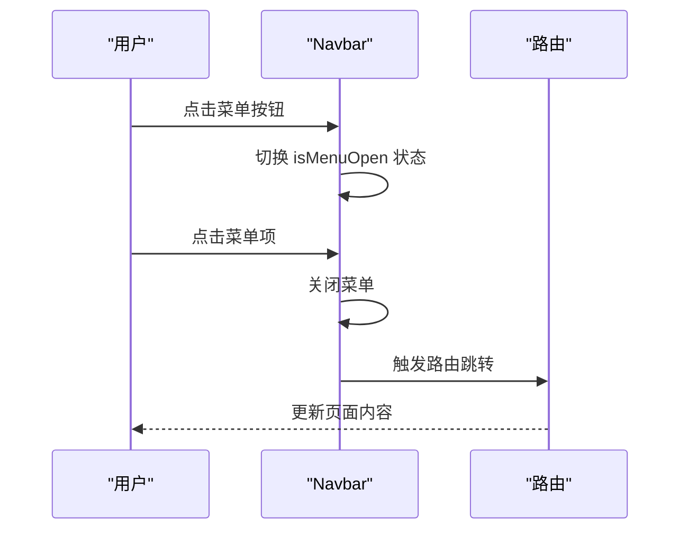
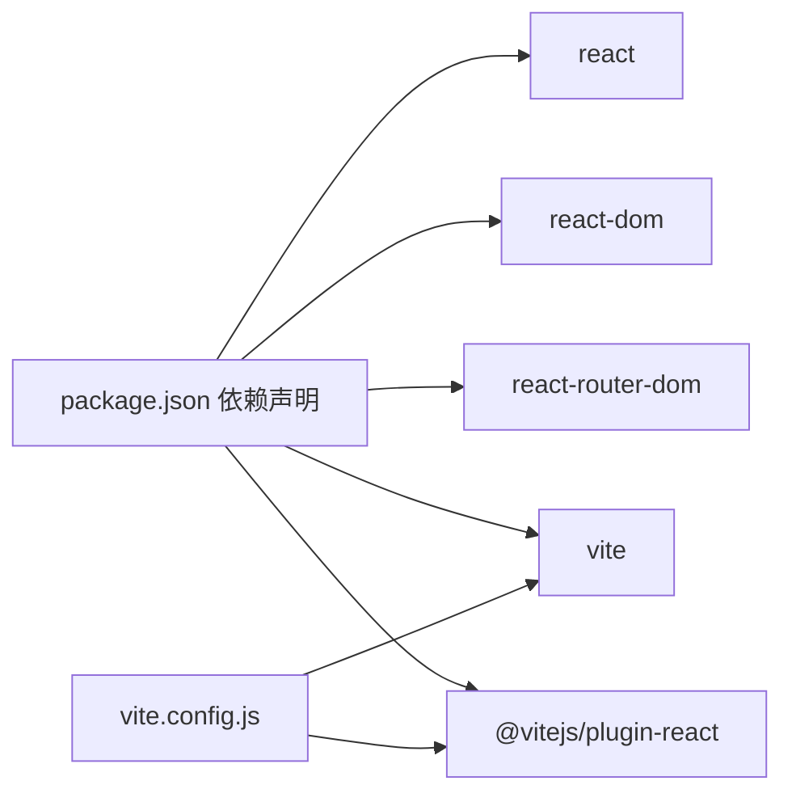

# 首页（Home）

<cite>
**本文引用的文件**
- [Home.jsx](file://src/pages/Home.jsx)
- [Home.css](file://src/pages/Home.css)
- [App.jsx](file://src/App.jsx)
- [main.jsx](file://src/main.jsx)
- [index.css](file://src/index.css)
- [Navbar.jsx](file://src/components/Navbar.jsx)
- [Footer.jsx](file://src/components/Footer.jsx)
- [Navbar.css](file://src/components/Navbar.css)
- [Footer.css](file://src/components/Footer.css)
- [package.json](file://package.json)
- [vite.config.js](file://vite.config.js)
</cite>

## 目录
1. [简介](#简介)
2. [项目结构](#项目结构)
3. [核心组件](#核心组件)
4. [架构总览](#架构总览)
5. [详细组件分析](#详细组件分析)
6. [依赖关系分析](#依赖关系分析)
7. [性能考虑](#性能考虑)
8. [故障排查指南](#故障排查指南)
9. [结论](#结论)
10. [附录](#附录)

## 简介
本文件面向“首页（Home）”组件，系统性解析其整体架构与核心功能实现，重点覆盖以下方面：
- Hero 区域：背景图层与粒子动画、标题文本渐变展示、CTA 按钮交互
- 功能特性展示模块：布局网格、内容组织与视觉层次
- 产品网格布局：响应式网格系统、产品卡片样式与悬停交互
- 统计数据展示：数据绑定、数字动画与视觉呈现
- 组件状态管理、事件处理与样式定制示例
- 性能优化建议与 SEO 最佳实践

## 项目结构
首页组件位于页面级目录，配合全局样式与导航、页脚组件共同构成完整站点骨架。路由在应用入口集中配置，首页通过路由直接渲染。

图表来源
- [main.jsx:1-14](file://src/main.jsx#L1-L14)
- [App.jsx:1-25](file://src/App.jsx#L1-L25)
- [Home.jsx:1-230](file://src/pages/Home.jsx#L1-L230)
- [Navbar.jsx:1-67](file://src/components/Navbar.jsx#L1-L67)
- [Footer.jsx:1-97](file://src/components/Footer.jsx#L1-L97)
- [index.css:1-228](file://src/index.css#L1-L228)
- [Home.css:1-399](file://src/pages/Home.css#L1-L399)
- [Navbar.css:1-155](file://src/components/Navbar.css#L1-L155)
- [Footer.css:1-186](file://src/components/Footer.css#L1-L186)

章节来源
- [main.jsx:1-14](file://src/main.jsx#L1-L14)
- [App.jsx:1-25](file://src/App.jsx#L1-L25)

## 核心组件
- 首页组件（Home）：负责渲染 Hero、功能特性、产品展示与 CTA 四大区块，并内置本地数据源（特性列表、产品列表、统计数据）
- 导航组件（Navbar）：提供全局导航与移动端菜单交互
- 页脚组件（Footer）：提供品牌信息、链接矩阵与联系方式
- 全局样式（index.css）：定义主题变量、通用组件样式与响应式断点
- 页面样式（Home.css）：定义首页各区块的布局、动画与响应式规则

章节来源
- [Home.jsx:1-230](file://src/pages/Home.jsx#L1-L230)
- [Home.css:1-399](file://src/pages/Home.css#L1-L399)
- [index.css:1-228](file://src/index.css#L1-L228)

## 架构总览
首页采用“页面组件 + 全局样式 + 小型局部组件”的轻量架构。数据以常量数组形式内嵌于页面组件内部，减少外部依赖；样式通过 CSS 变量统一主题，结合媒体查询实现响应式布局。

图表来源
- [App.jsx:1-25](file://src/App.jsx#L1-L25)
- [main.jsx:1-14](file://src/main.jsx#L1-L14)
- [Home.jsx:1-230](file://src/pages/Home.jsx#L1-L230)
- [Home.css:1-399](file://src/pages/Home.css#L1-L399)
- [Navbar.jsx:1-67](file://src/components/Navbar.jsx#L1-L67)
- [Footer.jsx:1-97](file://src/components/Footer.jsx#L1-L97)
- [Navbar.css:1-155](file://src/components/Navbar.css#L1-L155)
- [Footer.css:1-186](file://src/components/Footer.css#L1-L186)
- [index.css:1-228](file://src/index.css#L1-L228)

## 详细组件分析

### Hero 区域：背景、标题与 CTA
- 背景与动画
  - 渐变底色与粒子动画：通过绝对定位的背景层与伪随机动画属性实现浮动粒子效果，增强视觉动感
  - 背景层使用线性渐变，营造科技蓝主色调的沉浸感
- 标题文本
  - 分两行展示，第二行使用文本渐变类实现渐变文字效果
  - 标题字号随屏幕尺寸自适应调整，确保在移动端具备良好可读性
- 描述文本
  - 居中排版，最大宽度约束，行高与字色搭配保证阅读体验
- CTA 按钮
  - 主按钮与次按钮采用统一的按钮样式类，支持悬停过渡与阴影变化
  - 统一使用路由链接跳转至联系或产品页面
- 统计数据横幅
  - 使用统计项列表映射渲染，居中分布，顶部分隔线与浅色边框增强区块感

图表来源
- [Home.jsx:78-122](file://src/pages/Home.jsx#L78-L122)
- [Home.css:4-123](file://src/pages/Home.css#L4-L123)

章节来源
- [Home.jsx:78-122](file://src/pages/Home.jsx#L78-L122)
- [Home.css:4-123](file://src/pages/Home.css#L4-L123)

### 功能特性展示模块：布局与内容
- 布局设计
  - 采用四列网格布局，每列一个特性卡片，间距统一
  - 卡片内图标、标题、描述形成清晰的信息层级
- 内容组织
  - 特性数据以内联数组形式维护，便于扩展与本地化
  - 图标采用 SVG，颜色与尺寸由 CSS 控制，保持一致的视觉风格
- 视觉呈现
  - 卡片具备圆角、阴影与过渡动画，悬停时提升层级与阴影强度

图表来源
- [Home.jsx:5-46](file://src/pages/Home.jsx#L5-L46)
- [Home.jsx:124-141](file://src/pages/Home.jsx#L124-L141)
- [Home.css:124-164](file://src/pages/Home.css#L124-L164)

章节来源
- [Home.jsx:5-46](file://src/pages/Home.jsx#L5-L46)
- [Home.jsx:124-141](file://src/pages/Home.jsx#L124-L141)
- [Home.css:124-164](file://src/pages/Home.css#L124-L164)

### 产品网格布局：响应式网格、卡片样式与交互
- 实现原理
  - 使用 CSS Grid 创建四列布局，响应式断点下自动降级为两列与单列
  - 每个产品卡片包含图像区与信息区，图像区使用线性渐变背景与占位图标
- 产品卡片样式
  - 圆角、阴影与过渡动画，悬停时上移并增强阴影
  - 图像区伪元素叠加透明度，信息区提供名称、描述与“查看详情”链接
- 交互效果
  - 链接采用统一的按钮样式类，悬停时图标与文字间距变化，增强反馈

图表来源
- [Home.jsx:48-69](file://src/pages/Home.jsx#L48-L69)
- [Home.jsx:143-205](file://src/pages/Home.jsx#L143-L205)
- [Home.css:165-267](file://src/pages/Home.css#L165-L267)

章节来源
- [Home.jsx:48-69](file://src/pages/Home.jsx#L48-L69)
- [Home.jsx:143-205](file://src/pages/Home.jsx#L143-L205)
- [Home.css:165-267](file://src/pages/Home.css#L165-L267)

### 统计数据展示：数据绑定、动画与视觉
- 数据绑定
  - 统计数据以内联数组形式维护，通过映射渲染多个统计项
- 视觉呈现
  - 数字使用渐变文字，标签使用次级文字色，整体居中对齐
  - 顶部分隔线与适配间距确保区块边界清晰
- 响应式表现
  - 在小屏设备上采用换行与宽度控制，避免拥挤

图表来源
- [Home.jsx:71-76](file://src/pages/Home.jsx#L71-L76)
- [Home.jsx:113-121](file://src/pages/Home.jsx#L113-L121)
- [Home.css:97-123](file://src/pages/Home.css#L97-L123)

章节来源
- [Home.jsx:71-76](file://src/pages/Home.jsx#L71-L76)
- [Home.jsx:113-121](file://src/pages/Home.jsx#L113-L121)
- [Home.css:97-123](file://src/pages/Home.css#L97-L123)

### CTA 区域：样式与交互
- 设计要点
  - 使用主梯度背景与半透明纹理，文字采用白色高对比度
  - 文本居中排版，按钮组水平居中，移动端改为垂直堆叠
- 交互行为
  - 按钮类名统一，悬停时反色过渡，提供明确点击反馈

图表来源
- [Home.jsx:207-225](file://src/pages/Home.jsx#L207-L225)
- [Home.css:268-311](file://src/pages/Home.css#L268-L311)

章节来源
- [Home.jsx:207-225](file://src/pages/Home.jsx#L207-L225)
- [Home.css:268-311](file://src/pages/Home.css#L268-L311)

### 组件状态管理与事件处理
- 首页组件（Home）
  - 无内部状态，使用内联数据源进行渲染，适合静态内容场景
- 导航组件（Navbar）
  - 使用本地状态控制移动端菜单开关，点击菜单项后自动收起
  - 使用路由位置判断当前激活链接，提供导航高亮
- 事件处理
  - 菜单切换按钮绑定点击事件，菜单项点击后关闭菜单
  - 路由跳转使用 Link 组件，保持 SPA 导航体验

图表来源
- [Navbar.jsx:1-67](file://src/components/Navbar.jsx#L1-L67)

章节来源
- [Home.jsx:1-230](file://src/pages/Home.jsx#L1-L230)
- [Navbar.jsx:1-67](file://src/components/Navbar.jsx#L1-L67)

### 样式定制与主题变量
- 主题变量
  - 全局定义主色、辅色、中性色、背景色、阴影、圆角与间距等变量
  - 通过 CSS 变量统一主题，便于快速切换与定制
- 通用样式
  - 按钮、卡片、章节标题等通用组件样式集中定义，复用性强
- 响应式断点
  - 在不同断点下调整容器内边距、字体大小与网格列数，确保移动端体验

章节来源
- [index.css:1-228](file://src/index.css#L1-L228)
- [Home.css:1-399](file://src/pages/Home.css#L1-L399)

## 依赖关系分析
- 运行时依赖
  - React、React DOM、React Router DOM 提供组件框架与路由能力
- 构建工具
  - Vite + React 插件提供开发服务器与打包能力，默认端口 3000
- 组件间耦合
  - 首页组件与导航、页脚组件松耦合，通过路由与全局样式连接
  - 导航组件与页脚组件独立存在，仅共享全局样式变量

图表来源
- [package.json:1-23](file://package.json#L1-L23)
- [vite.config.js:1-11](file://vite.config.js#L1-L11)

章节来源
- [package.json:1-23](file://package.json#L1-L23)
- [vite.config.js:1-11](file://vite.config.js#L1-L11)

## 性能考虑
- 静态数据内联：首页数据以常量数组内嵌，避免首屏请求，利于快速渲染
- SVG 图标：内联 SVG 减少额外资源请求，同时可继承颜色变量
- 动画与阴影：合理使用 CSS 动画与阴影，避免过度复杂动画导致性能下降
- 响应式策略：通过媒体查询在不同断点下调整网格列数与字体大小，降低重排成本
- 资源加载：建议在生产环境启用资源压缩与缓存策略，结合 CDN 加速静态资源

## 故障排查指南
- 路由不生效
  - 确认应用根节点包裹了浏览器路由容器，且路由配置正确指向首页组件
- 样式未生效
  - 检查全局样式是否正确引入，确认 CSS 变量命名与使用一致
- 移动端菜单无法展开
  - 检查菜单状态切换逻辑与按钮事件绑定，确认断点下的样式覆盖
- 图标或背景显示异常
  - 检查 SVG 的 viewBox 与尺寸设置，确认 CSS 类名拼写与作用域

章节来源
- [main.jsx:1-14](file://src/main.jsx#L1-L14)
- [App.jsx:1-25](file://src/App.jsx#L1-L25)
- [Navbar.jsx:1-67](file://src/components/Navbar.jsx#L1-L67)
- [index.css:1-228](file://src/index.css#L1-L228)

## 结论
首页组件以简洁的结构与清晰的视觉层次，实现了从 Hero 引导到产品展示再到行动号召的完整转化路径。通过 CSS 变量与响应式网格，兼顾了主题一致性与多端体验。对于后续迭代，可在数据层引入外部配置或本地化资源，进一步提升可维护性与国际化支持。

## 附录
- 开发与构建
  - 开发服务器默认端口 3000，自动打开浏览器
  - 生产构建输出至 dist 目录，建议配合静态托管服务部署

章节来源
- [vite.config.js:1-11](file://vite.config.js#L1-L11)