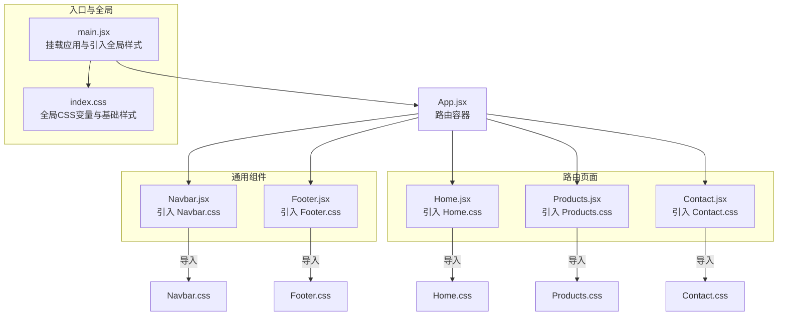
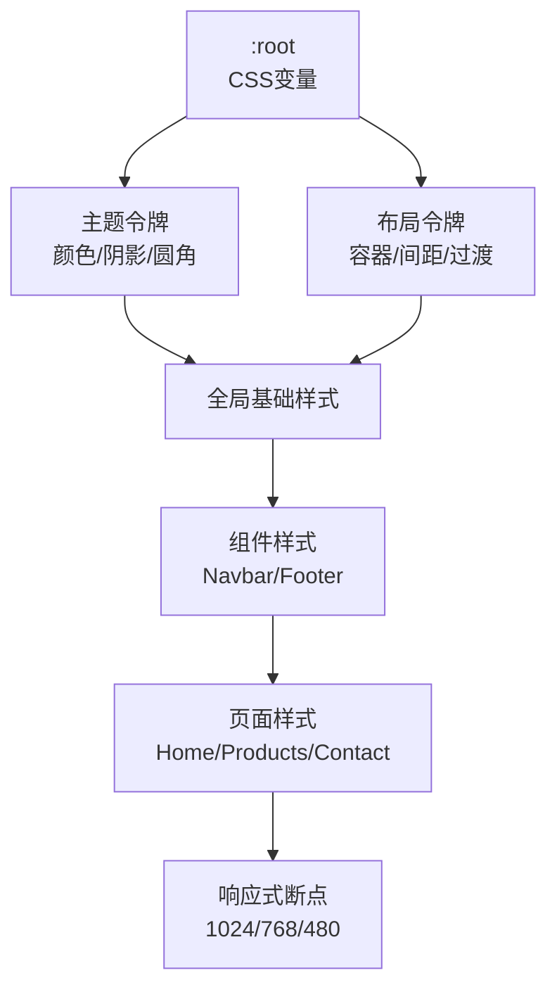
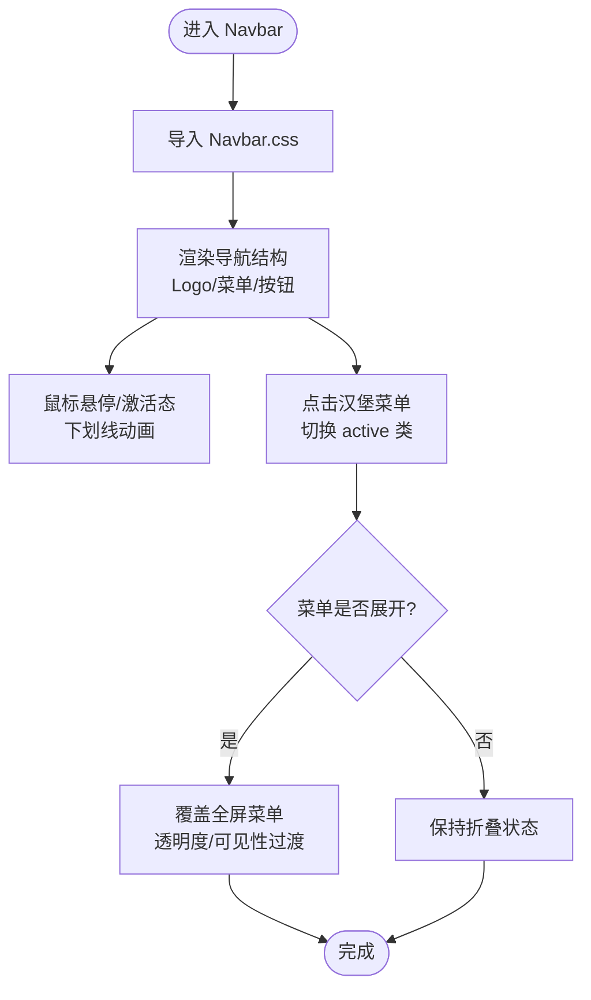
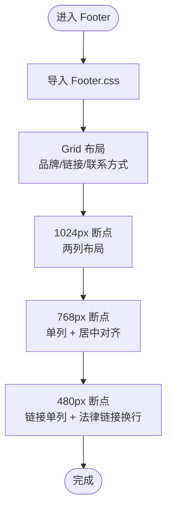
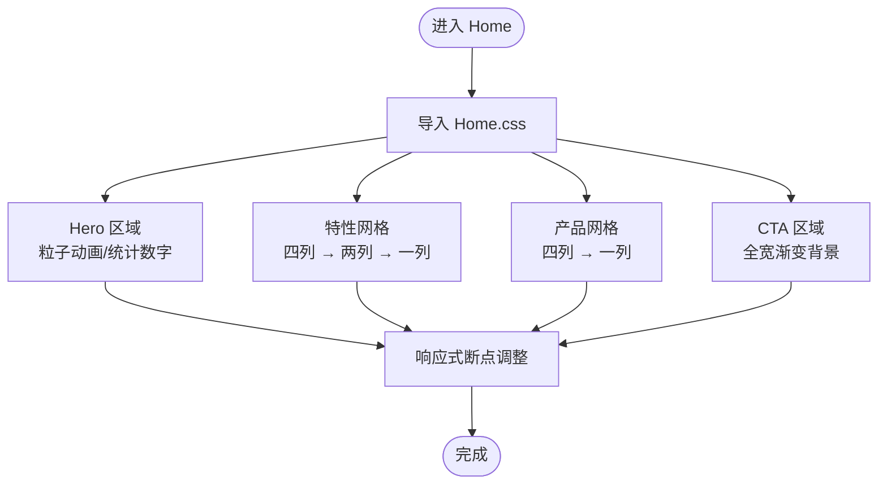
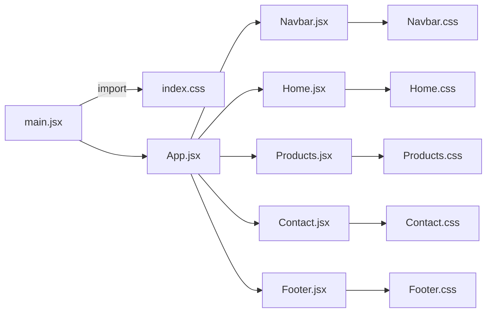

# 样式系统

<cite>
**本文引用的文件**
- [index.css](file://src/index.css)
- [Navbar.css](file://src/components/Navbar.css)
- [Footer.css](file://src/components/Footer.css)
- [Home.css](file://src/pages/Home.css)
- [Products.css](file://src/pages/Products.css)
- [Contact.css](file://src/pages/Contact.css)
- [App.jsx](file://src/App.jsx)
- [main.jsx](file://src/main.jsx)
- [Navbar.jsx](file://src/components/Navbar.jsx)
- [Footer.jsx](file://src/components/Footer.jsx)
- [Home.jsx](file://src/pages/Home.jsx)
- [Products.jsx](file://src/pages/Products.jsx)
- [Contact.jsx](file://src/pages/Contact.jsx)
- [vite.config.js](file://vite.config.js)
- [package.json](file://package.json)
</cite>

## 目录
1. [简介](#简介)
2. [项目结构](#项目结构)
3. [核心组件](#核心组件)
4. [架构总览](#架构总览)
5. [详细组件分析](#详细组件分析)
6. [依赖关系分析](#依赖关系分析)
7. [性能考量](#性能考量)
8. [故障排查指南](#故障排查指南)
9. [结论](#结论)
10. [附录](#附录)

## 简介
本项目采用以CSS变量为核心的现代化样式架构，结合原子化类名与模块化样式文件，构建了统一的科技风格企业官网。通过全局CSS变量集中管理色彩、间距、圆角、阴影与过渡等设计令牌，配合组件级样式文件实现职责清晰的模块化组织；同时利用媒体查询实现响应式布局，覆盖桌面、平板与移动端场景。

## 项目结构
项目采用“按功能域分层”的样式组织方式：全局样式集中于入口CSS，组件与页面样式分别独立成文件，通过组件导入的方式按需加载，避免全局污染并提升可维护性。

图表来源
- [main.jsx:1-14](file://src/main.jsx#L1-L14)
- [index.css:1-228](file://src/index.css#L1-L228)
- [App.jsx:1-25](file://src/App.jsx#L1-L25)
- [Home.jsx:1-230](file://src/pages/Home.jsx#L1-L230)
- [Products.jsx:1-139](file://src/pages/Products.jsx#L1-L139)
- [Contact.jsx:1-274](file://src/pages/Contact.jsx#L1-L274)
- [Navbar.jsx:1-67](file://src/components/Navbar.jsx#L1-L67)
- [Footer.jsx:1-97](file://src/components/Footer.jsx#L1-L97)

章节来源
- [main.jsx:1-14](file://src/main.jsx#L1-L14)
- [index.css:1-228](file://src/index.css#L1-L228)
- [App.jsx:1-25](file://src/App.jsx#L1-L25)

## 核心组件
- 全局样式与设计令牌
  - 使用CSS变量集中定义主色、辅色、中性色、背景色、阴影、圆角、间距与过渡等设计令牌，确保主题一致性与可扩展性。
  - 重置与基础样式：统一盒模型、字体、链接、列表、图片与表单控件的基础表现，保证跨浏览器一致性。
  - 容器与通用组件：提供容器最大宽度与内边距、按钮、卡片、章节标题等通用样式，便于复用。

- 组件样式模块化
  - 组件级样式文件独立存放，组件内部通过导入对应CSS文件实现样式注入，避免样式泄漏与命名冲突。
  - 通用组件（导航栏、页脚）与页面组件（首页、产品、联系）均采用相同模块化策略，保持一致的开发体验。

- 响应式设计
  - 在全局样式中定义主要断点，并在各组件样式中针对特定元素进行局部调整，形成“全局断点 + 局部微调”的响应式策略。
  - 断点覆盖：1024px、768px、480px，兼顾桌面端网格布局、移动端菜单与交互细节。

章节来源
- [index.css:1-228](file://src/index.css#L1-L228)
- [Navbar.css:1-155](file://src/components/Navbar.css#L1-L155)
- [Footer.css:1-186](file://src/components/Footer.css#L1-L186)
- [Home.css:1-399](file://src/pages/Home.css#L1-L399)
- [Products.css:1-230](file://src/pages/Products.css#L1-L230)
- [Contact.css:1-340](file://src/pages/Contact.css#L1-L340)

## 架构总览
下图展示了样式系统的整体架构：全局CSS变量作为设计令牌中心，组件样式通过原子化类名组合，页面样式负责区域布局与复杂交互，响应式规则在各层级生效。

图表来源
- [index.css:1-228](file://src/index.css#L1-L228)
- [Navbar.css:1-155](file://src/components/Navbar.css#L1-L155)
- [Footer.css:1-186](file://src/components/Footer.css#L1-L186)
- [Home.css:1-399](file://src/pages/Home.css#L1-L399)
- [Products.css:1-230](file://src/pages/Products.css#L1-L230)
- [Contact.css:1-340](file://src/pages/Contact.css#L1-L340)

## 详细组件分析

### 全局样式与设计令牌
- 设计令牌
  - 主题色：科技蓝及其渐变、浅/深色调，用于强调与品牌一致性。
  - 辅助色与强调色：用于图标、链接与装饰元素。
  - 中性色：文本主次色、边框色，确保对比度与可读性。
  - 背景色：页面主背景、二级背景、深色背景与卡片背景。
  - 阴影与圆角：统一卡片与交互元素的视觉层次。
  - 间距与容器：基于变量的栅格化间距体系，容器最大宽度与内边距。
  - 过渡：统一动画时长与缓动，提升交互质感。
- 基础样式
  - 重置：统一盒模型、去除默认内外边距、列表样式与图片自适应。
  - 字体与排版：系统字体栈、字号与行高、平滑渲染。
  - 通用组件：容器、按钮、卡片、章节标题等基础样式，供页面与组件复用。
- 响应式
  - 在关键断点调整容器内边距、标题字号与按钮尺寸，确保移动端阅读与交互体验。

章节来源
- [index.css:1-228](file://src/index.css#L1-L228)

### 导航栏组件样式
- 结构与交互
  - 固定定位、模糊背景与阴影，提升可读性与层次感。
  - 桌面端水平菜单，移动端显示汉堡菜单并覆盖全屏展示。
  - 链接悬停与激活态的下划线动画，增强导航反馈。
- 响应式
  - 在768px断点隐藏菜单按钮，显示汉堡菜单；菜单项在移动端垂直堆叠并增大字号，提升触控体验。

图表来源
- [Navbar.jsx:1-67](file://src/components/Navbar.jsx#L1-L67)
- [Navbar.css:1-155](file://src/components/Navbar.css#L1-L155)

章节来源
- [Navbar.jsx:1-67](file://src/components/Navbar.jsx#L1-L67)
- [Navbar.css:1-155](file://src/components/Navbar.css#L1-L155)

### 页脚组件样式
- 结构
  - 主体采用CSS Grid布局，包含品牌区、链接列与联系方式三列，底部包含法律链接与版权信息。
- 响应式
  - 在1024px断点合并为两列，品牌区跨行居中；在768px断点进一步简化为单列，链接列改为居中网格，联系方式与底部信息垂直排列；在480px断点链接列变为单列并换行。

图表来源
- [Footer.jsx:1-97](file://src/components/Footer.jsx#L1-L97)
- [Footer.css:1-186](file://src/components/Footer.css#L1-L186)

章节来源
- [Footer.jsx:1-97](file://src/components/Footer.jsx#L1-L97)
- [Footer.css:1-186](file://src/components/Footer.css#L1-L186)

### 首页页面样式
- 区域划分
  - Hero区域：粒子动画、渐变背景与统计数字展示。
  - 特性区域：四列卡片网格，展示核心优势。
  - 产品区域：四列卡片网格，展示产品卡片与“了解更多”链接。
  - CTA区域：全宽渐变背景，提供行动号召。
- 响应式
  - 在1024px断点将网格从四列减少到两列；在768px断点进一步减少到一列并调整按钮与统计布局；在480px断点继续微调字号与间距。

图表来源
- [Home.jsx:1-230](file://src/pages/Home.jsx#L1-L230)
- [Home.css:1-399](file://src/pages/Home.css#L1-L399)

章节来源
- [Home.jsx:1-230](file://src/pages/Home.jsx#L1-L230)
- [Home.css:1-399](file://src/pages/Home.css#L1-L399)

### 产品页面样式
- 区域划分
  - 页面头部：全宽渐变背景与标题描述。
  - 分类筛选：粘性定位的分类标签，支持横向滚动。
  - 产品列表：两列网格，展示产品卡片与特性标签。
  - CTA横幅：深色背景的行动号召。
- 响应式
  - 在1024px断点将产品网格改为一列；在768px断点将分类标签改为横向滚动并移除粘性定位，产品操作区改为纵向堆叠。

章节来源
- [Products.jsx:1-139](file://src/pages/Products.jsx#L1-L139)
- [Products.css:1-230](file://src/pages/Products.css#L1-L230)

### 联系页面样式
- 区域划分
  - 页面头部：全宽渐变背景与标题描述。
  - 联系内容：两列布局，左侧表单，右侧信息与地图占位。
  - 表单：输入框聚焦态高亮、必填标记、提交状态与加载动画。
  - 信息卡片：图标+文本的联系方式，社交链接区。
- 响应式
  - 在1024px断点将两列改为单列；在768px断点信息卡片改为纵向堆叠并最小宽度适配。

章节来源
- [Contact.jsx:1-274](file://src/pages/Contact.jsx#L1-L274)
- [Contact.css:1-340](file://src/pages/Contact.css#L1-L340)

## 依赖关系分析
- 样式依赖
  - 所有页面与组件均通过各自CSS文件实现样式注入，遵循“按需加载”的模块化策略。
  - 全局样式通过入口文件集中引入，确保设计令牌与基础样式在应用启动时可用。
- 构建与运行
  - Vite作为开发服务器与打包工具，默认启用React插件，支持热更新与快速启动。
  - 项目未配置CSS压缩与产物优化，建议在生产构建阶段引入压缩与缓存策略。

图表来源
- [main.jsx:1-14](file://src/main.jsx#L1-L14)
- [App.jsx:1-25](file://src/App.jsx#L1-L25)
- [Navbar.jsx:1-67](file://src/components/Navbar.jsx#L1-L67)
- [Home.jsx:1-230](file://src/pages/Home.jsx#L1-L230)
- [Products.jsx:1-139](file://src/pages/Products.jsx#L1-L139)
- [Contact.jsx:1-274](file://src/pages/Contact.jsx#L1-L274)
- [Footer.jsx:1-97](file://src/components/Footer.jsx#L1-L97)

章节来源
- [main.jsx:1-14](file://src/main.jsx#L1-L14)
- [vite.config.js:1-11](file://vite.config.js#L1-L11)
- [package.json:1-23](file://package.json#L1-L23)

## 性能考量
- CSS体积控制
  - 当前项目未启用CSS压缩与产物优化，建议在生产构建阶段引入压缩与去重策略，减少网络传输体积。
- 缓存策略
  - 通过构建工具生成带哈希的静态资源文件名，结合HTTP缓存头实现长效缓存，降低重复加载成本。
- 渲染性能
  - 使用CSS变量与原子化类名减少重复样式定义，避免过度嵌套导致的样式计算开销。
  - 动画与过渡使用GPU加速属性（如transform、opacity），避免频繁触发重排。
- 资源优化
  - 图标与背景使用SVG内联或外部CDN托管，结合懒加载与压缩，提升首屏性能。

## 故障排查指南
- 样式不生效
  - 检查组件是否正确导入对应CSS文件，确认文件路径与命名大小写。
  - 确认全局样式已在入口文件中引入，避免组件样式在全局样式之前加载。
- 响应式异常
  - 检查断点顺序与媒体查询优先级，避免低优先级断点覆盖高优先级规则。
  - 确认容器宽度与内边距在断点处正确调整，避免内容溢出或留白过大。
- 交互反馈缺失
  - 检查按钮与链接的hover/active类是否存在，确认过渡与阴影属性是否被其他规则覆盖。
- 动画卡顿
  - 将动画属性限制在transform与opacity，避免改变布局相关属性（如width、height）引发重排。
- 浏览器兼容性
  - 对不支持的CSS特性（如CSS变量、backdrop-filter）提供降级方案或polyfill。
  - 在关键样式上添加浏览器前缀，确保旧版本浏览器正常渲染。

## 结论
本项目通过CSS变量与模块化样式文件，实现了统一的设计语言与清晰的职责边界；配合响应式断点与原子化类名，兼顾了可维护性与可扩展性。建议在生产环境引入CSS压缩与缓存策略，持续优化渲染性能与用户体验。

## 附录
- 命名约定
  - 组件样式类名采用BEM风格（块-元素-修饰），如导航块、菜单元素与激活修饰，提升可读性与可维护性。
- 断点建议
  - 1024px：桌面端网格与布局微调
  - 768px：移动端菜单与交互细节
  - 480px：小屏设备的字体与间距优化
- 最佳实践
  - 将常用样式抽象为通用类（如按钮、卡片），减少重复定义。
  - 使用CSS变量统一管理设计令牌，便于主题切换与品牌更新。
  - 在复杂布局中优先使用Flexbox/Grid，配合媒体查询实现自适应。