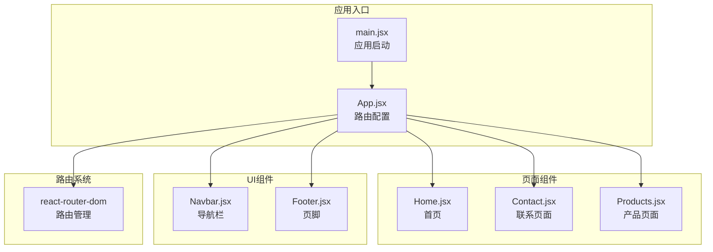
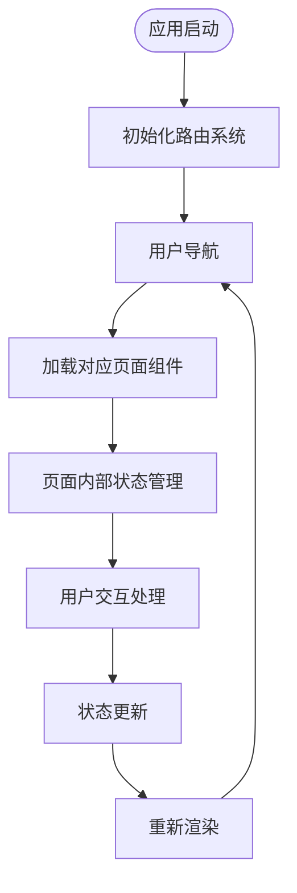
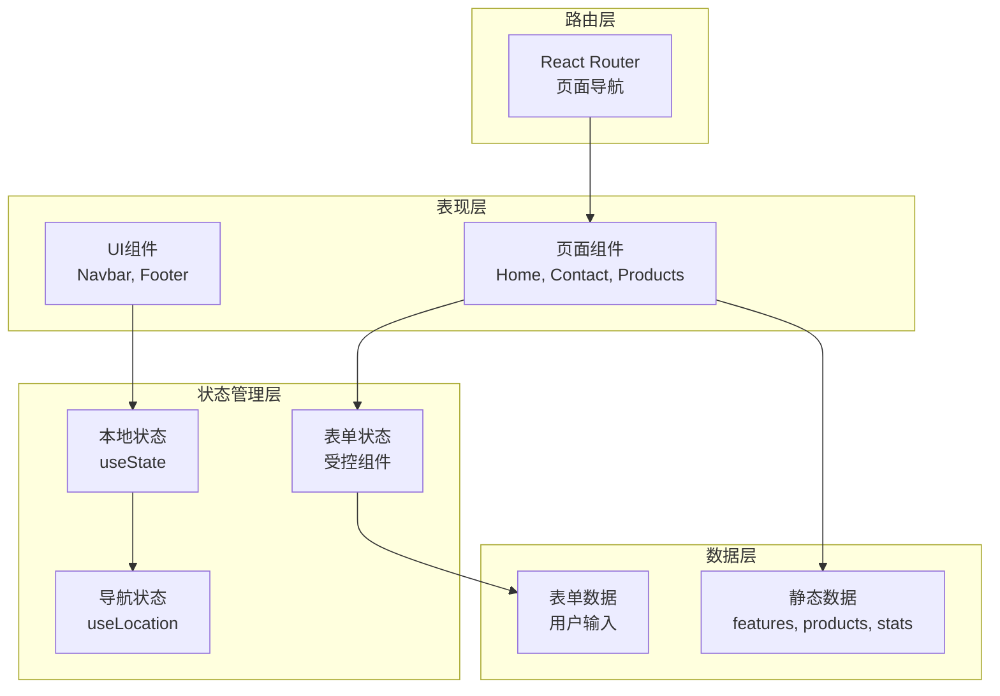
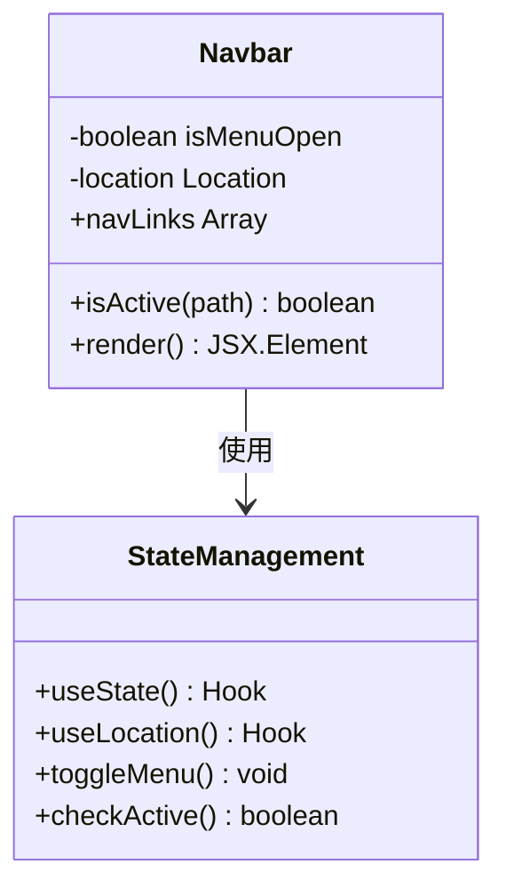
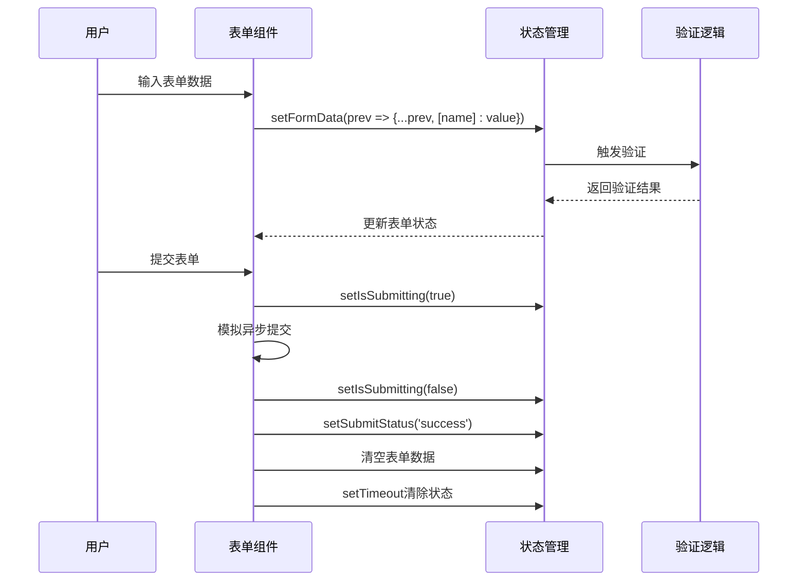
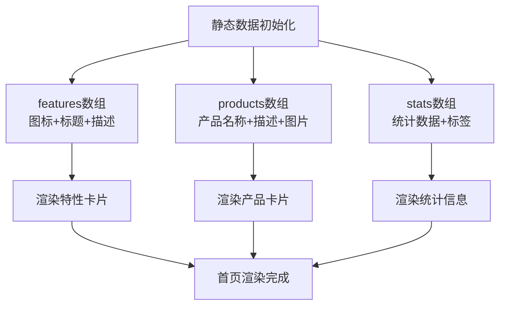
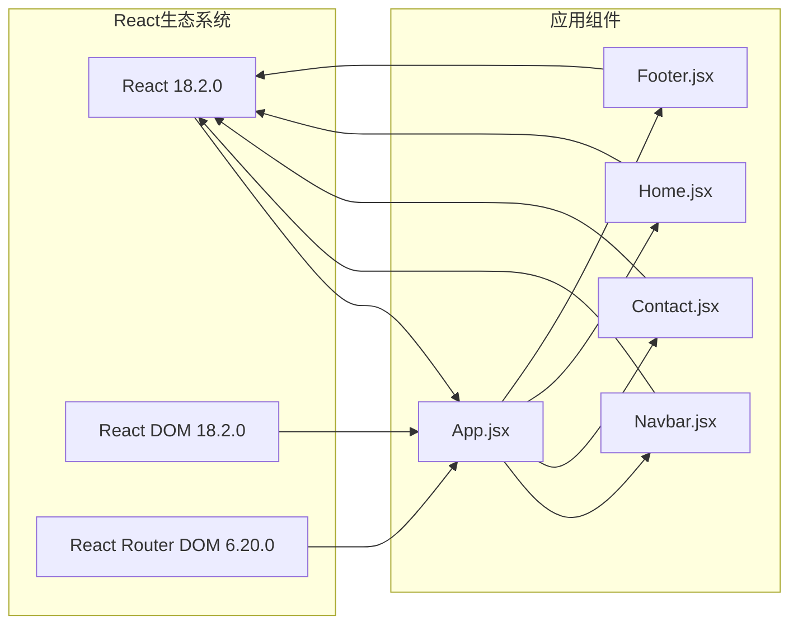

# 状态管理

<cite>
**本文档引用的文件**
- [App.jsx](file://tech-website/src/App.jsx)
- [main.jsx](file://tech-website/src/main.jsx)
- [Home.jsx](file://tech-website/src/pages/Home.jsx)
- [Contact.jsx](file://tech-website/src/pages/Contact.jsx)
- [Navbar.jsx](file://tech-website/src/components/Navbar.jsx)
- [Footer.jsx](file://tech-website/src/components/Footer.jsx)
- [package.json](file://tech-website/package.json)
</cite>

## 目录
1. [简介](#简介)
2. [项目结构](#项目结构)
3. [核心组件状态管理](#核心组件状态管理)
4. [架构概览](#架构概览)
5. [详细组件分析](#详细组件分析)
6. [依赖关系分析](#依赖关系分析)
7. [性能考虑](#性能考虑)
8. [故障排除指南](#故障排除指南)
9. [结论](#结论)

## 简介

本项目是一个基于React 18的现代化企业网站，采用函数式组件和Hooks的状态管理模式。项目展示了如何在实际开发中有效使用React Hooks进行状态管理，包括本地状态、表单状态、导航状态等。本文档将深入分析项目中的状态管理模式，提供最佳实践指导和性能优化建议。

## 项目结构

该项目采用清晰的文件组织结构，按照功能模块进行分离：

**图表来源**
- [main.jsx:1-14](file://tech-website/src/main.jsx#L1-L14)
- [App.jsx:1-25](file://tech-website/src/App.jsx#L1-L25)

**章节来源**
- [main.jsx:1-14](file://tech-website/src/main.jsx#L1-L14)
- [App.jsx:1-25](file://tech-website/src/App.jsx#L1-L25)

## 核心组件状态管理

### 应用级状态管理

项目采用最小化的状态管理模式，主要通过React Router进行页面级别的状态管理：

**图表来源**
- [main.jsx:7-13](file://tech-website/src/main.jsx#L7-L13)
- [App.jsx:8-22](file://tech-website/src/App.jsx#L8-L22)

### 组件状态声明模式

项目中的组件遵循统一的状态声明模式：

| 组件类型 | 状态声明方式 | 状态用途 | 更新机制 |
|---------|-------------|----------|----------|
| 导航组件 | useState用于菜单展开状态 | UI交互控制 | 用户点击事件 |
| 表单组件 | useState用于表单数据和提交状态 | 用户输入和提交流程 | 受控组件onChange |
| 页面组件 | 本地状态用于静态数据展示 | 内容渲染 | 组件挂载时初始化 |

**章节来源**
- [Navbar.jsx:1-67](file://tech-website/src/components/Navbar.jsx#L1-L67)
- [Contact.jsx:1-274](file://tech-website/src/pages/Contact.jsx#L1-L274)

## 架构概览

项目采用分层架构，状态管理贯穿整个应用：

**图表来源**
- [Home.jsx:4-76](file://tech-website/src/pages/Home.jsx#L4-L76)
- [Contact.jsx:5-14](file://tech-website/src/pages/Contact.jsx#L5-L14)
- [Navbar.jsx:6-7](file://tech-website/src/components/Navbar.jsx#L6-L7)

## 详细组件分析

### 导航栏组件状态管理

导航栏组件展示了本地状态的最佳实践：

**图表来源**
- [Navbar.jsx:5-64](file://tech-website/src/components/Navbar.jsx#L5-L64)

#### 状态管理策略

导航栏组件采用单一状态变量管理菜单展开/收起状态：

- **状态声明**: `const [isMenuOpen, setIsMenuOpen] = useState(false)`
- **状态更新**: 通过按钮点击事件切换状态
- **状态清理**: 组件卸载时自动清理，无需手动清理

**章节来源**
- [Navbar.jsx:6](file://tech-website/src/components/Navbar.jsx#L6)
- [Navbar.jsx:52-60](file://tech-website/src/components/Navbar.jsx#L52-L60)

### 表单状态管理实现

联系页面展示了完整的表单状态管理模式：

**图表来源**
- [Contact.jsx:16-43](file://tech-website/src/pages/Contact.jsx#L16-L43)

#### 表单状态管理策略

表单组件采用了完整的状态管理策略：

**状态声明**:
- `formData`: 包含所有表单字段的完整对象
- `isSubmitting`: 提交状态指示器
- `submitStatus`: 提交结果状态

**状态更新机制**:
- 使用受控组件模式，每个输入框都有对应的state属性
- 通过解构赋值更新特定字段，避免不必要的重渲染
- 异步提交处理，包含加载状态和错误处理

**验证逻辑**:
- HTML5原生验证属性（pattern, required）
- 自定义验证消息和样式反馈
- 实时状态更新和视觉反馈

**章节来源**
- [Contact.jsx:5-43](file://tech-website/src/pages/Contact.jsx#L5-L43)

### 静态内容组件状态管理

首页组件展示了静态数据的状态管理模式：

**图表来源**
- [Home.jsx:5-76](file://tech-website/src/pages/Home.jsx#L5-L76)

#### 静态数据状态管理

首页组件采用纯静态数据管理模式：

- **数据声明**: 在组件内部定义静态数组数据
- **渲染逻辑**: 使用map方法动态渲染列表项
- **性能优化**: 使用稳定的key值确保列表渲染效率

**章节来源**
- [Home.jsx:4-76](file://tech-website/src/pages/Home.jsx#L4-L76)

## 依赖关系分析

项目的状态管理依赖关系清晰明确：

**图表来源**
- [package.json:11-14](file://tech-website/package.json#L11-L14)
- [App.jsx:1-6](file://tech-website/src/App.jsx#L1-L6)

**章节来源**
- [package.json:1-23](file://tech-website/package.json#L1-L23)

## 性能考虑

### 状态更新优化

项目中的状态管理体现了良好的性能实践：

1. **局部状态优先**: 仅在需要的地方使用状态，避免过度状态化
2. **状态粒度控制**: 表单状态使用单一对象管理，减少状态拆分
3. **避免不必要重渲染**: 使用稳定的key值和合理的状态更新策略

### 内存管理

- **自动清理**: React自动管理组件卸载时的状态清理
- **无副作用状态**: 所有状态都是纯JavaScript对象，易于序列化和调试

### 性能优化建议

基于当前实现，可以考虑以下优化：

1. **表单验证优化**: 对于复杂表单，可考虑使用自定义Hook封装验证逻辑
2. **状态持久化**: 对于重要表单数据，可考虑添加本地存储支持
3. **批量更新**: 对于多个状态更新，可考虑使用批量更新策略

## 故障排除指南

### 常见状态管理问题

1. **状态更新不生效**
   - 检查状态更新是否在正确的组件中执行
   - 确认状态更新函数的调用时机

2. **表单状态异常**
   - 验证受控组件的value和onChange属性绑定
   - 检查状态更新的解构赋值语法

3. **导航状态问题**
   - 确认useLocation Hook的正确使用
   - 检查路由配置的正确性

### 调试方法

1. **React DevTools**: 使用组件树检查状态变化
2. **浏览器控制台**: 监听状态更新事件
3. **日志记录**: 在关键状态更新点添加console.log

**章节来源**
- [Contact.jsx:24-43](file://tech-website/src/pages/Contact.jsx#L24-L43)
- [Navbar.jsx:15-15](file://tech-website/src/components/Navbar.jsx#L15)

## 结论

本项目展示了React Hooks在现代Web应用中的最佳实践。通过合理使用useState、useEffect等Hooks，实现了简洁而高效的状态管理模式。

### 主要特点

1. **简洁性**: 采用最小化状态管理，避免过度复杂化
2. **一致性**: 统一的状态管理模式适用于所有组件
3. **可维护性**: 清晰的状态边界和职责分离
4. **性能**: 合理的状态粒度和更新策略

### 最佳实践总结

1. **状态声明**: 在组件内部声明必要的状态
2. **状态更新**: 使用受控组件模式管理用户输入
3. **状态清理**: 依赖React自动管理状态生命周期
4. **性能优化**: 避免不必要的状态拆分和重渲染

该状态管理模式适合中小型React应用，对于更复杂的状态管理需求，可考虑引入Redux或其他状态管理库。