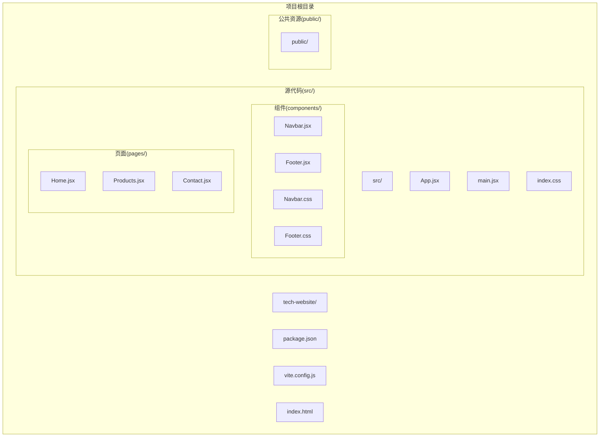
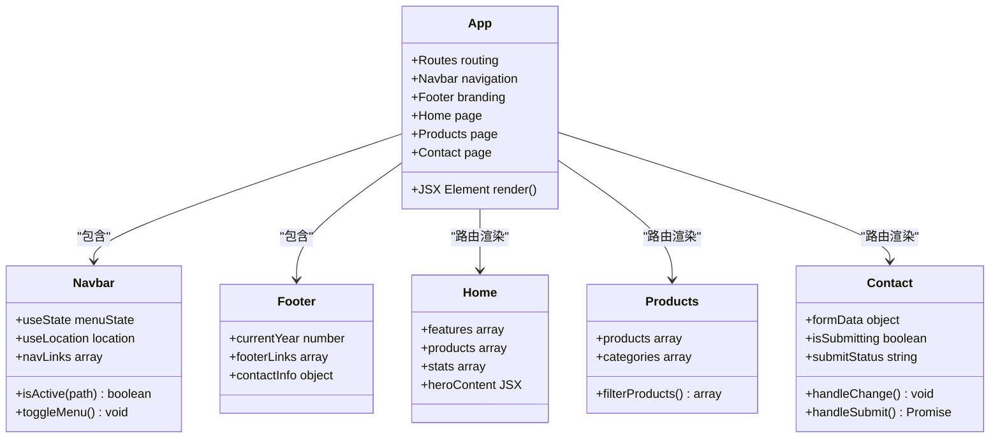
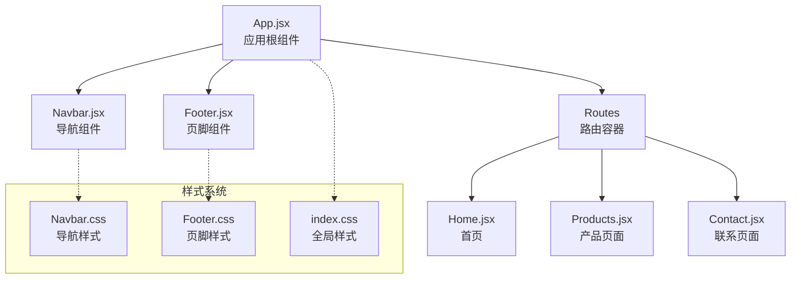
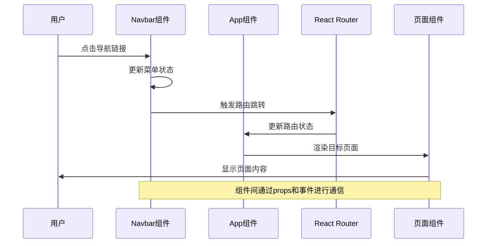
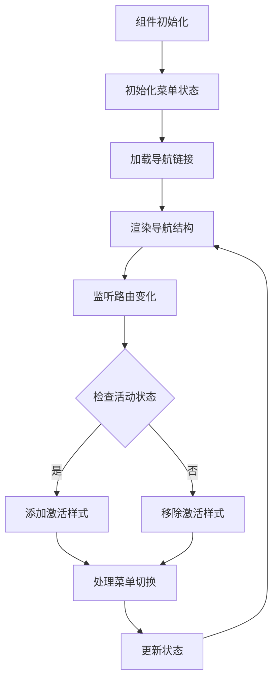
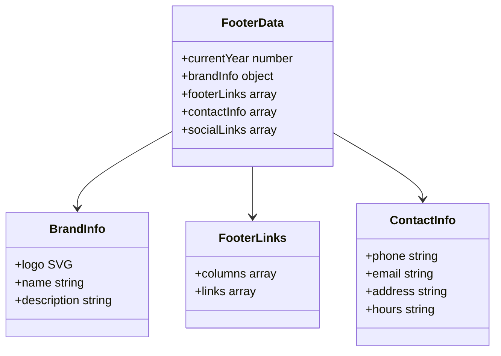
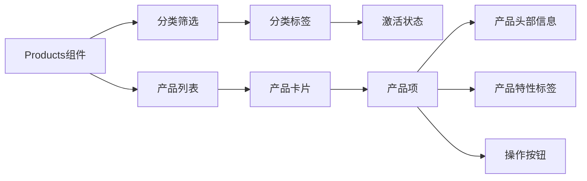
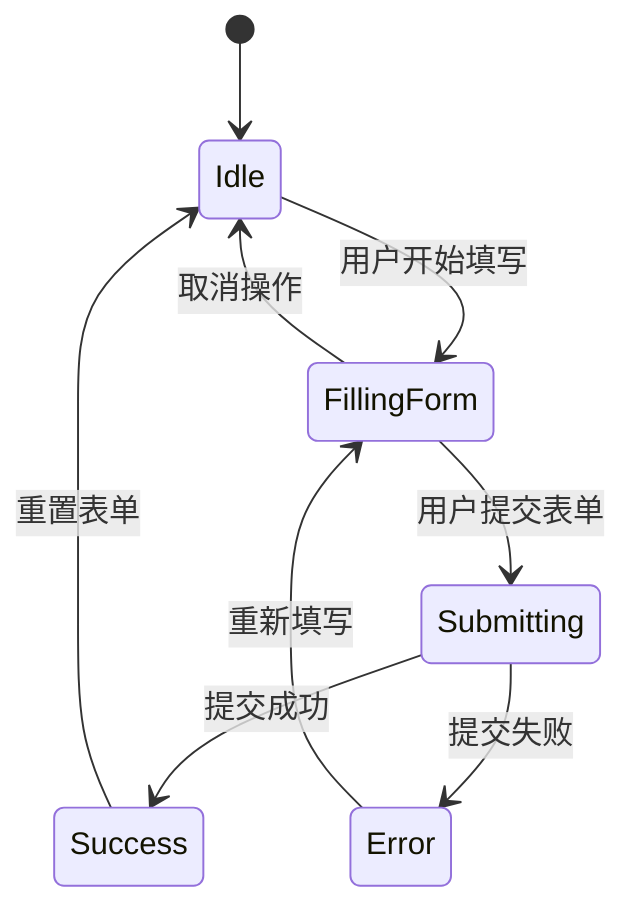
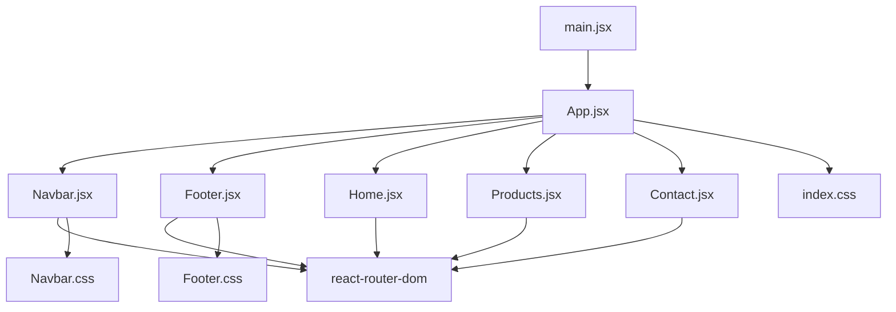
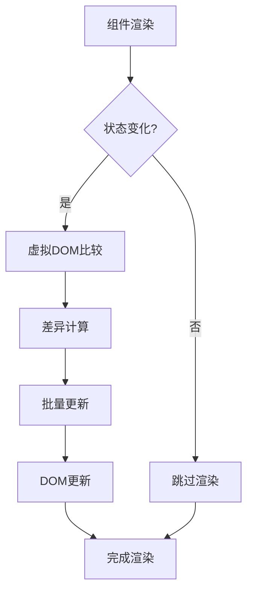

# 组件架构

<cite>
**本文档引用的文件**
- [App.jsx](file://tech-website/src/App.jsx)
- [main.jsx](file://tech-website/src/main.jsx)
- [Navbar.jsx](file://tech-website/src/components/Navbar.jsx)
- [Footer.jsx](file://tech-website/src/components/Footer.jsx)
- [Home.jsx](file://tech-website/src/pages/Home.jsx)
- [Products.jsx](file://tech-website/src/pages/Products.jsx)
- [Contact.jsx](file://tech-website/src/pages/Contact.jsx)
- [Navbar.css](file://tech-website/src/components/Navbar.css)
- [Footer.css](file://tech-website/src/components/Footer.css)
- [index.css](file://tech-website/src/index.css)
- [package.json](file://tech-website/package.json)
</cite>

## 目录
1. [简介](#简介)
2. [项目结构](#项目结构)
3. [核心组件](#核心组件)
4. [架构概览](#架构概览)
5. [详细组件分析](#详细组件分析)
6. [依赖关系分析](#依赖关系分析)
7. [性能考虑](#性能考虑)
8. [故障排除指南](#故障排除指南)
9. [结论](#结论)

## 简介

这是一个基于React的现代化企业网站项目，采用组件化设计理念构建。项目展示了清晰的组件层次结构、可复用的UI组件设计以及高效的组件间通信机制。该网站专注于企业数字化转型，提供一站式智能解决方案，通过React Router实现SPA路由管理，配合现代化的CSS变量系统实现响应式设计。

## 项目结构

项目采用功能导向的文件组织方式，主要包含以下核心目录：



**图表来源**
- [main.jsx:1-14](file://tech-website/src/main.jsx#L1-L14)
- [App.jsx:1-25](file://tech-website/src/App.jsx#L1-L25)

**章节来源**
- [package.json:1-23](file://tech-website/package.json#L1-L23)
- [main.jsx:1-14](file://tech-website/src/main.jsx#L1-L14)

## 核心组件

### 应用入口组件

应用的根组件App.jsx负责协调整个应用的组件树结构，采用声明式的组件组合模式：



**图表来源**
- [App.jsx:8-22](file://tech-website/src/App.jsx#L8-L22)
- [Navbar.jsx:5-64](file://tech-website/src/components/Navbar.jsx#L5-L64)
- [Footer.jsx:4-94](file://tech-website/src/components/Footer.jsx#L4-L94)

### 组件职责分离

每个组件都遵循单一职责原则：

- **App.jsx**: 应用根组件，负责路由配置和整体布局
- **Navbar.jsx**: 导航组件，处理菜单状态和路由导航
- **Footer.jsx**: 页脚组件，提供品牌信息和联系方式
- **Home.jsx**: 首页组件，展示产品特色和统计数据
- **Products.jsx**: 产品列表组件，展示企业级解决方案
- **Contact.jsx**: 联系页面组件，处理表单提交和用户交互

**章节来源**
- [App.jsx:1-25](file://tech-website/src/App.jsx#L1-L25)
- [Navbar.jsx:1-67](file://tech-website/src/components/Navbar.jsx#L1-L67)
- [Footer.jsx:1-97](file://tech-website/src/components/Footer.jsx#L1-L97)

## 架构概览

### 组件层次结构

应用采用扁平化的组件层次结构，所有页面组件都直接由App组件管理：



**图表来源**
- [App.jsx:8-22](file://tech-website/src/App.jsx#L8-L22)
- [main.jsx:7-13](file://tech-website/src/main.jsx#L7-L13)

### 组件通信机制

项目实现了多种组件间通信模式：

1. **Props传递**: 父组件向子组件传递数据和回调函数
2. **事件处理**: 子组件通过回调函数向上级组件传递状态变化
3. **状态提升**: 复杂状态在最近的共同祖先组件中管理



**图表来源**
- [Navbar.jsx:36-50](file://tech-website/src/components/Navbar.jsx#L36-L50)
- [App.jsx:13-17](file://tech-website/src/App.jsx#L13-L17)

**章节来源**
- [Navbar.jsx:15-16](file://tech-website/src/components/Navbar.jsx#L15-L16)
- [App.jsx:13-17](file://tech-website/src/App.jsx#L13-L17)

## 详细组件分析

### Navbar组件分析

Navbar组件是一个高度可复用的导航组件，实现了响应式设计和状态管理：

#### 设计原则

1. **状态封装**: 使用useState管理移动端菜单状态
2. **路由集成**: 集成react-router-dom实现导航跳转
3. **响应式设计**: 支持桌面端和移动端的不同布局
4. **可访问性**: 提供aria标签和键盘导航支持

#### Props接口设计

Navbar组件采用无props设计，通过内部状态管理实现功能：



**图表来源**
- [Navbar.jsx:5-64](file://tech-website/src/components/Navbar.jsx#L5-L64)

#### 状态管理策略

Navbar组件使用本地状态管理：
- `isMenuOpen`: 控制移动端菜单显示状态
- `location`: 通过useLocation获取当前路由信息
- `navLinks`: 静态导航链接配置数组

**章节来源**
- [Navbar.jsx:1-67](file://tech-website/src/components/Navbar.jsx#L1-L67)
- [Navbar.css:122-154](file://tech-website/src/components/Navbar.css#L122-L154)

### Footer组件分析

Footer组件提供统一的品牌展示和联系方式：

#### 设计特点

1. **网格布局**: 使用CSS Grid实现响应式布局
2. **品牌一致性**: 统一的Logo和色彩方案
3. **信息分层**: 清晰的信息分类和层级结构
4. **社交集成**: 多平台社交媒体链接

#### 数据结构

Footer组件维护以下数据结构：



**图表来源**
- [Footer.jsx:4-94](file://tech-website/src/components/Footer.jsx#L4-L94)

**章节来源**
- [Footer.jsx:1-97](file://tech-website/src/components/Footer.jsx#L1-L97)
- [Footer.css:14-185](file://tech-website/src/components/Footer.css#L14-L185)

### 页面组件分析

#### Home组件

Home组件采用模块化设计，包含多个功能区块：

1. **Hero区域**: 展示主标题和行动号召按钮
2. **特性展示**: 四个核心功能的图标卡片
3. **产品展示**: 四个核心产品的介绍
4. **统计信息**: 企业用户数量和成功率等指标

#### Products组件

Products组件实现产品列表展示和分类筛选：



**图表来源**
- [Products.jsx:4-54](file://tech-website/src/pages/Products.jsx#L4-L54)

#### Contact组件

Contact组件实现完整的表单处理流程：



**图表来源**
- [Contact.jsx:4-43](file://tech-website/src/pages/Contact.jsx#L4-L43)

**章节来源**
- [Home.jsx:1-230](file://tech-website/src/pages/Home.jsx#L1-L230)
- [Products.jsx:1-139](file://tech-website/src/pages/Products.jsx#L1-L139)
- [Contact.jsx:1-274](file://tech-website/src/pages/Contact.jsx#L1-L274)

## 依赖关系分析

### 外部依赖

项目使用现代化的前端技术栈：

```mermaid
graph TB
subgraph "运行时依赖"
React[react@^18.2.0]
ReactDOM[react-dom@^18.2.0]
Router[react-router-dom@^6.20.0]
end
subgraph "开发依赖"
Vite[vite@^5.0.0]
ReactPlugin[@vitejs/plugin-react@^4.2.0]
TypescriptTypes[@types/react@^18.2.37]
TypescriptDOM[@types/react-dom@^18.2.15]
end
subgraph "项目文件"
App[App.jsx]
Main[main.jsx]
Components[components/]
Pages[pages/]
end
App --> React
App --> Router
Main --> React
Main --> ReactDOM
Components --> React
Pages --> React
Vite --> ReactPlugin
```

**图表来源**
- [package.json:11-21](file://tech-website/package.json#L11-L21)

### 内部依赖关系



**图表来源**
- [main.jsx:1-14](file://tech-website/src/main.jsx#L1-L14)
- [App.jsx:1-6](file://tech-website/src/App.jsx#L1-L6)

**章节来源**
- [package.json:1-23](file://tech-website/package.json#L1-L23)

## 性能考虑

### 组件优化策略

1. **懒加载**: 页面组件按需加载，减少初始包大小
2. **状态最小化**: 仅在必要组件中维护状态
3. **事件委托**: 合理使用事件处理器避免重复绑定
4. **CSS变量**: 使用CSS自定义属性提升样式性能

### 渲染优化



### 样式优化

项目采用CSS变量系统实现主题统一和性能优化：

- **变量预定义**: 在`:root`中定义所有设计令牌
- **响应式断点**: 使用媒体查询实现自适应布局
- **动画性能**: 使用transform和opacity实现硬件加速

**章节来源**
- [index.css:2-54](file://tech-website/src/index.css#L2-L54)
- [Navbar.css:122-154](file://tech-website/src/components/Navbar.css#L122-L154)

## 故障排除指南

### 常见问题及解决方案

#### 路由不生效

**问题症状**: 导航链接点击无反应

**解决方案**:
1. 确认BrowserRouter包装App组件
2. 检查路由路径配置是否正确
3. 验证Link组件的to属性

#### 样式不显示

**问题症状**: 组件样式缺失或显示异常

**解决方案**:
1. 确认CSS文件正确导入
2. 检查CSS变量定义
3. 验证组件类名匹配

#### 状态更新异常

**问题症状**: 组件状态无法正确更新

**解决方案**:
1. 检查useState初始化值
2. 确认状态更新函数调用方式
3. 验证组件重新渲染条件

**章节来源**
- [main.jsx:7-13](file://tech-website/src/main.jsx#L7-L13)
- [App.jsx:13-17](file://tech-website/src/App.jsx#L13-L17)

## 结论

该项目展现了现代React应用的最佳实践，通过清晰的组件层次结构、合理的状态管理和高效的组件通信机制，构建了一个可扩展的企业网站架构。组件设计遵循单一职责原则，样式系统采用CSS变量实现主题统一，路由系统提供流畅的用户体验。

关键优势包括：
- **模块化设计**: 组件职责明确，易于维护和测试
- **响应式架构**: 支持多设备访问，用户体验一致
- **性能优化**: 合理的状态管理和渲染优化策略
- **可扩展性**: 清晰的架构为未来功能扩展奠定基础

该架构为类似的企业网站项目提供了优秀的参考模板，展示了如何在实际项目中应用React的核心概念和设计模式。