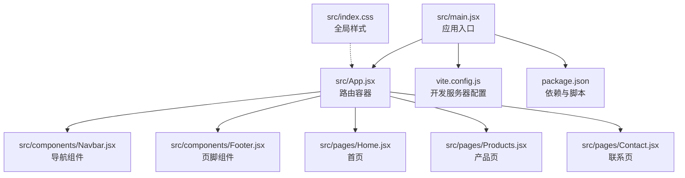
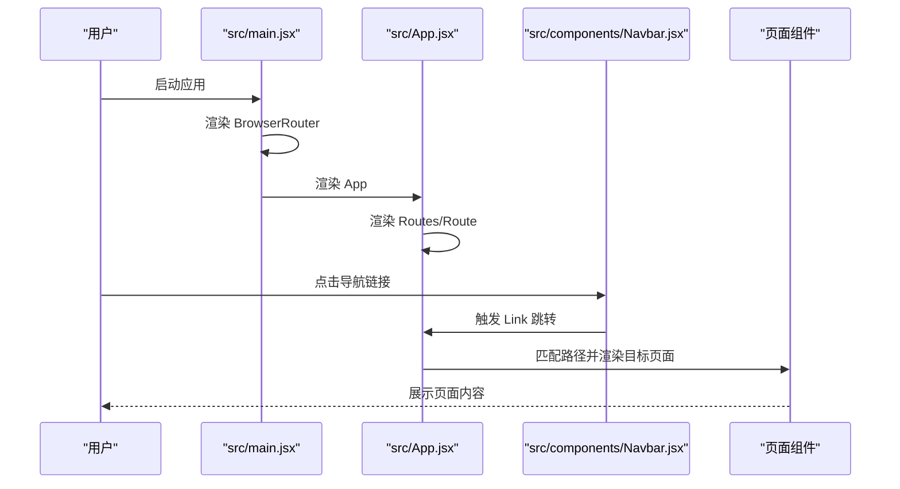
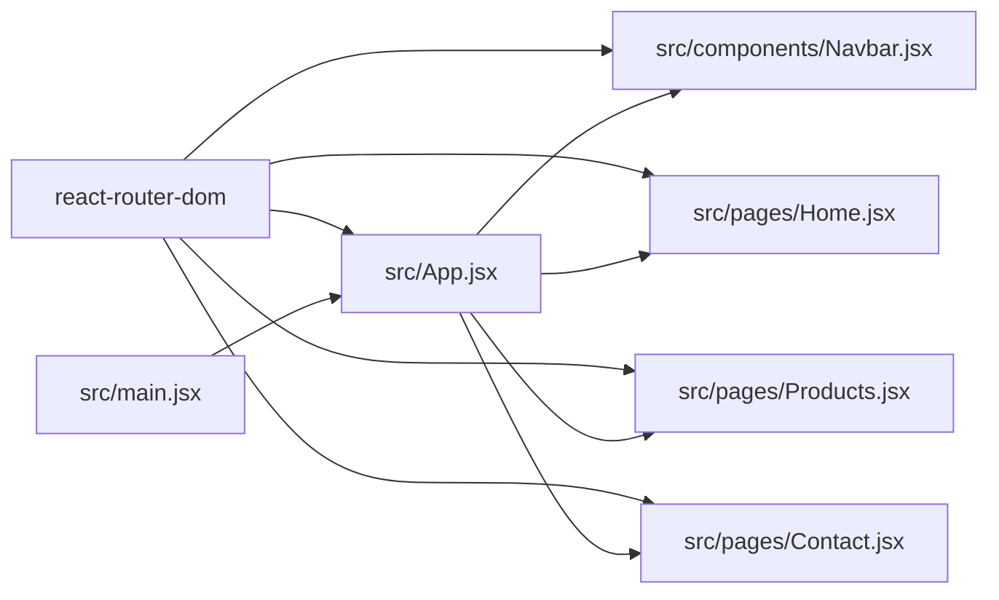

# 路由系统

<cite>
**本文引用的文件**
- [src/main.jsx](file://src/main.jsx)
- [src/App.jsx](file://src/App.jsx)
- [src/components/Navbar.jsx](file://src/components/Navbar.jsx)
- [src/components/Footer.jsx](file://src/components/Footer.jsx)
- [src/pages/Home.jsx](file://src/pages/Home.jsx)
- [src/pages/Products.jsx](file://src/pages/Products.jsx)
- [src/pages/Contact.jsx](file://src/pages/Contact.jsx)
- [src/index.css](file://src/index.css)
- [package.json](file://package.json)
- [vite.config.js](file://vite.config.js)
</cite>

## 目录
1. [简介](#简介)
2. [项目结构](#项目结构)
3. [核心组件](#核心组件)
4. [架构总览](#架构总览)
5. [详细组件分析](#详细组件分析)
6. [依赖关系分析](#依赖关系分析)
7. [性能考量](#性能考量)
8. [故障排查指南](#故障排查指南)
9. [结论](#结论)
10. [附录](#附录)

## 简介
本项目采用 React Router v6 实现前端页面导航，通过 BrowserRouter 包裹应用根节点，在 App 组件内使用 Routes/Route 定义静态路由。导航栏与页面组件通过 Link 进行页面跳转；当前实现未包含路由参数、查询字符串、路由守卫、嵌套路由与代码分割等高级特性，适合入门级单页应用。本文档将围绕现有路由配置进行系统化梳理，并给出最佳实践与常见问题解决方案。

## 项目结构
项目采用按功能分层的目录组织方式：入口文件在 src/main.jsx，应用根组件在 src/App.jsx，页面组件位于 src/pages，公共组件位于 src/components，全局样式位于 src/index.css。构建工具使用 Vite，默认端口 3000 并自动打开浏览器。

图示来源
- [src/main.jsx:1-14](file://src/main.jsx#L1-L14)
- [src/App.jsx:1-25](file://src/App.jsx#L1-L25)
- [src/components/Navbar.jsx:1-67](file://src/components/Navbar.jsx#L1-L67)
- [src/components/Footer.jsx:1-97](file://src/components/Footer.jsx#L1-L97)
- [src/pages/Home.jsx:1-230](file://src/pages/Home.jsx#L1-L230)
- [src/pages/Products.jsx:1-139](file://src/pages/Products.jsx#L1-L139)
- [src/pages/Contact.jsx:1-274](file://src/pages/Contact.jsx#L1-L274)
- [vite.config.js:1-11](file://vite.config.js#L1-L11)
- [package.json:1-23](file://package.json#L1-L23)

章节来源
- [src/main.jsx:1-14](file://src/main.jsx#L1-L14)
- [src/App.jsx:1-25](file://src/App.jsx#L1-L25)
- [vite.config.js:1-11](file://vite.config.js#L1-L11)
- [package.json:1-23](file://package.json#L1-L23)

## 核心组件
- 应用入口与路由上下文
  - 在入口文件中以 BrowserRouter 包裹应用，确保所有路由组件可访问路由能力。
  - 参考路径：[src/main.jsx:7-12](file://src/main.jsx#L7-L12)

- 路由容器与页面映射
  - App 组件内使用 Routes/Route 将路径与页面组件一一对应，形成基础路由表。
  - 参考路径：[src/App.jsx:13-17](file://src/App.jsx#L13-L17)

- 导航与跳转
  - 导航组件使用 Link 进行页面跳转，并通过 useLocation 判断当前激活项。
  - 参考路径：[src/components/Navbar.jsx:15-46](file://src/components/Navbar.jsx#L15-L46)

- 页面组件
  - 首页、产品页、联系页均通过 Link 在组件内部触发路由跳转。
  - 参考路径：[src/pages/Home.jsx:103](file://src/pages/Home.jsx#L103), [src/pages/Products.jsx:107](file://src/pages/Products.jsx#L107), [src/pages/Contact.jsx:169](file://src/pages/Contact.jsx#L169)

章节来源
- [src/main.jsx:7-12](file://src/main.jsx#L7-L12)
- [src/App.jsx:13-17](file://src/App.jsx#L13-L17)
- [src/components/Navbar.jsx:15-46](file://src/components/Navbar.jsx#L15-L46)
- [src/pages/Home.jsx:103](file://src/pages/Home.jsx#L103)
- [src/pages/Products.jsx:107](file://src/pages/Products.jsx#L107)
- [src/pages/Contact.jsx:169](file://src/pages/Contact.jsx#L169)

## 架构总览
下图展示了从入口到页面渲染的完整流程，以及导航组件如何影响当前路由状态。

图示来源
- [src/main.jsx:7-12](file://src/main.jsx#L7-L12)
- [src/App.jsx:13-17](file://src/App.jsx#L13-L17)
- [src/components/Navbar.jsx:37-46](file://src/components/Navbar.jsx#L37-L46)

## 详细组件分析

### 路由配置与路径匹配
- 路由定义
  - 使用 Routes/Route 将路径与组件绑定，形成静态路由表。
  - 示例路径：根路径、产品页、联系页。
  - 参考路径：[src/App.jsx:13-17](file://src/App.jsx#L13-L17)

- 路径匹配规则
  - 当前实现为精确匹配，无通配符或可选段。
  - Link 组件负责生成可点击的导航链接。
  - 参考路径：[src/components/Navbar.jsx:37-46](file://src/components/Navbar.jsx#L37-L46), [src/pages/Home.jsx:103](file://src/pages/Home.jsx#L103)

- 嵌套路由
  - 当前未使用嵌套路由，如需实现子页面或布局复用，可在 App.jsx 内增加嵌套层级。
  - 参考路径：[src/App.jsx:13-17](file://src/App.jsx#L13-L17)

- 路由参数与查询字符串
  - 未使用 useParams/useSearchParams，因此不支持动态参数与查询解析。
  - 如需参数传递，建议引入 useNavigate/useParams 并在 App.jsx 中扩展路由定义。
  - 参考路径：[src/App.jsx:13-17](file://src/App.jsx#L13-L17)

- 路由守卫
  - 未实现鉴权或权限控制逻辑，如需守卫可在导航组件或路由容器中添加条件判断。
  - 参考路径：[src/components/Navbar.jsx:37-46](file://src/components/Navbar.jsx#L37-L46)

- 代码分割与懒加载
  - 未启用 React.lazy/Suspense 或 React Router 的 lazy 分割，页面组件在入口时一并打包。
  - 如需优化首屏加载，建议对大型页面组件启用懒加载。
  - 参考路径：[src/App.jsx:4-6](file://src/App.jsx#L4-L6), [src/main.jsx:1-14](file://src/main.jsx#L1-L14)

- 面包屑导航
  - 未实现面包屑，可通过 useLocation/useNavigate 计算路径层级并渲染面包屑。
  - 参考路径：[src/components/Navbar.jsx:7](file://src/components/Navbar.jsx#L7)

- SEO 优化
  - 未集成动态标题、meta 标签或结构化数据，建议在页面组件中按需设置。
  - 参考路径：[src/pages/Home.jsx:1](file://src/pages/Home.jsx#L1), [src/pages/Products.jsx:1](file://src/pages/Products.jsx#L1), [src/pages/Contact.jsx:1](file://src/pages/Contact.jsx#L1)

章节来源
- [src/App.jsx:13-17](file://src/App.jsx#L13-L17)
- [src/components/Navbar.jsx:7](file://src/components/Navbar.jsx#L7)
- [src/main.jsx:1-14](file://src/main.jsx#L1-L14)

### 导航组件与交互
- 导航行为
  - 导航组件使用 Link 进行跳转，并在移动端切换菜单状态。
  - 参考路径：[src/components/Navbar.jsx:37-60](file://src/components/Navbar.jsx#L37-L60)

- 激活态判定
  - 通过 useLocation 获取当前路径并与导航项对比，动态添加激活类名。
  - 参考路径：[src/components/Navbar.jsx:7](file://src/components/Navbar.jsx#L7), [src/components/Navbar.jsx:15](file://src/components/Navbar.jsx#L15)

- 移动端适配
  - 使用 CSS 媒体查询与容器宽度变量，适配小屏设备显示。
  - 参考路径：[src/index.css:192-227](file://src/index.css#L192-L227)

章节来源
- [src/components/Navbar.jsx:7](file://src/components/Navbar.jsx#L7)
- [src/components/Navbar.jsx:15](file://src/components/Navbar.jsx#L15)
- [src/components/Navbar.jsx:37-60](file://src/components/Navbar.jsx#L37-L60)
- [src/index.css:192-227](file://src/index.css#L192-L227)

### 页面组件与跳转
- 首页跳转
  - 首页中的多个 Link 指向产品页与联系页，用于引导用户转化。
  - 参考路径：[src/pages/Home.jsx:103](file://src/pages/Home.jsx#L103), [src/pages/Home.jsx:189](file://src/pages/Home.jsx#L189), [src/pages/Home.jsx:215](file://src/pages/Home.jsx#L215)

- 产品页跳转
  - 产品列表中的“免费试用”与“了解详情”按钮触发跳转。
  - 参考路径：[src/pages/Products.jsx:107](file://src/pages/Products.jsx#L107), [src/pages/Products.jsx:110](file://src/pages/Products.jsx#L110)

- 联系页跳转
  - 联系页中的表单提交后可结合导航进行页面提示或跳转。
  - 参考路径：[src/pages/Contact.jsx:169](file://src/pages/Contact.jsx#L169)

章节来源
- [src/pages/Home.jsx:103](file://src/pages/Home.jsx#L103)
- [src/pages/Home.jsx:189](file://src/pages/Home.jsx#L189)
- [src/pages/Home.jsx:215](file://src/pages/Home.jsx#L215)
- [src/pages/Products.jsx:107](file://src/pages/Products.jsx#L107)
- [src/pages/Products.jsx:110](file://src/pages/Products.jsx#L110)
- [src/pages/Contact.jsx:169](file://src/pages/Contact.jsx#L169)

## 依赖关系分析
- 外部依赖
  - React 与 React DOM：UI 渲染与虚拟 DOM。
  - React Router DOM：路由能力与 Link/Navigate。
  - Vite：开发服务器与构建工具。
  - 参考路径：[package.json:11-21](file://package.json#L11-L21)

- 内部依赖
  - main.jsx 依赖 App.jsx；App.jsx 依赖各页面组件与公共组件。
  - Navbar/Link 依赖路由上下文；页面组件依赖 Link 进行跳转。
  - 参考路径：[src/main.jsx:3](file://src/main.jsx#L3), [src/App.jsx:1-6](file://src/App.jsx#L1-L6)

图示来源
- [src/main.jsx:3](file://src/main.jsx#L3)
- [src/App.jsx:1-6](file://src/App.jsx#L1-L6)
- [src/components/Navbar.jsx:2](file://src/components/Navbar.jsx#L2)
- [src/pages/Home.jsx:1](file://src/pages/Home.jsx#L1)
- [src/pages/Products.jsx:1](file://src/pages/Products.jsx#L1)
- [src/pages/Contact.jsx:1](file://src/pages/Contact.jsx#L1)

章节来源
- [package.json:11-21](file://package.json#L11-L21)
- [src/main.jsx:3](file://src/main.jsx#L3)
- [src/App.jsx:1-6](file://src/App.jsx#L1-L6)

## 性能考量
- 代码分割
  - 当前所有页面组件在入口时加载，建议对大型页面启用 React.lazy 与 Suspense，减少首屏体积。
  - 参考路径：[src/App.jsx:4-6](file://src/App.jsx#L4-L6)

- 路由切换开销
  - Link 为客户端路由跳转，避免整页刷新；若引入懒加载，注意骨架屏与错误边界以提升体验。
  - 参考路径：[src/components/Navbar.jsx:37-46](file://src/components/Navbar.jsx#L37-L46)

- 构建与缓存
  - Vite 默认开启 HMR 与预构建，生产构建可进一步优化资源与压缩策略。
  - 参考路径：[vite.config.js:1-11](file://vite.config.js#L1-L11)

## 故障排查指南
- 路由不生效
  - 确认应用根节点包裹了 BrowserRouter。
  - 参考路径：[src/main.jsx:9-11](file://src/main.jsx#L9-L11)

- Link 无法跳转
  - 检查 Link 的 to 属性是否与路由表路径一致。
  - 参考路径：[src/components/Navbar.jsx:40](file://src/components/Navbar.jsx#L40), [src/pages/Home.jsx:103](file://src/pages/Home.jsx#L103)

- 激活态不显示
  - 确保 useLocation 正确获取当前路径，且与导航项完全匹配。
  - 参考路径：[src/components/Navbar.jsx:7](file://src/components/Navbar.jsx#L7), [src/components/Navbar.jsx:15](file://src/components/Navbar.jsx#L15)

- 移动端菜单异常
  - 检查 CSS 媒体查询与容器宽度变量，确认断点与样式覆盖。
  - 参考路径：[src/index.css:192-227](file://src/index.css#L192-L227)

- SEO 问题
  - 页面缺少动态标题与 meta 描述，建议在页面组件中按需设置。
  - 参考路径：[src/pages/Home.jsx:1](file://src/pages/Home.jsx#L1), [src/pages/Products.jsx:1](file://src/pages/Products.jsx#L1), [src/pages/Contact.jsx:1](file://src/pages/Contact.jsx#L1)

章节来源
- [src/main.jsx:9-11](file://src/main.jsx#L9-L11)
- [src/components/Navbar.jsx:7](file://src/components/Navbar.jsx#L7)
- [src/components/Navbar.jsx:15](file://src/components/Navbar.jsx#L15)
- [src/index.css:192-227](file://src/index.css#L192-L227)
- [src/pages/Home.jsx:1](file://src/pages/Home.jsx#L1)
- [src/pages/Products.jsx:1](file://src/pages/Products.jsx#L1)
- [src/pages/Contact.jsx:1](file://src/pages/Contact.jsx#L1)

## 结论
本项目基于 React Router v6 实现了简洁清晰的静态路由体系，导航组件与页面组件通过 Link 完成跳转，整体结构清晰、易于维护。若需扩展至中大型站点，建议逐步引入参数路由、查询字符串、路由守卫、嵌套路由与代码分割等能力，并完善面包屑与 SEO 优化策略。

## 附录
- 最佳实践清单
  - 使用精确路径与 Link 进行跳转，避免硬编码 URL。
  - 对大型页面启用懒加载，配合骨架屏与错误边界。
  - 引入路由守卫与权限控制，保障受保护页面的安全。
  - 实现面包屑导航与动态标题，提升用户体验与 SEO。
  - 使用媒体查询与响应式容器，保证移动端体验一致。

- 常见问题速查
  - 路由不生效：检查 BrowserRouter 是否包裹根组件。
  - Link 无效：核对 to 属性与路由表路径。
  - 激活态异常：确认 useLocation 与路径匹配逻辑。
  - 移动端样式错乱：检查媒体查询断点与容器宽度变量。