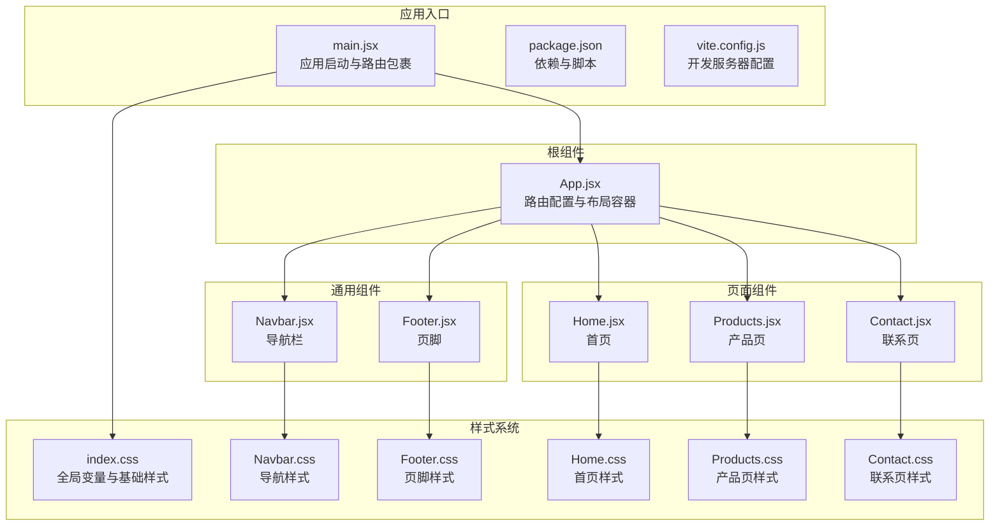
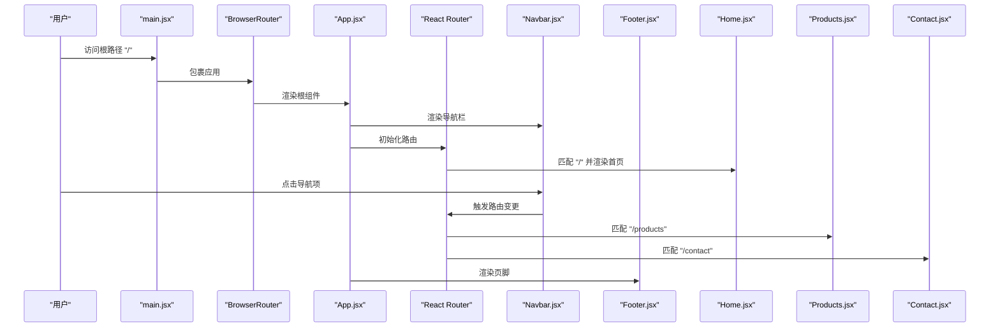
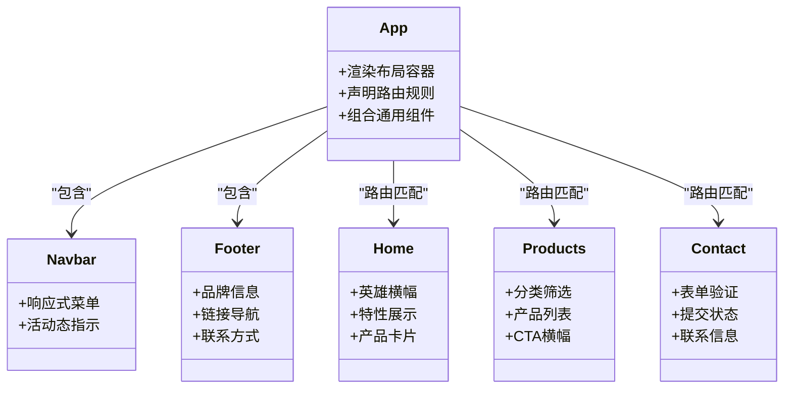
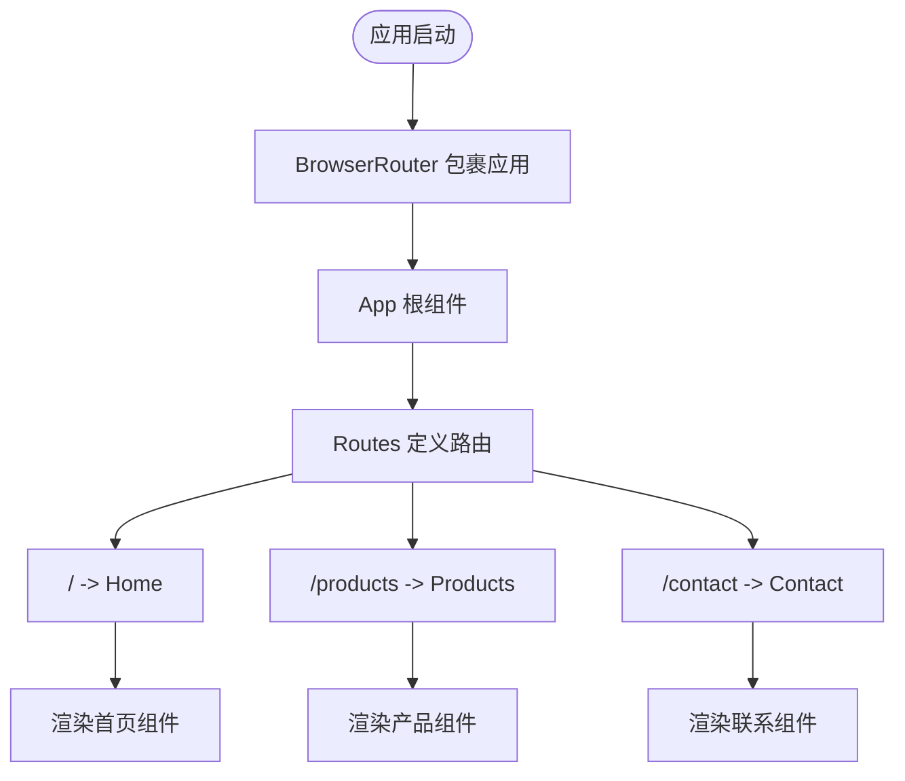
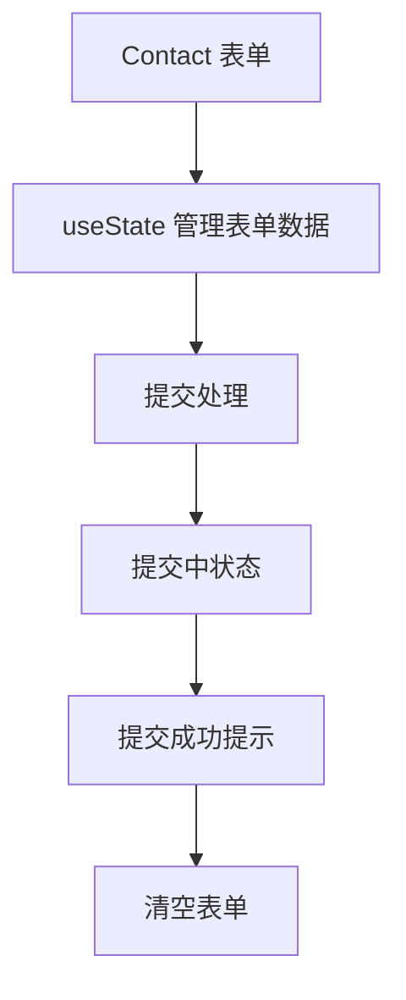
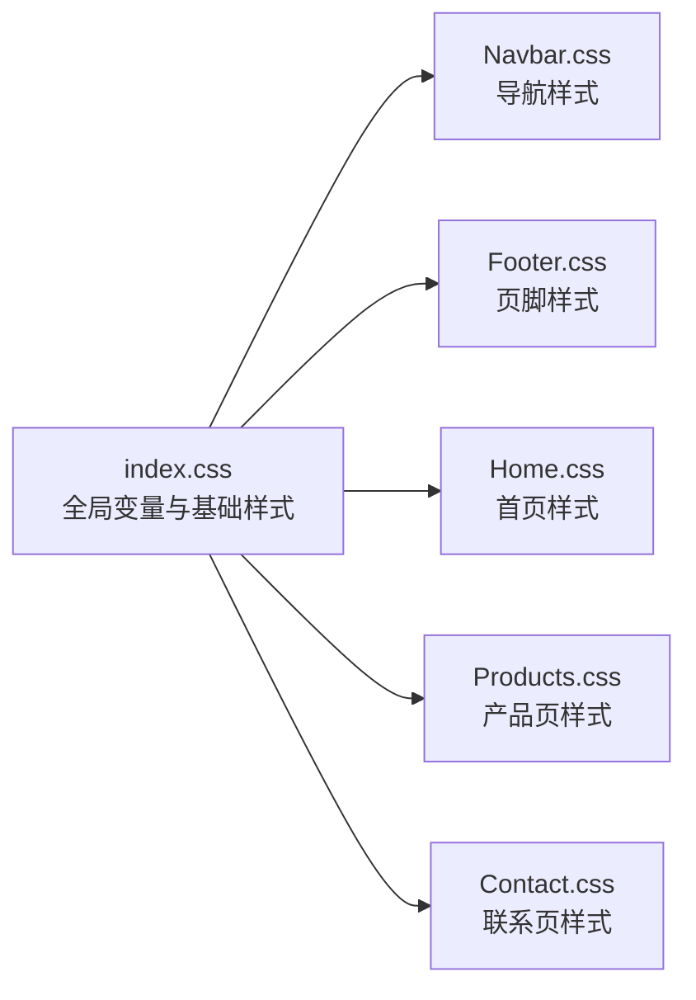
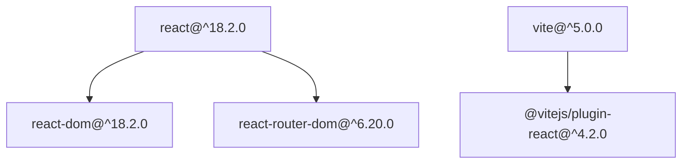

# 项目架构

<cite>
**本文档引用的文件**
- [App.jsx](file://src/App.jsx)
- [main.jsx](file://src/main.jsx)
- [Navbar.jsx](file://src/components/Navbar.jsx)
- [Footer.jsx](file://src/components/Footer.jsx)
- [Home.jsx](file://src/pages/Home.jsx)
- [Products.jsx](file://src/pages/Products.jsx)
- [Contact.jsx](file://src/pages/Contact.jsx)
- [index.css](file://src/index.css)
- [Navbar.css](file://src/components/Navbar.css)
- [Footer.css](file://src/components/Footer.css)
- [Home.css](file://src/pages/Home.css)
- [Products.css](file://src/pages/Products.css)
- [Contact.css](file://src/pages/Contact.css)
- [package.json](file://package.json)
- [vite.config.js](file://vite.config.js)
</cite>

## 目录
1. [简介](#简介)
2. [项目结构](#项目结构)
3. [核心组件](#核心组件)
4. [架构总览](#架构总览)
5. [详细组件分析](#详细组件分析)
6. [依赖分析](#依赖分析)
7. [性能考虑](#性能考虑)
8. [故障排除指南](#故障排除指南)
9. [结论](#结论)

## 简介
本技术网站采用基于 React 的组件化架构，结合 Vite 构建工具与 React Router 实现前端路由。项目通过清晰的目录结构与模块化设计，实现了可维护、可扩展的企业级官网架构。整体设计强调组件复用、样式隔离与响应式布局，使用 CSS 变量统一主题风格，确保视觉一致性与开发效率。

## 项目结构
项目采用按功能域分层的组织方式：入口文件负责应用初始化与路由包裹；根组件 App 负责页面级路由与全局布局；components 目录存放可复用的通用 UI 组件（如导航与页脚）；pages 目录存放页面级组件；样式文件与页面一一对应，便于维护与扩展。

**图表来源**
- [main.jsx:1-14](file://src/main.jsx#L1-L14)
- [App.jsx:1-25](file://src/App.jsx#L1-L25)
- [Navbar.jsx:1-67](file://src/components/Navbar.jsx#L1-L67)
- [Footer.jsx:1-97](file://src/components/Footer.jsx#L1-L97)
- [Home.jsx:1-230](file://src/pages/Home.jsx#L1-L230)
- [Products.jsx:1-139](file://src/pages/Products.jsx#L1-L139)
- [Contact.jsx:1-274](file://src/pages/Contact.jsx#L1-L274)
- [index.css:1-228](file://src/index.css#L1-L228)
- [Navbar.css:1-155](file://src/components/Navbar.css#L1-L155)
- [Footer.css:1-186](file://src/components/Footer.css#L1-L186)
- [Home.css:1-399](file://src/pages/Home.css#L1-L399)
- [Products.css:1-230](file://src/pages/Products.css#L1-L230)
- [Contact.css:1-340](file://src/pages/Contact.css#L1-L340)

**章节来源**
- [main.jsx:1-14](file://src/main.jsx#L1-L14)
- [App.jsx:1-25](file://src/App.jsx#L1-L25)
- [package.json:1-23](file://package.json#L1-L23)
- [vite.config.js:1-11](file://vite.config.js#L1-L11)

## 核心组件
- 应用入口与路由包裹：在入口文件中使用浏览器路由容器包裹应用，确保所有组件具备路由能力。
- 根组件 App：集中声明路由规则与页面级布局，包含导航、主内容区与页脚。
- 页面组件：Home、Products、Contact 分别承载首页、产品展示与联系表单等页面逻辑。
- 通用组件：Navbar 提供响应式导航与活动态指示；Footer 提供品牌信息、链接与联系方式。

这些组件共同构成“布局容器 + 页面组件 + 通用组件”的层次化结构，遵循单一职责与高内聚低耦合的设计原则。

**章节来源**
- [main.jsx:1-14](file://src/main.jsx#L1-L14)
- [App.jsx:1-25](file://src/App.jsx#L1-L25)
- [Navbar.jsx:1-67](file://src/components/Navbar.jsx#L1-L67)
- [Footer.jsx:1-97](file://src/components/Footer.jsx#L1-L97)

## 架构总览
系统采用“应用启动 → 路由容器 → 根组件 → 页面/组件树”的控制流。路由在根组件中声明，页面组件通过 Link 组件进行导航跳转。通用组件（Navbar、Footer）贯穿多个页面，形成一致的用户体验。

**图表来源**
- [main.jsx:1-14](file://src/main.jsx#L1-L14)
- [App.jsx:1-25](file://src/App.jsx#L1-L25)
- [Navbar.jsx:1-67](file://src/components/Navbar.jsx#L1-L67)
- [Footer.jsx:1-97](file://src/components/Footer.jsx#L1-L97)
- [Home.jsx:1-230](file://src/pages/Home.jsx#L1-L230)
- [Products.jsx:1-139](file://src/pages/Products.jsx#L1-L139)
- [Contact.jsx:1-274](file://src/pages/Contact.jsx#L1-L274)

## 详细组件分析

### 根组件 App.jsx 设计理念
- 路由声明：集中定义页面路由与元素映射，保证路由配置的一致性与可维护性。
- 布局容器：在导航与页脚之间插入主内容区，形成标准的页头-内容-页脚结构。
- 组件组合：通过导入通用组件与页面组件，实现布局与业务逻辑的解耦。

**图表来源**
- [App.jsx:1-25](file://src/App.jsx#L1-L25)
- [Navbar.jsx:1-67](file://src/components/Navbar.jsx#L1-L67)
- [Footer.jsx:1-97](file://src/components/Footer.jsx#L1-L97)
- [Home.jsx:1-230](file://src/pages/Home.jsx#L1-L230)
- [Products.jsx:1-139](file://src/pages/Products.jsx#L1-L139)
- [Contact.jsx:1-274](file://src/pages/Contact.jsx#L1-L274)

**章节来源**
- [App.jsx:1-25](file://src/App.jsx#L1-L25)

### 路由系统设计原理
- 路由配置：在根组件中使用路由容器与路由声明，将路径与页面组件绑定。
- 页面导航：页面组件内部使用链接组件进行页面间跳转，保持统一的导航体验。
- 路由容器：入口文件提供路由环境，确保组件具备路由能力。

**图表来源**
- [main.jsx:1-14](file://src/main.jsx#L1-L14)
- [App.jsx:1-25](file://src/App.jsx#L1-L25)

**章节来源**
- [main.jsx:1-14](file://src/main.jsx#L1-L14)
- [App.jsx:1-25](file://src/App.jsx#L1-L25)

### 组件间通信与状态管理
- 状态集中：页面组件内部使用本地状态管理（如表单状态），避免跨层级传递。
- 事件处理：通用组件通过事件回调与页面组件交互，保持单向数据流。
- 状态提升：当前项目未涉及跨组件共享状态，采用本地状态即可满足需求。

**图表来源**
- [Contact.jsx:1-274](file://src/pages/Contact.jsx#L1-L274)

**章节来源**
- [Contact.jsx:1-274](file://src/pages/Contact.jsx#L1-L274)

### 样式组织策略
- 全局样式：通过 CSS 变量定义主题色、阴影、圆角与间距，统一视觉风格。
- 组件样式：通用组件与页面组件分别拥有独立样式文件，实现样式隔离与可维护性。
- 响应式设计：在各样式文件中针对不同断点进行适配，确保移动端体验。

**图表来源**
- [index.css:1-228](file://src/index.css#L1-L228)
- [Navbar.css:1-155](file://src/components/Navbar.css#L1-L155)
- [Footer.css:1-186](file://src/components/Footer.css#L1-L186)
- [Home.css:1-399](file://src/pages/Home.css#L1-L399)
- [Products.css:1-230](file://src/pages/Products.css#L1-L230)
- [Contact.css:1-340](file://src/pages/Contact.css#L1-L340)

**章节来源**
- [index.css:1-228](file://src/index.css#L1-L228)
- [Navbar.css:1-155](file://src/components/Navbar.css#L1-L155)
- [Footer.css:1-186](file://src/components/Footer.css#L1-L186)
- [Home.css:1-399](file://src/pages/Home.css#L1-L399)
- [Products.css:1-230](file://src/pages/Products.css#L1-L230)
- [Contact.css:1-340](file://src/pages/Contact.css#L1-L340)

### 模块化设计理念
- 组件复用：通用组件（Navbar、Footer）在多个页面中复用，减少重复代码。
- 样式隔离：每个页面与组件拥有独立样式文件，避免样式冲突。
- 代码组织：按功能域划分目录，明确职责边界，便于团队协作与维护。

**章节来源**
- [Navbar.jsx:1-67](file://src/components/Navbar.jsx#L1-L67)
- [Footer.jsx:1-97](file://src/components/Footer.jsx#L1-L97)
- [Home.jsx:1-230](file://src/pages/Home.jsx#L1-L230)
- [Products.jsx:1-139](file://src/pages/Products.jsx#L1-L139)
- [Contact.jsx:1-274](file://src/pages/Contact.jsx#L1-L274)

## 依赖分析
项目依赖 React 生态与 Vite 构建工具，核心依赖包括 React、React DOM 与 React Router DOM。构建工具提供开发服务器与热更新能力，提升开发效率。

**图表来源**
- [package.json:11-21](file://package.json#L11-L21)

**章节来源**
- [package.json:1-23](file://package.json#L1-L23)
- [vite.config.js:1-11](file://vite.config.js#L1-L11)

## 性能考虑
- 轻量路由：使用现代路由库，避免不必要的渲染与内存占用。
- 样式优化：通过 CSS 变量与原子化类名减少样式体积，提升渲染性能。
- 构建优化：Vite 提供快速冷启动与热更新，缩短开发反馈周期。
- 组件拆分：按需加载与懒加载策略可进一步优化首屏性能（当前项目未启用，但具备扩展空间）。

## 故障排除指南
- 路由不生效：检查入口文件是否正确包裹路由容器，以及根组件路由声明是否完整。
- 样式异常：确认样式文件是否正确引入，CSS 变量命名是否一致，断点适配是否覆盖目标设备。
- 组件交互问题：检查事件回调与状态更新逻辑，确保单向数据流与不可变更新。

**章节来源**
- [main.jsx:1-14](file://src/main.jsx#L1-L14)
- [App.jsx:1-25](file://src/App.jsx#L1-L25)
- [index.css:1-228](file://src/index.css#L1-L228)

## 结论
该技术网站通过清晰的组件化架构与模块化组织，实现了高内聚、低耦合的前端系统。根组件集中路由与布局，通用组件提供一致的交互体验，页面组件聚焦业务逻辑。配合全局样式体系与响应式设计，项目在可维护性与用户体验方面达到良好平衡。未来可在状态管理、代码分割与测试覆盖等方面持续演进。