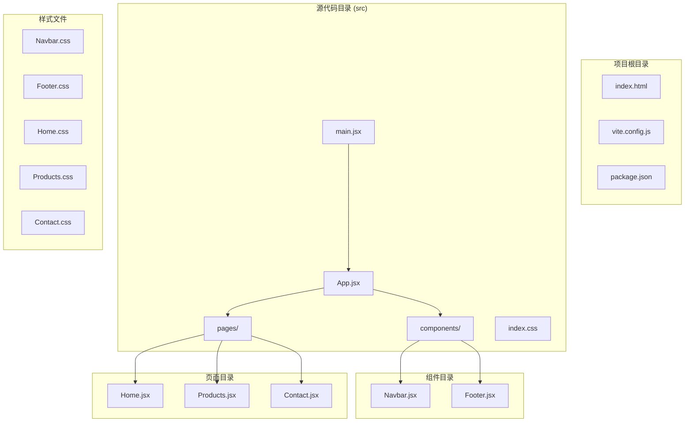
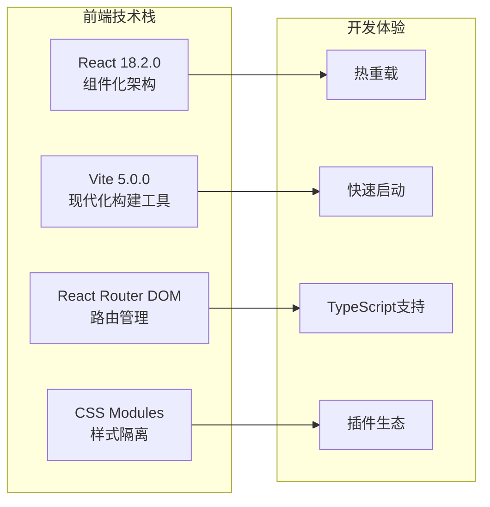
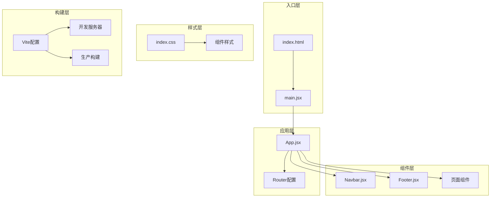
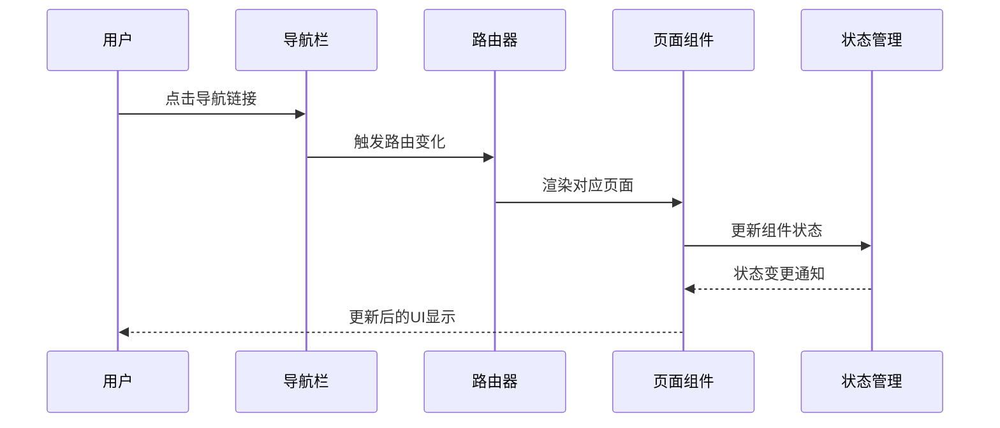
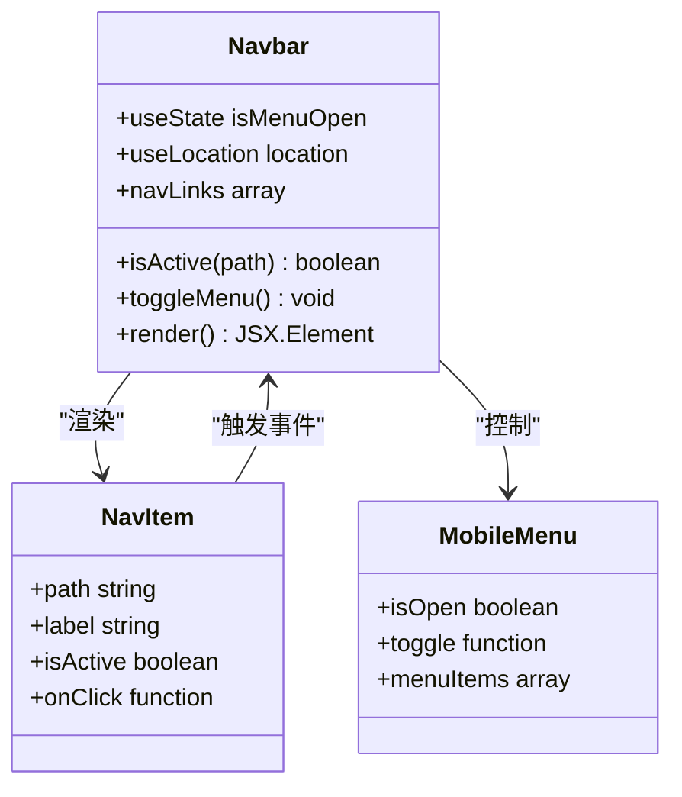
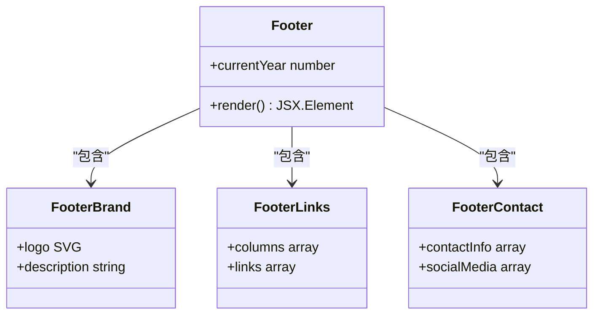
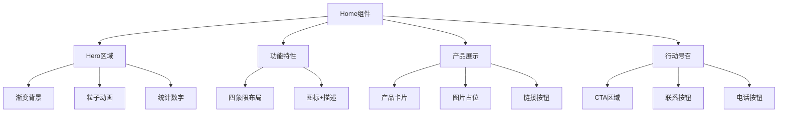
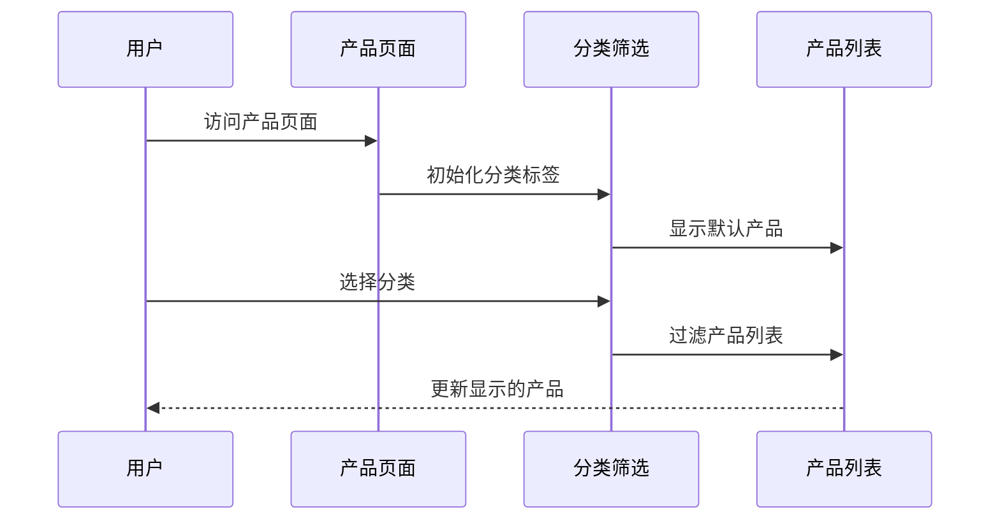
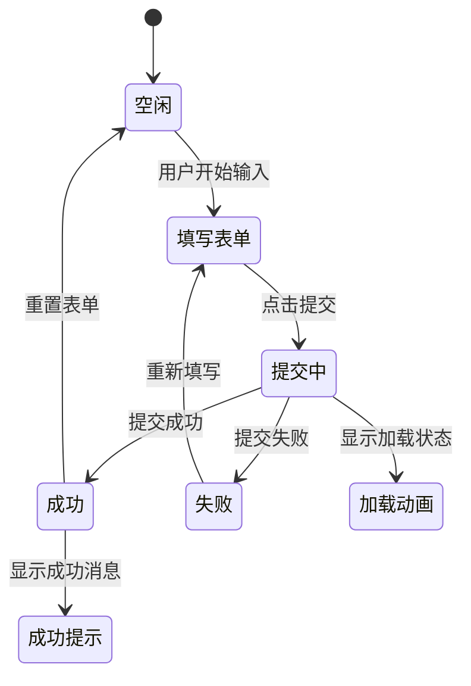

# 项目概述

<cite>
**本文档引用的文件**
- [package.json](file://tech-website/package.json)
- [vite.config.js](file://tech-website/vite.config.js)
- [src/App.jsx](file://tech-website/src/App.jsx)
- [src/main.jsx](file://tech-website/src/main.jsx)
- [index.html](file://tech-website/index.html)
- [src/components/Navbar.jsx](file://tech-website/src/components/Navbar.jsx)
- [src/components/Footer.jsx](file://tech-website/src/components/Footer.jsx)
- [src/pages/Home.jsx](file://tech-website/src/pages/Home.jsx)
- [src/pages/Products.jsx](file://tech-website/src/pages/Products.jsx)
- [src/pages/Contact.jsx](file://tech-website/src/pages/Contact.jsx)
- [src/index.css](file://tech-website/src/index.css)
- [src/components/Navbar.css](file://tech-website/src/components/Navbar.css)
- [src/components/Footer.css](file://tech-website/src/components/Footer.css)
</cite>

## 目录
1. [项目简介](#项目简介)
2. [项目结构](#项目结构)
3. [核心组件](#核心组件)
4. [架构概览](#架构概览)
5. [详细组件分析](#详细组件分析)
6. [依赖关系分析](#依赖关系分析)
7. [性能考虑](#性能考虑)
8. [故障排除指南](#故障排除指南)
9. [结论](#结论)

## 项目简介

这是一个基于React 18.2.0和Vite 5.0.0构建的企业级前端网站项目，专注于技术展示和营销功能。项目采用现代化的前端技术栈，为企业提供专业的数字展示平台。

### 项目目标
- 构建现代化的企业技术网站，展示产品和服务
- 提供优秀的用户体验和响应式设计
- 实现高效的开发和构建流程
- 支持多页面导航和交互式功能

### 核心特性
- **多页面导航系统**：基于React Router的SPA应用
- **响应式设计**：适配各种设备尺寸
- **交互式表单**：完整的联系表单功能
- **现代化构建工具**：Vite提供快速开发体验
- **组件化架构**：可复用的React组件设计

## 项目结构

项目采用清晰的文件组织结构，按照功能模块进行分层：



**图表来源**
- [src/App.jsx:1-25](file://tech-website/src/App.jsx#L1-L25)
- [src/main.jsx:1-14](file://tech-website/src/main.jsx#L1-L14)

**章节来源**
- [package.json:1-23](file://tech-website/package.json#L1-L23)
- [vite.config.js:1-11](file://tech-website/vite.config.js#L1-L11)

## 核心组件

### 技术栈选择

项目采用了当前主流的前端技术栈，每个技术都有其独特的优势：



**图表来源**
- [package.json:11-21](file://tech-website/package.json#L11-L21)

### 关键技术决策

1. **React 18.2.0**：提供最新的并发特性和性能优化
2. **Vite 5.0.0**：提供极速的开发服务器和构建工具
3. **React Router DOM**：实现客户端路由导航
4. **CSS变量**：统一的设计系统和主题管理

**章节来源**
- [package.json:6-21](file://tech-website/package.json#L6-L21)

## 架构概览

项目采用经典的React单页应用(SPA)架构，结合现代构建工具：



**图表来源**
- [src/main.jsx:7-13](file://tech-website/src/main.jsx#L7-L13)
- [src/App.jsx:8-22](file://tech-website/src/App.jsx#L8-L22)

### 数据流架构



**图表来源**
- [src/components/Navbar.jsx:52-60](file://tech-website/src/components/Navbar.jsx#L52-L60)
- [src/App.jsx:13-17](file://tech-website/src/App.jsx#L13-L17)

## 详细组件分析

### 导航栏组件 (Navbar)

导航栏是整个网站的核心组件，实现了响应式设计和交互功能：



**图表来源**
- [src/components/Navbar.jsx:5-67](file://tech-website/src/components/Navbar.jsx#L5-L67)

#### 核心功能特性

1. **响应式菜单**：在移动端自动切换为汉堡菜单
2. **活动状态管理**：根据当前路由高亮显示活动链接
3. **动画效果**：平滑的展开/收起动画
4. **渐变色彩**：科技感十足的蓝色渐变设计

**章节来源**
- [src/components/Navbar.jsx:1-67](file://tech-website/src/components/Navbar.jsx#L1-L67)
- [src/components/Navbar.css:1-155](file://tech-website/src/components/Navbar.css#L1-L155)

### 页脚组件 (Footer)

页脚组件提供了完整的企业信息展示和导航功能：



**图表来源**
- [src/components/Footer.jsx:4-97](file://tech-website/src/components/Footer.jsx#L4-L97)

#### 设计特点

1. **网格布局**：响应式三列布局设计
2. **品牌展示**：清晰的企业标识和描述
3. **导航分类**：按功能分类的产品和服务链接
4. **联系方式**：多种联系方式的集成展示
5. **社交媒体**：完整的社交平台链接

**章节来源**
- [src/components/Footer.jsx:1-97](file://tech-website/src/components/Footer.jsx#L1-L97)
- [src/components/Footer.css:1-186](file://tech-website/src/components/Footer.css#L1-L186)

### 主页组件 (Home)

主页是网站的核心展示页面，包含了丰富的内容和功能：



**图表来源**
- [src/pages/Home.jsx:78-226](file://tech-website/src/pages/Home.jsx#L78-L226)

#### 内容结构

1. **英雄横幅**：吸引用户的主视觉区域
2. **功能特性**：展示产品的核心优势
3. **产品展示**：主要产品的详细介绍
4. **行动号召**：引导用户采取下一步行动

**章节来源**
- [src/pages/Home.jsx:1-230](file://tech-website/src/pages/Home.jsx#L1-L230)

### 产品页面 (Products)

产品页面提供了详细的产品信息和分类浏览功能：



**图表来源**
- [src/pages/Products.jsx:58-135](file://tech-website/src/pages/Products.jsx#L58-L135)

#### 功能特性

1. **分类筛选**：支持按产品类别筛选
2. **产品卡片**：每个产品独立的信息展示
3. **价格显示**：清晰的价格信息标注
4. **特性标签**：突出产品的核心功能
5. **CTA按钮**：引导用户联系销售

**章节来源**
- [src/pages/Products.jsx:1-139](file://tech-website/src/pages/Products.jsx#L1-L139)

### 联系页面 (Contact)

联系页面实现了完整的表单功能和用户交互：



**图表来源**
- [src/pages/Contact.jsx:24-43](file://tech-website/src/pages/Contact.jsx#L24-L43)

#### 表单功能

1. **表单验证**：实时的输入验证和错误提示
2. **异步提交**：模拟的异步提交处理
3. **状态管理**：完整的表单状态跟踪
4. **用户体验**：友好的反馈机制
5. **响应式设计**：适配各种设备的表单布局

**章节来源**
- [src/pages/Contact.jsx:1-274](file://tech-website/src/pages/Contact.jsx#L1-L274)

## 依赖关系分析

项目的技术依赖关系清晰明确，体现了现代化前端开发的最佳实践：

```mermaid
graph TB
subgraph "运行时依赖"
A[react ^18.2.0]
B[react-dom ^18.2.0]
C[react-router-dom ^6.20.0]
end
subgraph "开发依赖"
D[@vitejs/plugin-react ^4.2.0]
E[vite ^5.0.0]
F[@types/react ^18.2.37]
G[@types/react-dom ^18.2.15]
end
subgraph "项目配置"
H[package.json]
I[vite.config.js]
J[index.html]
end
H --> A
H --> B
H --> C
H --> D
H --> E
H --> F
H --> G
I --> D
J --> H
```

**图表来源**
- [package.json:11-21](file://tech-website/package.json#L11-L21)
- [vite.config.js:1-11](file://tech-website/vite.config.js#L1-L11)

### 依赖特性

1. **轻量级核心**：React作为核心框架，保持较小的包体积
2. **现代化工具链**：Vite提供快速的开发体验
3. **类型安全保障**：TypeScript类型定义确保开发质量
4. **生态兼容性**：与React生态系统完全兼容

**章节来源**
- [package.json:1-23](file://tech-website/package.json#L1-L23)

## 性能考虑

项目在设计时充分考虑了性能优化，采用了多种最佳实践：

### 构建优化

1. **Tree Shaking**：Vite自动移除未使用的代码
2. **代码分割**：按需加载页面组件
3. **资源压缩**：生产环境自动压缩静态资源
4. **缓存策略**：合理的浏览器缓存配置

### 运行时优化

1. **虚拟DOM**：React的高效更新机制
2. **状态管理**：局部状态管理减少不必要的重渲染
3. **CSS变量**：统一的主题管理和快速的样式切换
4. **响应式设计**：移动端优先的性能优化

## 故障排除指南

### 常见问题及解决方案

#### 开发服务器问题
- **问题**：开发服务器无法启动
- **解决方案**：检查端口占用情况，修改vite.config.js中的端口配置

#### 组件样式问题
- **问题**：组件样式不生效
- **解决方案**：确认CSS文件正确导入，检查样式优先级

#### 路由跳转问题
- **问题**：页面间导航失效
- **解决方案**：检查路由配置，确认组件导出正确

#### 表单提交问题
- **问题**：表单提交无响应
- **解决方案**：检查表单状态管理，确认事件处理器绑定

**章节来源**
- [vite.config.js:6-9](file://tech-website/vite.config.js#L6-L9)
- [src/main.jsx:7-13](file://tech-website/src/main.jsx#L7-L13)

## 结论

这个技术网站项目展示了现代前端开发的最佳实践，通过精心设计的架构和组件化开发模式，为企业提供了一个功能完整、性能优异的数字展示平台。

### 项目优势

1. **技术先进性**：采用最新的React 18和Vite技术栈
2. **开发效率**：现代化的开发工具链提供快速迭代能力
3. **用户体验**：响应式设计和流畅的交互体验
4. **可维护性**：清晰的代码结构和组件化设计
5. **扩展性**：良好的架构为未来功能扩展奠定基础

### 学习价值

对于初学者而言，这个项目提供了：
- React组件化开发的完整示例
- 现代前端工具链的实际应用
- 响应式设计的最佳实践
- 企业级项目的架构思路

对于有经验的开发者而言，这个项目展示了：
- 现代前端技术栈的组合优势
- 开发流程优化的实践经验
- 企业级项目的设计考量
- 性能优化的具体方法